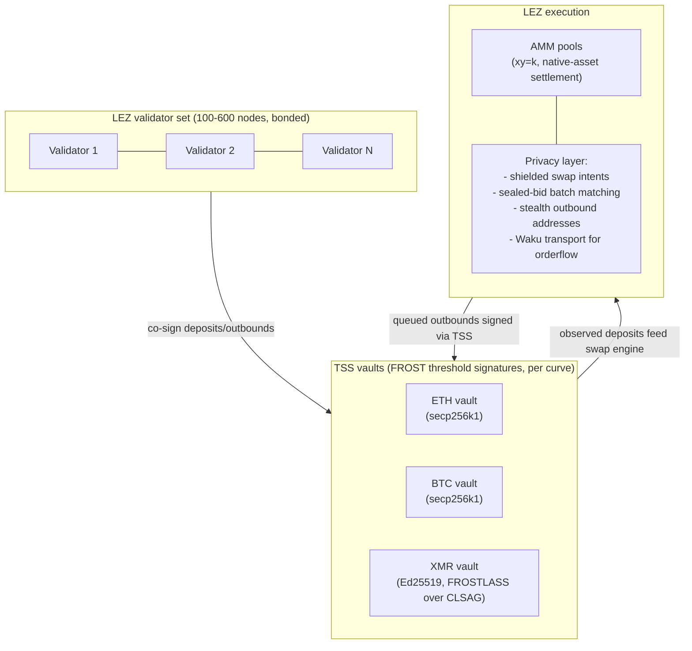

# RFP-021 — Cross-Chain Privacy DEX (Federated Middle Layer)

> **Note:** This RFP is a *decision-stage draft*. It exists to help the Logos team and the community compare cross-chain DEX designs across RFP-021 through RFP-025. Hard requirements, team profile, timeline, and contracting details are deliberately omitted; they will be filled in if the design is selected for funding.

## 🧭 Overview

Build a cross-chain privacy DEX on LEZ that custodies external assets (BTC, ETH, XMR, and others) via a threshold signature scheme held by the LEZ validator set, executes swaps natively against an AMM, and adds LEZ-specific privacy primitives (shielded swap intents, sealed-bid batch matching, stealth outbound addresses) that the existing comparators (Thorchain, Serai, Maya, Chainflip) do not offer.

The design follows the **federated-signer middle chain** pattern that Thorchain (over $120B cumulative volume since 2021 per DefiLlama, accessed 2026-05-21) and Serai (pre-mainnet, post-cryptographic-audit by Cypher Stack in May 2025) have converged on. RFP-021 inherits that pattern's well-understood AMM-style liquidity and one-step user experience, then layers LEZ's privacy execution primitives on top to close the privacy gap that every comparator leaves open: even Serai's middle-chain state is publicly readable, and Thorchain's source-chain memos link source and destination addresses on transparent ledgers before the middle chain even sees them.

This is the most ambitious option in the cross-chain bundle. It is also the one with the strongest empirical case (volume, user experience, asset coverage) and the strongest custody risk.

## Desired properties

- **Native cross-chain swap.** User deposits BTC, ETH, or XMR; receives the destination asset on the destination chain in a single user action. No wrapped tokens linger on LEZ after the swap.
- **AMM-style liquidity.** A single ordered state machine maintains pool invariants (`xy=k` or comparable). Large swaps clear against pooled liquidity, not against a per-trade counterparty.
- **One-step UX.** Deposit-with-memo, await outbound. No counterparty interactivity, no refund flows, no online-availability requirement past broadcast.
- **Bonded validator set with slashable misbehaviour.** Validators stake against the assets they custody; the bond-to-custodied-value ratio is enforced in protocol (Serai uses a 33% custody cap; Thorchain uses 2:1 bonded plus 1:1 pooled).
- **LEZ-native privacy execution.** Shielded swap intents (the user's swap is a commitment, not a public memo); sealed-bid batch matching with threshold decryption (collapses identity-based front-running); stealth outbound addresses on destination chains (breaks destination-chain clustering even for chains with no native privacy).
- **Permissioned-by-stake but censorship-resistant.** Anyone can join the validator set by posting the required stake; validator-set rotation occurs on a known cadence (Thorchain churns every 3 days; Serai per session).
- **Emergency halt mechanism.** Used three times in Thorchain's history; the protocol must be able to freeze outbounds on suspected custody compromise or consensus fault.

## High-level functionality and flow

**Happy path.** User sends BTC to a vault address on Bitcoin, carrying a memo (or, with LEZ privacy primitives, a commitment) that specifies the destination asset and address. LEZ validators observe the deposit, reach consensus via their consensus protocol, route the swap through the appropriate AMM pool, queue the outbound, and the threshold signature group co-signs an outbound transaction on the destination chain. Outbound is broadcast to a stealth address derived from the destination address. Total wall-clock time: source-chain finality plus LEZ consensus plus destination-chain finality, typically minutes.

**Validator-set churn.** On a fixed cadence, the protocol runs a distributed key generation for the next validator set and migrates vault balances from old keys to new keys. New validators bond their stake; departing validators recover their bond after a vesting period.

**Misbehaviour path.** Failed keygen, failed keysign, observed double-spend attempts, or chain-attributable malfeasance trigger slashing of the responsible validator's bond. Slashing amounts and trigger conditions are protocol-defined.

**Emergency path.** A `halt` mechanism (Thorchain's `make halt` precedent; Serai uses session-level rollback during DKG failure) freezes outbounds on suspected solvency or signing failure.

## Pros

- **Highest deployed-volume model.** Thorchain has cleared over $120B cumulative cross-chain volume since 2021 ([DefiLlama Thorchain DEX](https://defillama.com/protocol/thorchain-dex), accessed 2026-05-21). The AMM-style middle-chain pattern wins on liquidity gravity and user experience over every atomic-swap competitor.
- **Sub-block-time settlement on the middle chain.** Only destination-chain finality and the TSS keysign delay the outbound. No multi-hour timelock windows.
- **Arbitrary asset pairs.** Pair coverage is reduced to "does the validator set run an observer for chain X". BTC, ETH, XMR all in scope at launch.
- **Cryptoeconomic recourse.** Misbehaviour is slashable. The economic security argument is explicit and bounded.
- **LEZ privacy execution is a real differentiator.** No comparator offers shielded swap intents, sealed-bid batch matching, or stealth outbound addresses. This is the precise gap LEZ can fill.
- **Composable with the rest of LEZ.** The protocol-owned vault assets can back lending markets, structured products, and so on, on the same LEZ.

## Cons

- **Custody risk is real and realised.** Thorchain's GG20 TSS vault was drained on 2026-05-15 ($10.8M) via a TSSHOCK-class implementation weakness. Wormhole's Solana bridge was drained on 2022-02-02 ($326M) via a per-chain contract bug (`load_instruction_at`); Jump Crypto re-deposited the loss out of pocket. The federated middle-chain pattern has a non-zero historical loss rate.
- **Signer federation is a chokepoint.** Validators are identifiable; the validator set is a target for out-of-protocol pressure (legal, regulatory, kinetic). The federation cannot be made "fully decentralised" in the sense that an atomic-swap design can.
- **Pre-economic-security bootstrap.** Serai's mint-on-bootstrap design illustrates that the slashable-bond argument does not bind until the validator-stake pool catches up with custody. The launch window is a real risk.
- **XMR privacy compromise.** Any TSS custody of Monero is necessarily view-key-shared: the validator set learns the LEZ-side Monero deposit history. This is the same compromise Serai accepts (FROSTLASS over CLSAG); it must be called out plainly to users, not papered over.
- **Engineering surface is large.** Building a new chain, a per-external-chain observer fleet, a TSS scheme with serious audit posture, churn/migration logic, and an emergency halt is a multi-year programme. Serai took roughly five years from inception (around 2021) to post-cryptographic-audit pre-mainnet status (Cypher Stack audits completed May 2025; mainnet not yet launched as of 2026-05-21).

## Risks

- **TSS implementation failure.** The 2026-05-15 Thorchain incident is the canonical example. Mitigation: choose FROST over GG20 (Serai's choice, and the lesson Thorchain's incident reinforces); budget for at least one Cypher Stack-equivalent audit of the chosen scheme; design with FROSTLASS-grade Monero support from the start rather than retrofitting.
- **Per-external-chain contract risk.** Wormhole's 2022 incident bypassed rather than broke the trust model: a Solana-side `load_instruction_at` bug let an attacker forge VAAs. Every integrated chain adds an attack surface independent of the LEZ consensus. Mitigation: minimise per-chain on-chain components; lean on TSS-signed outputs to chains with no LEZ-deployed contract.
- **Validator-set capture.** A small or homogeneous validator set is a censorship and coercion target. Mitigation: stake-weighted permissionless entry; geographic and jurisdictional diversity as a soft target.
- **Pre-mainnet economic-security gap.** Slashable-bond security depends on stake value catching up with custody value. Mitigation: explicit caps on custody until the bond-to-custodied ratio binds; transparent on-protocol ratio enforcement (Thorchain's Incentive Pendulum is one mechanism).
- **Regulatory exposure on XMR custody.** Holding XMR in a protocol-owned vault attracts more scrutiny than holding BTC. Mitigation: validator geographic diversity; documented privacy posture; clear separation between protocol governance and individual validator entities.
- **Privacy claim overreach.** The LEZ privacy primitives close the public-ledger linkability gap but do not protect against an honest-but-curious validator set. The threat model must be documented honestly so users do not assume "private" means "the validators learn nothing".

## Relationship to other RFPs in this bundle

- **RFP-003 (Atomic Swaps with LEZ, open)** is the baseline atomic-swap RFP. RFP-021 is the structural alternative: federated middle layer instead of bilateral atomic swap. The two coexist: RFP-021 handles the high-liquidity bulk path; RFP-003 (and its evolutions RFP-022 and RFP-023) cover the non-custodial niche.
- **RFP-004 (Privacy-Preserving DEX, open)** is a *single-chain* shielded DEX on LEZ. RFP-021 is *cross-chain* with vault custody. Distinct scopes; the two could ship in parallel and serve different user journeys (intra-LEZ shielded trading vs cross-chain settlement).
- **RFP-022 (bonded atomic swaps)** and **RFP-023 (reputation-based atomic swaps)** are the non-custodial alternatives. They preserve cryptographic non-custody at the cost of multi-hour settlement and counterparty interactivity. RFP-021 sacrifices non-custody for AMM-style liquidity and one-step UX. The Logos design space is broad enough to ship both modes.
- **RFP-024 (sXMR pure)** and **RFP-025 (sXMR with SLA)** target a different product: synthetic XMR exposure inside LEZ DeFi, with atomic-swap redemption to real XMR. They are orthogonal to RFP-021 and could ship alongside it, sharing the same LEZ privacy primitives.

See [appendix/cross-chain-trust-model-contrast.md](../appendix/cross-chain-trust-model-contrast.md) for the full federated-signers vs atomic-swaps trust analysis that motivates this RFP's place in the bundle.

## References

- [DefiLlama Thorchain DEX (volume figures)](https://defillama.com/protocol/thorchain-dex) (accessed 2026-05-21)
- [Serai AMM docs](https://docs.serai.exchange/amm/) (accessed 2026-05-21)
- [Serai blog: Announcing monero-oxide (2025-09-09)](https://serai.exchange/2025/09/09/monero-serai-oxide.html) (accessed 2026-05-21)
- [Serai Validator Sets spec](https://github.com/serai-dex/serai/blob/develop/spec/protocol/Validator%20Sets.md) (accessed 2026-05-21)
- [Serai blog: How Far We've Come (2023-10-06)](https://serai.exchange/2023/10/06/how-far-weve-come.html) (accessed 2026-05-21)
- [Thorchain Medium: Why Cross-Chain bridges are superior to Atomic Swaps (2019)](https://medium.com/thorchain/why-cross-chain-bridges-are-superior-to-atomic-swaps-aebde263103c) (accessed 2026-05-21)
- [Thorchain docs: Continuous Liquidity Pools](https://docs.thorchain.org/technical-documentation/thorchain-finance/continuous-liquidity-pools) (accessed 2026-05-21)
- [Thorchain docs: RUNE (bond-to-pooled ratio)](https://docs.thorchain.org/understanding-thorchain/rune) (accessed 2026-05-21)
- [Crypto Times: $10.8M drained from Thorchain on 2026-05-15](https://www.cryptotimes.io/2026/05/17/10-8-million-drained-inside-the-thorchain-exploit-that-froze-cross-chain-defi-for-13-hours/) (accessed 2026-05-21)
- [Halborn: Wormhole Hack February 2022](https://www.halborn.com/blog/post/explained-the-wormhole-hack-february-2022) (accessed 2026-05-21)
- [FROST: Flexible Round-Optimized Schnorr Threshold Signatures (Komlo and Goldberg, SAC 2020 / IACR 2020/852)](https://eprint.iacr.org/2020/852) (accessed 2026-05-21)
