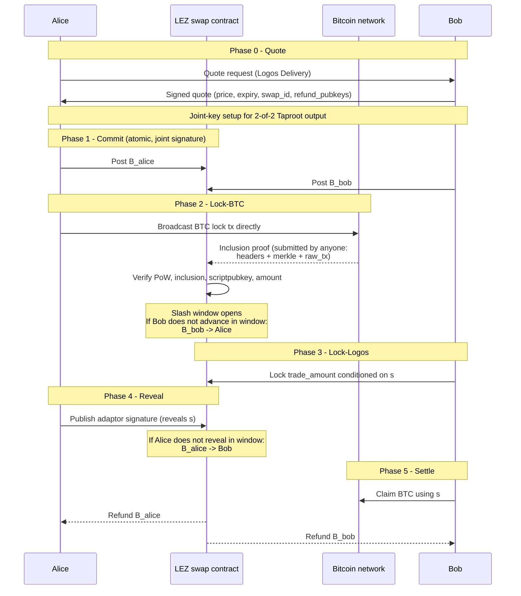

# RFP-022 — Bonded Atomic Swaps (Two Tiers)

> **Note:** This RFP is a *decision-stage draft*. It exists to help the Logos
> team and the community compare cross-chain DEX designs across RFP-021 through
> RFP-025. Hard requirements, team profile, timeline, and contracting details
> are deliberately omitted; they will be filled in if the design is selected for
> funding.

## 🧭 Overview

Extend RFP-003 (Atomic Swaps with LEZ, open) with a maker/taker bond layer on
LEZ that constrains the free-option problem inherent to atomic swaps. Bonds are
posted on LEZ in stables or LEZ-native assets; slashing is conditioned on
LEZ-observable failures to advance through the swap state machine.

The bond is the **price of the free option** the protocol structurally creates
at each phase boundary. The locker is short an option (their leg is committed
for a window during which the counterparty can observe the market); the
counterparty is long the option. The bond is posted by the long-option party; on
default (exercising the abort branch) it slashes to the locker, settling the
option premium. On honest completion the bond refunds (option expired worthless,
no premium owed). Bond sized at or above option value (`σ × √T × notional`; see
[atomic-swaps primer](../appendix/atomic-swaps-primer.md#notation-for-option-value))
makes the abort branch EV-negative and closes the free option.

Locking order is fixed by the cryptographic primitive, not by design choice. The
[atomic-swaps primer §Generalising the locks-first rule across pairs](../appendix/atomic-swaps-primer.md#generalising-the-locks-first-rule-across-pairs)
sets out the rule; the specific lock-ordering for LEZ↔BTC and LEZ↔XMR is part of
the applicant's design output and must be justified against the primer's
framing. In the worked examples below, Alice locks first on the external chain
and Bob locks second on LEZ; this is the BTC-XMR convention lifted directly.
Applicants targeting other pairs (LEZ↔ETH especially, where both chains have
full scripting) must state the locking-order choice explicitly.

The design splits into two tiers that reflect a structural asymmetry in the
underlying cryptography:

- **Tier 1 (LEZ to BTC, LEZ to ETH).** Both sides' locks are verifiable on LEZ
  via a chain-watching light-client module. Both Alice's and Bob's bonds are
  slashable on default; full bilateral free-option mitigation.
- **Tier 2 (LEZ to XMR).** Alice's XMR lock cannot be proven on LEZ without
  revealing either the per-tx private key or the recipient view key (plus the
  output blinding factor), each of which is sufficient to deanonymise the swap
  output once submitted to world-readable LEZ state. Monero's bilateral
  `check_tx_proof` (OutProofV2 or InProofV2 variants per
  [Zero to Monero 2.0 §Payment Proofs](https://www.getmonero.org/library/Zero-to-Monero-2-0-0.pdf))
  is the canonical disclosure-requiring proof; no SPV-style alternative exists
  pre-FCMP++. Bob's lock (on LEZ) remains observable, so Bob's bond is
  slashable; Alice's bond is slashable only on her LEZ-observable abandonment
  (failure to reveal after Bob has locked Logos). Alice keeps a residual
  pre-XMR-lock free option that only reputation (RFP-023) can constrain.

The Bond layer is a strict superset of RFP-003. Builders should consume the
per-pair SDKs from RFP-003 unchanged; this RFP adds the bond escrow contract,
the bond accounting, and the LEZ-side proof verification primitives.

## Desired properties

- **Non-custodial.** No vault holds external assets; no signer set. Bonds live
  in LEZ-native assets on LEZ.
- **Free-option mitigation (Tier 1).** Symmetric bonding makes both sides'
  optionality strictly EV-negative when bonds are sized above the option value
  (`σ × √T × notional` is the standard option-pricing heuristic; an indicative
  range is 2 to 5% of trade notional for 1-hour windows, to be validated by
  applicants against actual observed BTC/ETH volatility).
- **Free-option mitigation (Tier 2).** Bob's optionality is closed by his
  slashable bond. Alice's post-Bob-lock optionality is closed by her bond.
  Alice's pre-XMR-lock optionality is *not* closed; this is the structural limit
  of the asymmetry.
- **Unauthenticated proof submitter.** Either party can broadcast the other's
  signed lock transaction (broadcasting is permissionless on every supported
  chain). The LEZ inclusion-proof submitter is also unauthenticated. This
  eliminates "attest or be slashed" grief vectors: a malformed lock simply never
  lands, the state machine times out, no slashing dispute occurs.
- **Bondless taker entry path.** First-time takers can complete a capped first
  swap (worked example: US$100 equivalent notional) without posting a taker
  bond. After the first swap, the taker has LEZ-denominated assets they can post
  as bond against larger swap sizes. This is enforceable by the LEZ escrow
  program directly; no reputation registry needed.
- **Upgrade clause for Tier 2.** When a non-disclosing Monero proof primitive
  becomes production-ready (FCMP++ or equivalent; in specification phase per
  [Monero, FCMP++ announcement, 2024-04-27](https://www.getmonero.org/2024/04/27/fcmps.html),
  accessed 2026-05-21), Tier 2 collapses into Tier 1: Alice's XMR lock becomes
  verifiable on LEZ without view-key disclosure, and the residual free option
  closes.
- **Composes with RFP-023 reputation.** Maker reputation (and
  zk-membership-proof taker reputation if available) compounds the cost of
  defection. In Tier 2 specifically, taker reputation is load-bearing because it
  is the only restraint on Alice's pre-lock free option.

## High-level functionality and flow

### Tier 1: LEZ to BTC (example)

Bond notation:

- `B_alice` = Alice's full bond, posted on LEZ at Commit.
- `B_bob` = Bob's full bond, posted on LEZ at Commit.

Both bonds are posted before any external-chain lock, so the bonds are always
already on LEZ when slash conditions trigger. No phase-by-phase bond slicing;
each phase boundary creates an option that one of the two bonds prices.

Notes on the table:

- **Phase 1 is atomic.** Both bonds are posted in the same LEZ transaction,
  jointly signed. Abandonment at this point looks like abandoning a quote:
  nobody is committed yet, no on-chain advancement occurred, no slash applies.
  This eliminates a 1a/1b split where one party posts and the other doesn't.
- **Phase 2 has no Bob-broadcasts hop.** Alice broadcasts the BTC lock directly.
  The LEZ inclusion-proof submitter remains unauthenticated (Bob, Alice, or a
  watchtower service can post the proof once the BTC tx confirms). If Alice
  signs and broadcasts a malformed lock (wrong amount, wrong scriptpubkey), the
  LEZ contract rejects the inclusion proof, the state machine times out, both
  bonds refund. No slashing dispute, no fraud-proof window. The swap fails
  closed because the precondition for state advancement (a real BTC lock
  matching the swap parameters) never holds.
- **Phase 3 locks only `trade_amount`.** Bob's bond `B_bob` was posted at Phase
  1 and remains in the bond escrow; Phase 3 is a separate lock of trade capital,
  not the bond. This resolves an earlier draft where `B_bob` appeared both
  spendable (slashable in Phase 2) and locked (Phase 3) in the same model.

### Option-pricing audit

For each phase boundary, name (a) who is short the option, (b) who is long the
option, (c) the premium instrument that prices it:

| Boundary                                | Short the option (waiting)                        | Long the option (deciding)                | Premium instrument                             |
| --------------------------------------- | ------------------------------------------------- | ----------------------------------------- | ---------------------------------------------- |
| After Phase 2 (BTC locked, Logos not)   | Alice (her BTC is wedged for the timelock window) | Bob (he chooses whether to lock Logos)    | `B_bob`, slashes to Alice on Bob's no-advance  |
| After Phase 3 (Logos locked, no reveal) | Bob (his Logos is wedged)                         | Alice (she chooses whether to reveal `s`) | `B_alice`, slashes to Bob on Alice's no-reveal |
| After Phase 4 (reveal published)        | nobody (settlement is deterministic)              | n/a                                       | n/a                                            |

Bond sizing must satisfy
`B_bob ≥ option_value(σ_BTC/Logos × √T_phase2 × notional)` and
`B_alice ≥ option_value(σ_BTC/Logos × √T_phase3 × notional)`. See the primer for
the notation.

The audit closes the structural worry "are we adding new free options with each
phase?" by accounting for them: every boundary is named, the option holder is
named, and the bond pricing it is named. Phases without a one-sided commitment
(Phase 0 Quote, Phase 1 atomic Commit, Phase 5 Settle) create no option and need
no premium.

### Direction symmetry

The same phase table runs for the LEZ→BTC direction (a user wanting BTC
initiates against a BTC-holding maker) and the BTC→LEZ direction (a user with
BTC initiates against a Logos-holding maker). The locking order (BTC first, then
LEZ) is fixed by the cryptographic primitive (see overview); only the
taker/maker labels move. Bond sizing and slash conditions are
direction-symmetric. The same applies to LEZ↔ETH once the lock-ordering choice
is fixed for that pair.

### Tier 2: LEZ to XMR

Same phase structure as Tier 1, with the following differences driven by
Monero's unverifiable lock state on LEZ:

- **Phase 2 (Lock-XMR) is not LEZ-observable.** The state machine cannot
  auto-transition from Commit to Lock-Logos based on Alice's Monero lock. Bob
  detects Alice's lock by running a Monero wallet himself (Alice sends him the
  bilateral `check_tx_proof` privately; this does *not* go on LEZ). Bob's
  decision to advance to Lock-Logos is off-chain.
- **If Alice never locks XMR after Commit**, the state machine times out and
  both bonds refund. There is no LEZ-observable default, so no slash applies.
  Alice has paid only gas; she keeps her pre-XMR-lock free option. **This is the
  residual asymmetry of Tier 2:** the option Bob bears at this boundary cannot
  be priced by a bond, because the trigger event (Alice's XMR lock) is not
  LEZ-observable. Maker market competition and reputation (RFP-023) are the only
  available premium instruments. See "Open question" below.
- **Phase 3 onwards is identical to Tier 1.** Bob's lock on LEZ is observable.
  Alice's bond `B_alice` slashes on failure to reveal after Bob's lock; Bob's
  bond `B_bob` slashes on failure to complete after the reveal (per Tier 1
  mechanics).

#### Option-pricing audit (Tier 2)

| Boundary                                             | Short the option                                                                                               | Long the option                              | Premium instrument                                                                          |
| ---------------------------------------------------- | -------------------------------------------------------------------------------------------------------------- | -------------------------------------------- | ------------------------------------------------------------------------------------------- |
| After Phase 2 (XMR locked off-LEZ, Logos not locked) | Bob (he committed in good faith to source XMR; if Alice never locked, Bob saw nothing and waits out the timer) | Alice (chooses whether to actually lock XMR) | **None**. Trigger event not LEZ-observable. Reputation + market competition only (RFP-023). |
| After Phase 3 (Logos locked, no reveal)              | Bob (his Logos is wedged)                                                                                      | Alice (chooses whether to reveal `s`)        | `B_alice`, slashes to Bob on Alice's no-reveal                                              |
| After Phase 4 (reveal published)                     | nobody                                                                                                         | n/a                                          | n/a                                                                                         |

#### Direction symmetry (XMR↔LEZ)

The same Tier-2 phase structure runs for both XMR→LEZ and LEZ→XMR. In both
directions, **the XMR-side party holds the unverifiable lock**: that's the
cryptographic constraint (Monero outputs cannot be proven to LEZ without
view-key disclosure). The roles flip relative to taker/maker but the
protocol-level asymmetry is the same: the XMR-side party is reputation-gated;
the LEZ-side party is bonded.

For XMR→LEZ (a user wanting Logos pays in XMR): Alice in the table holds XMR;
the residual unpriced option is held by Alice; Bob (LEZ-side) is the party with
the on-chain bond that can be slashed if he fails to advance after Alice's XMR
lock — but Bob's failure-to-advance is what's not provable on LEZ. Same
asymmetry, mirrored.

#### Open question: off-chain verifiable maker reputation

Tier 2's residual unpriced option (Phase 2 boundary) is reputation-only. A
natural follow-up is whether the reputation signal can be made *verifiable* by
third parties off-chain, rather than relying purely on on-chain attestation plus
dispute fallback. This is treated as a reputation-mechanism question and the
discussion lives in
[RFP-023 §Off-chain verifiable maker reputation](./RFP-023-reputation-atomic-swaps.md#off-chain-verifiable-maker-reputation-lezxmr-open-question).
RFP-022 applicants should ensure the protocol primitives (anchored quote
signatures, deterministic stealth-address derivation, joint-key transcript
retention) make such a layer possible, even if the layer itself is left to
RFP-023.

### Bondless taker entry path

A taker without LEZ-denominated assets initiates a "first-swap" mode flagged in
the LEZ escrow program:

- Trade notional capped at a small value (worked example: US$100 equivalent),
  sized against expected free-option value at the protocol's typical lock
  window.
- No taker bond required.
- After completion, the taker has LEZ-denominated assets in their account from
  the swap proceeds. They can post these as bond against subsequent larger
  swaps.
- The cap is enforced by the LEZ escrow program; no reputation registry is
  required to make the cap binding. This decouples the bondless entry path from
  the (more complex) reputation infrastructure in RFP-023.

## Pros

- **Closes the free-option problem cryptoeconomically for BTC and ETH (Tier
  1).** No bilateral counterparty trust, no third-party attestation, no
  validator federation. The slash is enforced by the LEZ smart contract directly
  off the on-chain state of both chains.
- **Preserves the non-custodial property of atomic swaps.** No vault to drain,
  no TSS to break, no validator set to compromise. Funds never leave Alice's or
  Bob's control during the swap.
- **Builds cleanly on RFP-003.** Per-pair SDKs and the LEZ-side Risc0 escrow
  programs from RFP-003 are reused; this RFP layers on the bond escrow and the
  proof verification primitives. The dependency chain is clean.
- **Material improvement for the LEZ to XMR pair (Tier 2) on the maker side.**
  Bob's free option is closed even though Alice's lock is not verifiable on LEZ.
  This unblocks a category of makers who today refuse to post against
  atomic-swap takers because they can be free-optioned.
- **Bondless taker entry path solves the onboarding chicken-and-egg.** A
  privacy-seeking taker arriving from XMR or BTC does not need to acquire LEZ
  assets before their first swap. They complete a small first swap, accumulate
  LEZ assets, and bond from there. No KYC-tolerant on-ramp required.
- **Upgrade-clean for FCMP++.** When the non-disclosing Monero proof primitive
  ships, Tier 2 collapses into Tier 1 with no protocol-level rewrite. The RFP
  carries an explicit upgrade clause.

## Cons

- **Does not fix settlement time.** Settlement is still bounded by source-chain
  finality plus LEZ finality plus the timelock window. Hours, not minutes. The
  bond does not accelerate cryptographic settlement.
- **Does not fix interactivity.** Both parties must be online to lock, reveal,
  and (if the other side defaults) submit the slash claim. The bond removes the
  incentive to grief but not the requirement to participate.
- **Per-trade matching, no AMM.** No protocol-owned liquidity, no AMM pricing.
  Each swap requires a willing counterparty for the exact pair and exact size.
  RFP-021 wins decisively on liquidity gravity.
- **Bond opportunity cost.** Makers must lock LEZ-denominated bond capital,
  which yields nothing during the lock window. This raises maker spreads
  relative to the unbonded (free-option) atomic swap of RFP-003.
- **Bond denomination friction.** First-time takers need LEZ-denominated bond
  assets. The bondless-taker capped-entry path mitigates this but only for the
  first swap.
- **Tier 2 is structurally weaker.** Alice retains a pre-XMR-lock free option on
  the LEZ to XMR pair. Reputation (RFP-023) is the only available restraint on
  this option under current Monero cryptography. Users must understand the
  asymmetry.
- **More complex than RFP-003.** Bond accounting, slash conditions, light-client
  modules, dispute windows. The protocol surface and audit surface both grow.

## Risks

- **Cross-chain bond correlation.** If Bob is matched against N concurrent swaps
  and the LEZ chain re-orgs or his observer crashes, all N swaps may slash him.
  Mitigation: per-maker concurrency caps; bond scaling with active-swap count;
  explicit re-org tolerance windows.
- **Light-client implementation risk (Tier 1).** The BTC and ETH light-client
  modules are the load-bearing primitive. A bug that lets an attacker submit a
  false inclusion proof is a direct theft vector. Mitigation: fork from
  well-audited references (ZeroSync, Citrea Clementine LCP for BTC;
  Nimbus-derived for ETH); independent audit budget.
- **Bond sizing parameter risk.** Bond too small leaves residual optionality;
  bond too large prices honest makers out of the market. Volatility regime
  changes (e.g. XMR price moves of 20% in a session) widen the option value.
  Mitigation: protocol-adjustable bond parameters; optional volatility-indexed
  bond sizing.
- **Adversarial bond-bootstrap attack.** An attacker who controls the first set
  of makers can credibly claim "reputation-rich" status and capture taker flow.
  Mitigation: combine bond requirements with reputation accrual (RFP-023) so
  reputation cannot be purchased without time-and-capital cost.
- **FCMP++ upgrade slippage (Tier 2).** If the non-disclosing Monero proof
  primitive does not ship on the expected horizon, Tier 2 remains permanently
  asymmetric. Mitigation: design the protocol assuming Tier 2 is the steady
  state; treat FCMP++ as an optional improvement, not a dependency.
- **First-swap cap evasion.** A taker could split a large trade into many capped
  first swaps under fresh pseudonyms. Mitigation: cap by IP, device fingerprint
  (weak), or by Sybil-resistant identity proof (stronger); combine with rate
  limits enforced at the LEZ escrow program.

## Relationship to other RFPs in this bundle

- **RFP-003 (Atomic Swaps with LEZ, open)** is the foundation this RFP extends.
  The per-pair SDKs (LEZ-BTC, LEZ-XMR, LEZ-ETH), the Risc0 LEZ-side escrow, and
  the custom-LEZ-token support (RFP-003 hard requirement 7) are dependencies.
  RFP-022 layers bond escrow, slash conditions, and chain-watching light-client
  modules on top.
- **RFP-021 (cross-chain privacy DEX)** is the federated-custody alternative.
  RFP-021 sacrifices non-custody for AMM liquidity and one-step UX; RFP-022
  sacrifices liquidity gravity for non-custody. The two coexist in a complete
  cross-chain DEX strategy.
- **RFP-023 (reputation-based atomic swaps)** is the bonding alternative.
  RFP-022 consumes the maker-reputation primitive from RFP-023; in Tier 2
  specifically, the taker-reputation primitive is the only restraint on Alice's
  residual pre-XMR-lock free option. If RFP-023 ships later, RFP-022 specifies a
  stub interface and degrades to "count of completed swaps" reputation in the
  interim.
- **RFP-024 (sXMR pure)** and **RFP-025 (sXMR with SLA)** are orthogonal. They
  target synthetic XMR exposure inside LEZ DeFi; this RFP targets real-asset
  atomic swaps. They could be deployed alongside.

See [appendix/atomic-swaps-primer.md](../appendix/atomic-swaps-primer.md) for
the underlying cryptographic mechanics, the free-option framing, and the
`σ × √T × notional` notation. See
[appendix/cross-chain-trust-model-contrast.md](../appendix/cross-chain-trust-model-contrast.md)
for the federated-signer-vs-atomic-swap trust contrast that motivates this RFP.

## References

- [RFP-003: Atomic Swaps with LEZ](./RFP-003-atomic-swaps.md)
- [eth-lez-atomic-swaps reference implementation](https://github.com/logos-co/eth-lez-atomic-swaps)
  (accessed 2026-05-21)
- [Bitcoin to Monero atomic swaps (getmonero.org, 2021-08-20)](https://www.getmonero.org/2021/08/20/atomic-swaps.html)
  (accessed 2026-05-21)
- [Gugger, Bitcoin-Monero Cross-chain Atomic Swap, IACR 2020/1126](https://eprint.iacr.org/2020/1126.pdf)
  (accessed 2026-05-21)
- [Hoenisch and del Pino, Atomic Swaps between Bitcoin and Monero, arXiv:2101.12332 (2021-01-29)](https://arxiv.org/abs/2101.12332)
  (accessed 2026-05-21)
- [comit-network/xmr-btc-swap (BTC-XMR adaptor-signature reference implementation; unmaintained since 2024-11)](https://github.com/comit-network/xmr-btc-swap)
  (accessed 2026-05-21)
- [eigenwallet/core (active fork of comit-network/xmr-btc-swap; v4.6.1, 2026-05-15)](https://github.com/eigenwallet/core)
  (accessed 2026-05-21)
- [LLFourn one-time-VES: Verifiably Encrypted Signatures (Lloyd Fournier, adaptor signatures)](https://github.com/LLFourn/one-time-VES/blob/master/main.pdf)
  (accessed 2026-05-21)
- [apoelstra/scriptless-scripts: atomic-swap protocol notes (Andrew Poelstra)](https://github.com/apoelstra/scriptless-scripts/blob/master/md/atomic-swap.md)
  (accessed 2026-05-21)
- [BIP-340: Schnorr signatures for secp256k1](https://github.com/bitcoin/bips/blob/master/bip-0340.mediawiki)
  (accessed 2026-05-21)
- [BIP-341: Taproot](https://github.com/bitcoin/bips/blob/master/bip-0341.mediawiki)
  (accessed 2026-05-21)
- [Citrea Clementine: Trust-Minimized Bitcoin Bridge](https://docs.citrea.xyz/essentials/clementine-trust-minimized-bitcoin-bridge)
  (accessed 2026-05-21)
- [ZeroSync](https://zerosync.org/) (accessed 2026-05-21)
- [Monero, Zero to Monero 2.0 (whitepaper, §Payment Proofs)](https://www.getmonero.org/library/Zero-to-Monero-2-0-0.pdf)
  (accessed 2026-05-21)
- [Monero, FCMP++ announcement (2024-04-27)](https://www.getmonero.org/2024/04/27/fcmps.html)
  (accessed 2026-05-21)
