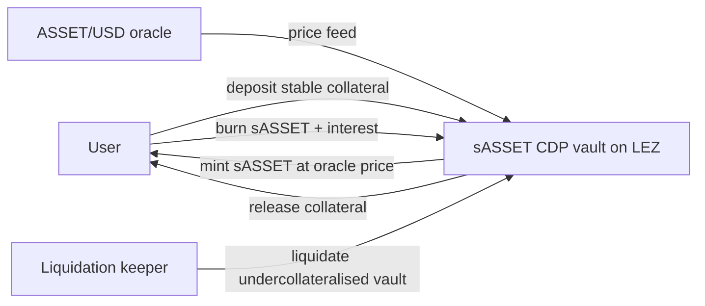

# RFP-024 — CDP-Backed Synthetic Assets (sASSET)

> **Note:** This RFP is a *decision-stage draft*. It exists to help the Logos
> team and the community compare cross-chain DEX designs across RFP-021,
> RFP-024, RFP-025, and RFP-026. Hard requirements, FURPS detail, team profile,
> timeline, and contracting details are deliberately omitted; they will be
> filled in if the design is selected for funding.

## 🧭 Overview

Build a CDP-backed synthetic-asset facility on LEZ that can mint a synthetic
token (sASSET) tracking the price of *any oracle-priced asset* — `sXMR`, `sZEC`,
`sBTC`, `sETH`, and so on. Users mint sASSET by locking stable collateral (or
other governance-approved LEZ assets) into a CDP-style vault, similar to the
Synthetix V3 Pools mechanic (SIP-302). Users burn sASSET to recover their
collateral. The protocol holds none of the tracked asset at any point and does
not deposit it on the asset's home chain — sASSET is a *debt instrument against
stable collateral*, not a wrapped asset.

The mint/burn/liquidate machinery is identical regardless of which asset is
tracked; the only per-asset input is the oracle price feed. Adding a new
synthetic (e.g. going from `sXMR` to `sZEC`) is a matter of wiring up a
documented oracle for the new asset and setting that synthetic's risk
parameters, not re-engineering the vault. This is exactly the property Synthetix
exploited to list `sUSD`, `sETH`, `sBTC`, `sXMR`, `sBCH`, `sADA`, and others off
a single CDP-minting engine.

Inspired by **Synthetix CDP minting** (SIP-302 Pools V3). A directly relevant
deployed analogue is Synthetix's own historical sXMR ERC-20 (Hadar release,
2020-03-30), which was SNX-collateralised and oracle-priced via Chainlink, never
redeemable for real XMR — one of a whole family of oracle-priced synths off the
same engine. See
[appendix/synthetics-design-space.md](../appendix/synthetics-design-space.md)
§Oracle-priced over-collateralised synthetics.

This is the preferred synthetic design in the bundle. For privacy-coin
underlyings such as XMR, RFP-025 (real-asset multisig) carries custody risk and
a deposit-history leak; RFP-026 layers atomic-swap redemption on top of this RFP
for users who want to exit to the real asset on its home chain (but does not
change the CDP mint mechanic).

## Which assets fit this design

Any asset for which a usable price oracle exists can be minted as a CDP-backed
synthetic here. The asset's own chain capabilities are irrelevant to *minting* —
the vault only ever holds LEZ-side collateral. Lead examples:

- **`sXMR` (Monero).** The bundle's primary motivating case: privacy-coin
  exposure inside LEZ DeFi with no XMR custody. Monero has no smart contracts and
  no SPV proof, but none of that matters to a CDP synthetic because the protocol
  never touches XMR.
- **`sZEC` (Zcash).** Same privacy-coin story as XMR; oracle-priced shielded-asset
  exposure without custodying ZEC.
- **`sBTC` (Bitcoin).** Synthetic BTC exposure inside LEZ without a federation
  custodying BTC (contrast Stacks sBTC, which is custody-backed — see the
  appendix).
- **`sETH` (Ethereum).** Synthetic ETH exposure; a liquid, well-oracled asset
  that is a natural low-risk first listing to validate the engine before adding
  thinner-oracle assets.

What *does* vary per asset is risk configuration, not mechanism: oracle quality
and redundancy, price volatility (which drives the c-ratio and liquidation
parameters), and whether a robust enough price feed exists at all. Thinly-traded
or poorly-oracled assets are out of scope until a defensible oracle exists for
them. Applicants should treat "is there a manipulation-resistant oracle for this
asset?" as the gating question for each listing.

## High-level functionality and flow

- **Mint.** A user deposits stable collateral (or other governance-approved LEZ
  assets) into the sASSET vault on LEZ. The protocol mints sASSET at the current
  oracle price for the tracked asset, up to a configurable issuance ratio
  (minimum c-ratio). The user holds sASSET; the vault holds the collateral.
- **Burn / unwind.** The user repays sASSET (plus any interest/fees) and the
  vault releases the collateral.
- **Liquidation.** If the vault's c-ratio breaches the threshold (oracle price
  moves against the user), a liquidation keeper closes the position and returns
  surplus collateral to the user, less penalty.
- **Trading.** sASSET is a vanilla LEZ token; users trade it against stables on
  RFP-004 or any other LEZ DEX. The price tracks oracle within whatever spread
  the market clears.

There is **no atomic swap and no custody of the tracked asset in this RFP**. A
user who wants the real asset on its home chain (real XMR on Monero L1, real BTC
on Bitcoin, etc.) either sells sASSET on a DEX (and takes the spread), or uses
RFP-026 (atomic-swap redemption built on top of this RFP) once that ships and
the relevant chain's atomic-swap support exists.

## Pros

- **Strongest non-custody story.** The protocol never touches the tracked asset;
  the vault holds only LEZ-side stable collateral. No signer set, no multisig, no
  bridge, no deposit-history leak — true for `sXMR`, `sBTC`, `sZEC`, and any
  other listing alike.
- **One engine, many assets.** A single audited CDP facility supports an open set
  of synthetics. New listings cost an oracle integration and a risk-parameter
  review, not a new protocol. This is the principal reason to prefer the CDP
  design over per-asset custody bridges.
- **Composable from day one.** sASSET is a vanilla LEZ token; lending markets,
  DEXes, governance, structured products can integrate without coordinating with
  the synthetics team.
- **Regulatory defensibility highest in the bundle.** The protocol is, in
  defensible terms, a price feed plus a collateral vault. Operators of price
  feeds have meaningfully different exposure from operators of asset-custodying
  bridges.
- **Independent of atomic-swap UX issues.** Mint and burn are LEZ-native
  operations; there is no atomic-swap latency, no maker discovery, no
  counterparty interactivity required for the core product.
- **Lowest engineering cost in the bundle's synthetics line.** Existing CDP
  designs (Synthetix, MakerDAO, Liquity) provide a well-mapped implementation
  template; the work is adapting those patterns to LEZ.
- **Builders are not blocked on LP-0018 or LP-0019.** Atomic-swap-specific
  concerns (taker spam, maker reliability) do not apply to the CDP mint path;
  those issues affect RFP-026 only.

## Cons

- **No path to the real asset within this RFP.** A user who wants the underlying
  on its home chain must either accept the secondary-market discount (sell
  sASSET for stables, buy the asset off-platform) or wait for RFP-026 to ship for
  that asset and use it. The "synthetic" is genuinely synthetic: no
  underlying-asset redemption.
- **Soft peg only.** sASSET tracks oracle within whatever spread the secondary
  market clears. Under stress (oracle staleness, collateral crunch, panicked
  unwinds) the peg can widen meaningfully.
- **Debt pool socialisation considerations.** In a V2-style debt pool, all
  synth holders share aggregate Synth debt; in V3-style per-pool debt, the same
  accounting model applies within a pool. Applicants must pick a model and
  document its failure modes. With multiple synthetics off one engine, the debt
  pool spans all of them — a sharp move in one asset's oracle is felt by holders
  of the shared pool.
- **Per-asset oracle quality varies.** The engine is asset-agnostic but its
  safety is not: a liquid asset like ETH has deep, redundant oracles, while a
  thinner privacy coin may have fewer independent feeds and worse manipulation
  resistance. Each listing inherits the strength (or weakness) of its oracle.
- **Privacy is partial.** sASSET is *not* a private asset on LEZ on its own; the
  token program is public state. Privacy must come from LEZ-native shielding
  (RFP-004's shielded swap intents, deshield-swap-reshield patterns). The CDP
  vault and the mint/burn flow are public. (For non-privacy underlyings like ETH
  or BTC this is a non-issue; it matters for the `sXMR`/`sZEC` privacy-coin case.)
- **Open question: does Logos want a synthetic that does not redeem to the
  underlying?** Synthetix-style synths have proven they can sustain liquidity for
  major asset classes (sUSD, sETH) but Synthetix's privacy-coin listing (sXMR)
  itself never achieved meaningful volume. An audience that specifically wants the
  real asset may not be satisfied by a debt instrument that merely tracks it.

## Risks

- **Oracle manipulation.** A manipulated ASSET/USD oracle lets an attacker mint
  sASSET cheaply or under-collateralise existing positions. Mitigation: redundant
  oracle stack with median-of-N pricing; configurable price-deviation guards;
  oracle-staleness checks. This risk scales inversely with the asset's oracle
  depth, so per-listing oracle review is mandatory.
- **Collateral solvency.** If the collateral asset (stables) depegs or is
  compromised, sASSET backing degrades. Mitigation: accept only collateral with
  documented threat models; cap protocol-wide collateral concentration by asset;
  require liquidation parameters that hold under collateral-asset volatility.
- **Liquidation infrastructure under-built.** A CDP design that does not have
  working keeper bots and a profitable liquidation incentive will hit insolvency
  on the first market shock. Mitigation: design liquidation incentives carefully;
  budget engineering for keeper operations; document MEV considerations.
- **Demand asymmetry.** Mint demand may be easy (LEZ-DeFi users want exposure to
  the tracked asset inside LEZ) but secondary-market liquidity for that synthetic
  may not materialise. The CDP design absorbs this — there is no LP bottleneck —
  but the token's tradability is bottlenecked by LEZ DEX adoption.
- **Privacy-claim overreach (privacy-coin listings).** sASSET is not a private
  asset; for `sXMR`/`sZEC` the privacy property is only that *the underlying
  asset is private*. Mint/burn on LEZ is public. Documentation must be honest.
- **Synthetix-sXMR precedent.** Synthetix listed sXMR in 2020 and it did not
  achieve meaningful adoption, even though its sUSD/sETH synths did. Mitigation:
  LEZ-native privacy positioning and tight LEZ-DeFi integration may differentiate
  privacy-coin listings, but applicants should validate demand per asset before
  building.

## Relationship to other RFPs in this bundle

- **RFP-003 (Atomic Swaps with LEZ, open)** is not a dependency of this RFP.
  RFP-024 is a CDP design that does not interact with atomic swaps. RFP-026
  layers atomic-swap redemption on top of this RFP for assets that have
  atomic-swap support.
- **RFP-021 (cross-chain privacy DEX)** is the federated-custody alternative for
  real-asset exposure. Orthogonal product: RFP-024 gives synthetic exposure
  inside LEZ DeFi without custody; RFP-021 gives the real asset via a federated
  middle layer.
- **RFP-025 (real-asset locked in trusted multisig)** is the not-preferred
  custody-backed alternative, scoped specifically to XMR. The two RFPs target the
  same audience differently *for the XMR case*: RFP-024 says "we don't custody the
  asset"; RFP-025 says "we do, via a federated multisig". RFP-024 is preferred.
- **RFP-026 (atomic-swap redemption to the real asset)** strictly extends this
  RFP. RFP-024 ships first; RFP-026 adds an atomic-swap exit path for users who
  want to redeem to the asset's home chain (for any asset where atomic-swap
  support exists). RFP-026 does not re-spec the CDP mint mechanic.
- **RFP-004 (Privacy-Preserving DEX)** is the natural single-chain trading venue
  for sASSET. Trade sASSET against stables on RFP-004's AMM pools under the
  shield/deshield pattern.
- **LP-0018 and LP-0019** are atomic-swap-specific prizes; they affect RFP-026
  only.

See
[appendix/synthetics-design-space.md](../appendix/synthetics-design-space.md)
for the deployed-synthetics taxonomy and the Synthetix CDP minting reference.

## References

- [RFP-003: Atomic Swaps with LEZ](./RFP-003-atomic-swaps.md)
- [appendix/synthetics-design-space.md](../appendix/synthetics-design-space.md)
- [appendix/cross-chain-trust-model-contrast.md](../appendix/cross-chain-trust-model-contrast.md)
- [Synthetix SIP-302 (Pools V3)](https://sips.synthetix.io/sips/sip-302)
  (accessed 2026-05-22) — canonical CDP-minting reference, with direct relevance
  to the sASSET design.
- [Synthetix blog: Hadar release (sXMR ERC-20 and sibling oracle-priced synths, 2020-03-30)](https://blog.synthetix.io/new-synths-update-for-the-upcoming-hadar-release/)
  (accessed 2026-05-22) — historical example of many oracle-priced synths off one
  CDP engine.
