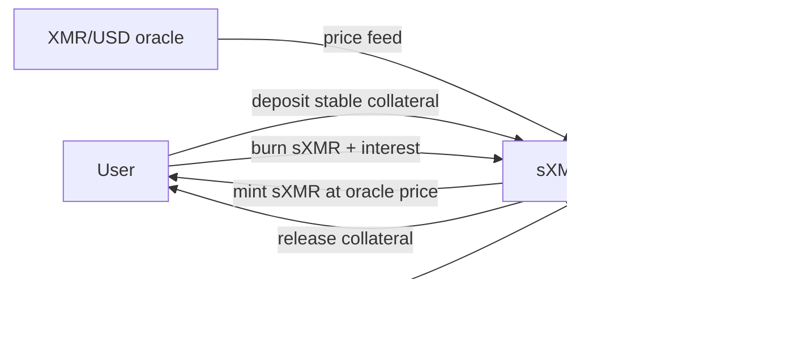

# RFP-024 — Synthetic XMR (sXMR), CDP-Backed Synthetic

> **Note:** This RFP is a *decision-stage draft*. It exists to help the Logos
> team and the community compare cross-chain DEX designs across RFP-021,
> RFP-024, RFP-025, and RFP-026. Hard requirements, FURPS detail, team profile,
> timeline, and contracting details are deliberately omitted; they will be
> filled in if the design is selected for funding.

## 🧭 Overview

Build a synthetic XMR token (sXMR) on LEZ that tracks the XMR price via oracle.
Users mint sXMR by locking stable collateral (or other governance-approved LEZ
assets) into a CDP-style vault, similar to the Synthetix V3 Pools mechanic
(SIP-302). Users burn sXMR to recover their collateral. The protocol holds no
XMR at any point and does not deposit XMR on Monero L1 — sXMR is a *debt
instrument against stable collateral*, not a wrapped asset.

Inspired by **Synthetix CDP minting** (SIP-302 Pools V3). The closest deployed
analogue: Synthetix's own historical sXMR ERC-20 (Hadar release, 2020-03-30),
which was SNX-collateralised and oracle-priced via Chainlink, never redeemable
for real XMR. See
[appendix/synthetics-design-space.md](../appendix/synthetics-design-space.md)
§Oracle-priced over-collateralised synthetics.

This is the preferred sXMR design in the bundle. RFP-025 (real-asset multisig)
carries custody risk and a Monero deposit-history leak; RFP-026 layers
atomic-swap redemption on top of this RFP for users who want to exit to real XMR
on Monero L1 (but does not change the CDP mint mechanic).

## High-level functionality and flow

- **Mint.** A user deposits stable collateral (or other governance-approved LEZ
  assets) into the sXMR vault on LEZ. The protocol mints sXMR at the current
  oracle price, up to a configurable issuance ratio (minimum c-ratio). The user
  holds sXMR; the vault holds the collateral.
- **Burn / unwind.** The user repays sXMR (plus any interest/fees) and the vault
  releases the collateral.
- **Liquidation.** If the vault's c-ratio breaches the threshold (oracle price
  moves against the user), a liquidation keeper closes the position and returns
  surplus collateral to the user, less penalty.
- **Trading.** sXMR is a vanilla LEZ token; users trade it against stables on
  RFP-004 or any other LEZ DEX. The price tracks oracle within whatever spread
  the market clears.

There is **no atomic swap and no XMR custody in this RFP**. A user who wants
real XMR on Monero L1 either sells sXMR on a DEX (and takes the spread), or uses
RFP-026 (atomic-swap redemption built on top of this RFP) once that ships.

## Pros

- **Strongest non-custody story.** The protocol never touches XMR; the vault
  holds only LEZ-side stable collateral. No signer set, no multisig, no bridge,
  no Monero deposit-history leak.
- **Composable from day one.** sXMR is a vanilla LEZ token; lending markets,
  DEXes, governance, structured products can integrate without coordinating with
  the sXMR team.
- **Regulatory defensibility highest in the bundle.** The protocol is, in
  defensible terms, a price feed plus a collateral vault. Operators of price
  feeds have meaningfully different exposure from operators of XMR-custodying
  bridges.
- **Independent of atomic-swap UX issues.** Mint and burn are LEZ-native
  operations; there is no atomic-swap latency, no maker discovery, no
  counterparty interactivity required for the core product.
- **Lowest engineering cost in the bundle's synthetics line.** Existing CDP
  designs (Synthetix, MakerDAO, Liquity) provide a well-mapped implementation
  template; the work is adapting those patterns to LEZ.
- **Builders are not blocked on LP-0018 or LP-0019.** Atomic-swap-specific
  concerns (taker spam, maker reliability) do not apply to the CDP mint path;
  those issues affect RFP-026 only.

## Cons

- **No path to real XMR within this RFP.** A user who wants XMR on Monero L1
  must either accept the secondary-market discount (sell sXMR for stables, buy
  XMR off-platform) or wait for RFP-026 to ship and use that. The "synthetic" is
  genuinely synthetic: no underlying-asset redemption.
- **Soft peg only.** sXMR tracks oracle within whatever spread the secondary
  market clears. Under stress (oracle staleness, collateral crunch, panicked
  unwinds) the peg can widen meaningfully.
- **Debt pool socialisation considerations.** In a V2-style debt pool, all sXMR
  holders share aggregate Synth debt; in V3-style per-pool debt, the same
  accounting model applies within a pool. Applicants must pick a model and
  document its failure modes.
- **Privacy is partial.** sXMR is *not* a private asset on LEZ on its own; the
  token program is public state. Privacy must come from LEZ-native shielding
  (RFP-004's shielded swap intents, deshield-swap-reshield patterns). The CDP
  vault and the mint/burn flow are public.
- **Open question: does Logos want a synthetic that does not redeem to the
  underlying?** Synthetix-style synths have proven they can sustain liquidity
  for major asset classes (sUSD, sETH) but Synthetix sXMR itself never achieved
  meaningful volume. The XMR audience may specifically want real XMR, not a debt
  instrument that tracks it.

## Risks

- **Oracle manipulation.** A manipulated XMR/USD oracle lets an attacker mint
  sXMR cheaply or under-collateralise existing positions. Mitigation: redundant
  oracle stack with median-of-N pricing; configurable price-deviation guards;
  oracle-staleness checks.
- **Collateral solvency.** If the collateral asset (stables) depegs or is
  compromised, sXMR backing degrades. Mitigation: accept only collateral with
  documented threat models; cap protocol-wide collateral concentration by asset;
  require liquidation parameters that hold under collateral-asset volatility.
- **Liquidation infrastructure under-built.** A CDP design that does not have
  working keeper bots and a profitable liquidation incentive will hit insolvency
  on the first market shock. Mitigation: design liquidation incentives
  carefully; budget engineering for keeper operations; document MEV
  considerations.
- **Demand asymmetry.** Mint demand may be easy (LEZ-DeFi users want XMR
  exposure inside LEZ) but secondary-market XMR liquidity may not materialise.
  The CDP design absorbs this — there is no LP bottleneck — but the token's
  tradability is bottlenecked by LEZ DEX adoption.
- **Privacy-claim overreach.** sXMR is not a private asset; the privacy property
  is only that *the underlying asset XMR is private*. Mint/burn on LEZ is
  public. Documentation must be honest.
- **Synthetix-sXMR precedent.** Synthetix listed sXMR in 2020 and it did not
  achieve meaningful adoption. Mitigation: LEZ-native privacy positioning and
  tight LEZ-DeFi integration may differentiate, but applicants should validate
  demand before building.

## Relationship to other RFPs in this bundle

- **RFP-003 (Atomic Swaps with LEZ, open)** is not a dependency of this RFP.
  RFP-024 is a CDP design that does not interact with atomic swaps. RFP-026
  layers atomic-swap redemption on top of this RFP.
- **RFP-021 (cross-chain privacy DEX)** is the federated-custody alternative for
  real-XMR exposure. Orthogonal product: RFP-024 gives synthetic XMR exposure
  inside LEZ DeFi without custody; RFP-021 gives real XMR via a federated middle
  layer.
- **RFP-025 (sXMR as real-XMR locked in trusted multisig)** is the not-preferred
  alternative for real-XMR-backed sXMR. The two RFPs target the same audience
  differently: RFP-024 says "we don't custody XMR"; RFP-025 says "we do, via a
  federated multisig". RFP-024 is preferred.
- **RFP-026 (sXMR atomic-swap redemption to real XMR)** strictly extends this
  RFP. RFP-024 ships first; RFP-026 adds an atomic-swap exit path for users who
  want to redeem to Monero L1. RFP-026 does not re-spec the CDP mint mechanic.
- **RFP-004 (Privacy-Preserving DEX)** is the natural single-chain trading venue
  for sXMR. Trade sXMR against stables on RFP-004's AMM pools under the
  shield/deshield pattern.
- **LP-0018 and LP-0019** are atomic-swap-specific prizes; they affect RFP-026
  only.

See
[appendix/synthetics-design-space.md](../appendix/synthetics-design-space.md)
for the deployed-synthetics taxonomy and the Synthetix CDP minting reference.

## References

- [RFP-003: Atomic Swaps with LEZ](./RFP-003-atomic-swaps.md)
- [appendix/synthetics-design-space.md](../appendix/synthetics-design-space.md)
- [appendix/cross-chain-trust-model-contrast.md](../appendix/cross-chain-trust-model-contrast.md)
- [Synthetix SIP-302 (Pools V3)](https://sips.synthetix.io/sips/sip-302)
  (accessed 2026-05-22) — canonical CDP-minting reference, with direct relevance
  to sXMR design.
- [Synthetix blog: Hadar release (sXMR ERC-20, 2020-03-30)](https://blog.synthetix.io/new-synths-update-for-the-upcoming-hadar-release/)
  (accessed 2026-05-22) — historical Synthetix sXMR listing.
