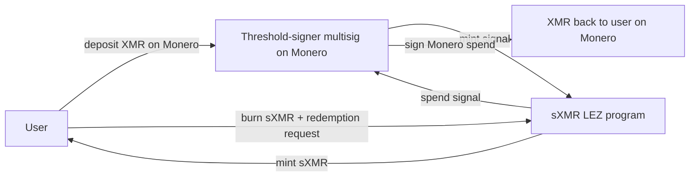

# RFP-025 — Synthetic XMR (sXMR) Backed by Real XMR in Trusted Multisig

> **Note:** This RFP is a *decision-stage draft*. It exists to help the Logos
> team and the community compare cross-chain DEX designs across RFP-021,
> RFP-024, RFP-025, and RFP-026. Hard requirements, FURPS detail, team profile,
> timeline, and contracting details are deliberately omitted; they will be
> filled in if the design is selected for funding.
>
> **The Logos team's current preference is RFP-024 (CDP-backed synthetic) over
> this design.** RFP-025 is documented here so the design space is comparable,
> but the custody and privacy trade-offs (below) make it the less attractive
> option. Read this RFP as "what would it take to do sXMR the sBTC way?" — not
> as "the Logos plan".

## 🧭 Overview

Build a synthetic XMR token (sXMR) on LEZ backed 1:1 by real XMR held in a
threshold-signer multisig on Monero. Users mint sXMR by depositing XMR into the
protocol's Monero-side multisig; users redeem sXMR by burning the LEZ-side token
to trigger a multisig-signed Monero spend back to the user. The token is a
*wrapped representation* of custodied XMR, not a debt instrument against stable
collateral.

Inspired by **sBTC (Stacks)** and **Secret Network's Secret Monero Bridge**. See
[appendix/synthetics-design-space.md](../appendix/synthetics-design-space.md)
§Redeem-to-underlying with custody for both reference projects. The TSS custody
for the Monero side follows Serai's FROST-over-CLSAG approach to avoid the
GG20/TSSHOCK class of failures (see
[appendix/cross-chain-trust-model-contrast.md](../appendix/cross-chain-trust-model-contrast.md)
§Federated-signer middle chain). The custody trust model is the same trust class
as RFP-021.

This design is **not the Logos team's preferred sXMR design** (RFP-024 is). The
custody risk and Monero deposit-history leak (both documented below) are real
and material. RFP-025 exists in the bundle as the deployed-prior-art comparison
point and as the design choice if real-XMR backing turns out to be a hard
product requirement.

## High-level functionality and flow

- **Mint.** A user sends XMR to the protocol's Monero-side multisig with a memo
  identifying the user's LEZ destination address. The signer set observes the
  deposit, reaches consensus, and the LEZ sXMR program mints 1:1 sXMR to the
  destination.
- **Burn / redeem.** A user burns sXMR on LEZ with a Monero destination address.
  The signer set observes the burn, reaches threshold, and signs a Monero spend
  from the multisig to the user's address.
- **Custody.** The protocol holds real XMR in a threshold-signer multisig
  (FROST-over-CLSAG; per-coin threshold suitable for Monero). The signer set is
  bonded and slashable; signer bond size scales with custody value.
- **Governance.** Signer set composition, threshold, bond requirements, and
  slashing rules are protocol-governed.

The atomic-swap protocol is *not* used in this RFP. Mint and redemption are
direct interactions with the multisig.

## Pros

- **Real XMR redemption with a documented SLA shape.** Unlike RFP-024 (no XMR
  redemption) and unlike RFP-026 (best-effort matching, no guarantees), this
  design lets a user mint and redeem on demand, bounded by the signer-set
  responsiveness.
- **Hard peg within reserve capacity.** sXMR is 1:1 backed by real XMR; oracle
  is not load-bearing (no oracle needed for the peg itself, only for any
  auxiliary pricing).
- **Composable from day one.** sXMR is a vanilla LEZ token; lending, DEXes,
  governance, structured products can integrate.
- **Audience overlap with sBTC and Secret Monero Bridge.** Users who already
  accept federated-custody designs on Stacks/Secret will find the trust model
  familiar.

## Cons

- **Custody risk is real and historically realised.** A signer set holding real
  XMR is a target. Thorchain's 2026-05-15 GG20/TSSHOCK exploit drained $10.8M
  from a similar architecture. Wormhole's 2022 Solana-side bug drained $326M.
  sBTC's signer set is 15 entities and has not been exploited at time of
  writing, but the failure-mode category is well-documented.
- **View-key-shared custody leaks Monero deposit history to signers.** Threshold
  custody of XMR requires view-key sharing among signers. Honest-but-curious
  signers learn the protocol-side mint and burn flow. This is the same
  compromise RFP-021 accepts; it is the structural cost of TSS custody of XMR
  under current Monero cryptography.
- **Signer-set bootstrap problem.** Bonded-security guarantees do not bind until
  the signer-set stake catches up with custody value. Early in the protocol's
  life the bond-to-custody ratio is unfavourable; the protocol is at its weakest
  precisely when its custody is smallest.
- **Signer-set censorship and coercion vector.** Identifiable signers are a
  chokepoint for legal, regulatory, and out-of-protocol pressure. The federation
  cannot be made "fully decentralised" the way an atomic-swap design (RFP-026)
  can be.
- **Redemption SLA depends on signer liveness.** If the signer set cannot reach
  threshold to sign (network partition, mass offline event), redemption breaks
  even with no malice.
- **Reinvents sBTC for a privacy-coin underlying.** The novelty relative to sBTC
  is the LEZ privacy execution on the sXMR token side, not the custody model.
  The custody side carries familiar risks; the LEZ side cannot compensate for
  them.
- **Privacy-claim overreach.** sXMR on LEZ is private only insofar as LEZ-native
  shielding makes it so. The protocol-side Monero deposit/redemption flow is
  visible to signers and leaks the underlying-asset graph; users may misread
  "sXMR is private" as "the protocol does not see my XMR activity".
- **Why this RFP is not preferred.** The custody and view-key disclosure issues
  above mean RFP-025 reintroduces exactly the trust assumptions that RFP-024
  deliberately avoids. The Logos team's working assumption is that LEZ users
  prefer the synthetic-with-no-custody trade-off (RFP-024) over the
  wrapped-with-custody trade-off (this RFP).

## Risks

- **Signer-set compromise.** A captured signer set can drain the entire reserve.
  Mitigation: large signer set (Serai uses up to 600; Thorchain ~100);
  permissionless entry once bootstrapped; high bond-to-custodied ratio;
  emergency-halt mechanism; geographic and jurisdictional diversity.
- **TSS implementation bug.** Thorchain's GG20 TSS exploit on 2026-05-15
  ($10.8M) is the canonical example. Mitigation: choose FROST over GG20 for the
  Monero side; budget for Cypher-Stack-equivalent audit; isolate signer-software
  dependencies; track Serai's monero-oxide work as the production-grade
  FROSTLASS instantiation.
- **Signer-set offline event.** If the signer set cannot reach threshold
  (network partition, mass node failure), redemption SLA breaks even with no
  malice. Mitigation: redundant signer geographic placement; documented signer
  SLOs; emergency-halt mechanism that pauses redemption gracefully.
- **Bond denomination volatility.** If signer bonds are denominated in
  LEZ-native assets that depeg or are volatile, bond-to-custodied ratio drifts.
  Mitigation: cap bond-asset concentration; require signers to top up on
  bond-asset depeg.
- **Regulatory exposure on XMR custody.** A protocol that custodies real XMR
  draws more scrutiny than RFP-024's CDP design or RFP-026's
  peer-to-peer-atomic-swap design. Mitigation: signer-set jurisdictional
  diversity; documented compliance posture; willingness to operate as a
  permissionless smart contract regardless of any single jurisdiction's stance.
- **Reserve undercollateralisation.** If the reserve is drawn down faster than
  it can be replenished from fees or governance top-ups, redemption capacity
  goes to zero; sXMR loses its peg.

## Relationship to other RFPs in this bundle

- **RFP-024 (sXMR CDP-backed)** is the preferred alternative. RFP-024 says "we
  don't custody XMR, sXMR is a debt instrument against stable collateral"; this
  RFP says "we do custody XMR via a federated multisig". The two are mutually
  exclusive product directions, not layered.
- **RFP-026 (sXMR atomic-swap redemption to real XMR)** is the non-custodial
  alternative for delivering real XMR to users. RFP-026 builds on RFP-024 and
  uses atomic swaps; RFP-025 holds real XMR in a multisig. RFP-026 has
  best-effort SLA; RFP-025 has hard-peg-within-reserve.
- **RFP-021 (cross-chain privacy DEX)** shares the federated-signer trust model.
  The two RFPs could share signer-set infrastructure if both are funded (same
  FROST-over-CLSAG primitives, possibly same validator set), trading some
  signer-set economies of scale.
- **RFP-003 (Atomic Swaps with LEZ, open)** is not used by this RFP. Mint and
  redemption are direct multisig interactions, not atomic swaps.
- **LP-0018 and LP-0019** do not apply to this RFP. They address
  atomic-swap-specific concerns; this RFP has no atomic-swap leg.

See
[appendix/synthetics-design-space.md](../appendix/synthetics-design-space.md)
§Redeem-to-underlying with custody for the deployed prior art (sBTC, Secret
Monero Bridge) and
[appendix/cross-chain-trust-model-contrast.md](../appendix/cross-chain-trust-model-contrast.md)
for the federated-signer trust analysis.

## References

- [RFP-003: Atomic Swaps with LEZ](./RFP-003-atomic-swaps.md)
- [appendix/synthetics-design-space.md](../appendix/synthetics-design-space.md)
- [appendix/cross-chain-trust-model-contrast.md](../appendix/cross-chain-trust-model-contrast.md)
- [docs.stacks.co/concepts/sbtc](https://docs.stacks.co/concepts/sbtc) (accessed
  2026-05-22) — sBTC is a 1:1 BTC-backed asset on Stacks; custody is a 15-signer
  federation with 70% threshold (current operating set 14 signers, 10-of-14 to
  sign); withdrawal latency ~6 Bitcoin blocks.
- [Hiro: Who are the sBTC signers, breaking down SIP-028](https://www.hiro.so/blog/who-are-the-sbtc-signers-breaking-down-sip-028)
  (accessed 2026-05-22)
- [Crypto Times: $10.8M drained from Thorchain on 2026-05-15](https://www.cryptotimes.io/2026/05/17/10-8-million-drained-inside-the-thorchain-exploit-that-froze-cross-chain-defi-for-13-hours/)
  (accessed 2026-05-19)
- [Halborn: Wormhole Hack on 2022-02-02 (technical analysis)](https://www.halborn.com/blog/post/explained-the-wormhole-hack-february-2022)
  (accessed 2026-05-19)
- [FROST: Flexible Round-Optimized Schnorr Threshold Signatures (Komlo and Goldberg, SAC 2020 / IACR 2020/852)](https://eprint.iacr.org/2020/852)
  (accessed 2026-05-21)
- [Announcing monero-oxide / FROSTLASS over CLSAG (Serai, 2025-09-09)](https://serai.exchange/2025/09/09/monero-serai-oxide.html)
  (accessed 2026-05-19) — production-grade reference for Monero TSS custody.
