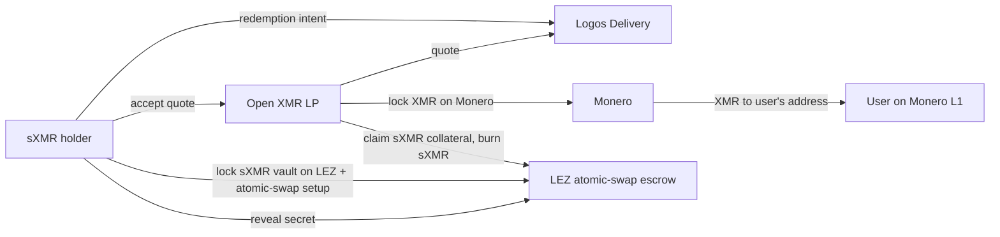

# RFP-026 — sXMR Atomic-Swap Redemption to Real XMR

> **Note:** This RFP is a *decision-stage draft*. It exists to help the Logos
> team and the community compare cross-chain DEX designs across RFP-021,
> RFP-024, RFP-025, and RFP-026. Hard requirements, FURPS detail, team profile,
> timeline, and contracting details are deliberately omitted; they will be
> filled in if the design is selected for funding.
>
> **This RFP strictly extends RFP-024.** RFP-024 (CDP-backed sXMR) is a hard
> prerequisite. RFP-026 adds an atomic-swap-based redemption path so that sXMR
> holders can exit to real XMR on Monero L1, without the protocol ever holding
> XMR. It does not re-specify the CDP mint mechanic.

## 🧭 Overview

Add a peer-to-peer atomic-swap redemption module on top of RFP-024's CDP-backed
sXMR. Holders of sXMR who want to receive real XMR on Monero L1 can post a
redemption intent over Logos Delivery; any XMR holder (an "LP") can quote and
counterparty the redemption via an atomic swap using the RFP-003 LEZ-XMR SDK. On
success, the user's sXMR is burned on LEZ, the LP receives the unlocked stable
collateral, and the user receives real XMR on Monero L1.

The protocol holds no XMR at any step. There is no LP registry, no bond, no SLA.
Anyone with XMR can quote. Spreads widen under stress without bound; redemption
availability is whatever the LP market clears. This is the *non-custodial
real-XMR exit path* for RFP-024's CDP synthetic. Builders who want a guaranteed
redemption SLA backed by federated custody should look at RFP-025 instead.

Inspired by **eigenwallet/COMIT BTC-XMR atomic swap** for the redemption-leg
cryptography. See
[appendix/atomic-swaps-primer.md](../appendix/atomic-swaps-primer.md) for the
underlying protocol mechanics and the locking-order protocol constraint
(LEZ-side locks first by protocol for XMR↔LEZ).

## High-level functionality and flow

Step-by-step:

1. The sXMR holder publishes a redemption intent (notional, oracle price,
   deadline) over Logos Delivery.
2. Any open-set XMR LP sees the intent, computes their quote (oracle ± spread),
   and replies bilaterally over Logos Delivery / Logos Chat.
3. The holder accepts a quote and the two parties run the RFP-003 LEZ-XMR
   atomic-swap protocol. The LEZ side (the sXMR + collateral release) locks
   first; the LP locks XMR on Monero second. See
   [primer §Locking order](../appendix/atomic-swaps-primer.md#locking-order) for
   why this ordering is forced by protocol.
4. The holder reveals the secret on LEZ; the LP uses it to claim the sXMR-backed
   stable collateral as their payout (less any protocol fee). The LP also has a
   claim path on the Monero side to deliver real XMR to the holder.
5. On success, sXMR is burned on LEZ (collateral leaves the RFP-024 vault to the
   LP); the holder receives real XMR on Monero L1.

Failure modes:

- **No LP shows up.** The holder's redemption intent expires; their sXMR
  position is unchanged. They can retry, lower the price, or sell sXMR on a DEX
  instead.
- **LP walks mid-swap.** The atomic-swap refund path unwinds; the holder retains
  sXMR; the LP loses time and transaction fees. See
  [primer §Timelocks and refunds](../appendix/atomic-swaps-primer.md#timelocks-and-refunds).
- **Holder walks mid-swap.** Symmetric; both parties refund.
- **The free-option problem applies.** Either party can walk and the other waits
  out the refund window. This is intrinsic to atomic swaps; RFP-026 accepts it
  as the cost of non-custody. LP-0018 (spam protection for makers) and LP-0019
  (taker reliability) may be layered on later but are not preconditions.

## Pros

- **Real XMR delivery without custody.** Successful redemption ends with real
  XMR on Monero L1, with no protocol-side multisig holding the underlying.
  RFP-025 carries custody risk; RFP-026 does not.
- **Composes cleanly with RFP-024.** The CDP mint mechanic from RFP-024 is
  unchanged. RFP-026 adds a peer-to-peer exit path that LEZ DeFi users can use
  alongside the standard burn-to-stables option.
- **Open LP set is censorship-resistant.** No permissioned set; no KYC; no
  operator that can be coerced into refusing service.
- **Regulatory minimalism preserved from RFP-024.** The protocol does not handle
  XMR; the atomic swap is a bilateral interaction between user and LP. The
  protocol provides the LEZ-side escrow program, the matching board over Logos
  Delivery, and the cryptographic primitives — nothing more.
- **Lowest-risk path to a real-XMR exit.** Other paths (RFP-021 federated DEX,
  RFP-025 multisig wrap) require custody. RFP-026 keeps non-custody intact.

## Cons

- **Soft SLA only.** Redemption availability is whatever the LP market clears.
  There is no protocol-side commitment to a delivery window. A user who wants a
  hard SLA on real XMR must use RFP-025 (and accept its custody trade-off).
- **LP-side bottleneck likely.** Mint demand may be easy; LP supply (XMR holders
  willing to atomic-swap their XMR for stables) is harder to source.
  Privacy-maximalist XMR holders may not want a public LP role.
- **Atomic-swap UX inherited.** Settlement time is dominated by Monero block
  confirmations (typically under an hour but with variance); both parties online
  for the lock+reveal duration. Intent gossip over Logos Delivery softens but
  cannot eliminate this.
- **Free-option problem applies.** Either party can walk mid-swap, costing the
  other party time. This is intrinsic to atomic swaps. LP-0018 and LP-0019
  address it but are not preconditions; this RFP ships without those
  mitigations.
- **Adverse-selection of LPs.** LPs likely show up when oracle is below true XMR
  price (free money on the redemption leg) and vanish when oracle is above.
  Redemption availability is expected to be asymmetric across price regimes.
- **No fee revenue capture for the protocol on the LP side.** Open LP set means
  LPs capture the spread; the protocol's only revenue is mint/burn fees from
  RFP-024 plus any explicit redemption-protocol fee.

## Risks

- **LP exodus.** All XMR holders stop quoting. Redemption becomes unavailable;
  users fall back to RFP-024's sell-sXMR-on-DEX exit. The protocol cannot
  intervene. Mitigation: design to survive long no-LP windows; let the market
  discount on sXMR signal demand to bring LPs back.
- **Spam attacks on makers.** A malicious user can post redemption intents that
  an LP locks against, then walks. LP loses time and fees per cycle. Mitigation:
  LP-0018 if/when it ships; until then, LPs must filter intents at their own
  discretion (e.g. requiring sXMR proof-of-balance or rate-limiting per
  identity).
- **Maker-side reliability.** An unreliable LP can grief takers by
  quote-and-walk. Mitigation: LP-0019 if/when it ships; until then, takers must
  filter LPs by reputation gathered out-of-band.
- **Locking-order constraint.** The LEZ side must lock first for XMR↔LEZ (Monero
  today provides no on-chain primitive supporting the locks-first role; see
  [primer §Locking order](../appendix/atomic-swaps-primer.md#locking-order)).
  For LEZ→XMR (this RFP's direction), this is the *taker* (sXMR holder) locking
  first, which is the desired draining-attack posture (taker bears the
  lock-window cost). Sub-case A in LP-0018's framing.
- **Atomic-swap protocol immaturity.** The deployed BTC-XMR atomic-swap
  ecosystem (eigenwallet, Farcaster) is community-scale not volume-scale.
  LEZ-XMR is a new pair; the LEZ-XMR module from RFP-003 must be built and
  audited before this RFP can ship. Mitigation: RFP-003 is a prerequisite;
  RFP-026 depends on its LEZ-XMR SDK.

## Relationship to other RFPs in this bundle

- **RFP-024 (sXMR CDP-backed)** is a **hard prerequisite**. RFP-026 does not
  implement the CDP mint mechanic; it only adds the atomic-swap redemption path.
  A builder funded for RFP-026 must build against a deployed (or jointly-built)
  RFP-024.
- **RFP-003 (Atomic Swaps with LEZ, open)** is a **hard prerequisite**. The
  LEZ-XMR atomic-swap SDK is the redemption settlement layer. RFP-026 does not
  modify RFP-003; it consumes it.
- **RFP-025 (sXMR real-XMR multisig)** is the not-preferred alternative for
  real-XMR delivery. RFP-025 promises a hard SLA at the cost of custody; RFP-026
  offers a soft SLA without custody. The two are mutually exclusive product
  directions for the "deliver real XMR to sXMR holders" goal.
- **RFP-021 (cross-chain privacy DEX)** is orthogonal — federated-custody
  real-XMR cross-chain swaps, not synthetic exposure with optional redemption.
- **LP-0018 (Spam protection for atomic-swap makers)** can be layered on the
  redemption-leg atomic swap once the prize is awarded. Not a precondition;
  RFP-026 ships with the free-option problem accepted as a known cost.
- **LP-0019 (Taker reliability for atomic swaps)** can be layered for
  LP-discovery UX and maker-misbehaviour attribution. Not a precondition.
- **RFP-004 (Privacy-Preserving DEX, open)** is the natural single-chain trading
  venue for sXMR pre-redemption (the alternative exit path that does not involve
  atomic swaps at all).

See [appendix/atomic-swaps-primer.md](../appendix/atomic-swaps-primer.md) for
atomic-swap mechanics and the locking-order protocol constraint, and
[appendix/cross-chain-trust-model-contrast.md](../appendix/cross-chain-trust-model-contrast.md)
for the federated-signer-vs-atomic-swap trust contrast.

## References

- [RFP-003: Atomic Swaps with LEZ](./RFP-003-atomic-swaps.md)
- [RFP-024: sXMR CDP-Backed Synthetic](./RFP-024-synthetic-xmr-pure.md)
- [appendix/atomic-swaps-primer.md](../appendix/atomic-swaps-primer.md)
- [appendix/cross-chain-trust-model-contrast.md](../appendix/cross-chain-trust-model-contrast.md)
- [appendix/synthetics-design-space.md](../appendix/synthetics-design-space.md)
- [LP-0018: Spam Protection for Atomic-Swap Makers](../lambda-prizes/LP-0018-atomic-swap-anti-spam.md)
- [LP-0019: Taker Reliability for Atomic Swaps](../lambda-prizes/LP-0019-atomic-swap-maker-reputation.md)
- [Bitcoin to Monero atomic swaps (getmonero.org, 2021-08-20)](https://www.getmonero.org/2021/08/20/atomic-swaps.html)
  (accessed 2026-05-21)
- [eigenwallet/core (active fork of comit-network/xmr-btc-swap; v4.6.4, 2026-05-21)](https://github.com/eigenwallet/core)
  (accessed 2026-05-22)
