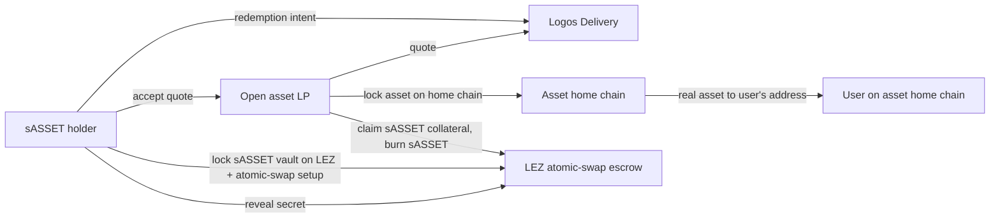

# RFP-026 — Atomic-Swap Redemption of Synthetics to the Real Asset

> **Note:** This RFP is a *decision-stage draft*. It exists to help the Logos
> team and the community compare cross-chain DEX designs across RFP-021,
> RFP-024, RFP-025, and RFP-026. Hard requirements, FURPS detail, team profile,
> timeline, and contracting details are deliberately omitted; they will be
> filled in if the design is selected for funding.
>
> **This RFP strictly extends RFP-024.** RFP-024 (CDP-backed sASSET) is a hard
> prerequisite. RFP-026 adds an atomic-swap-based redemption path so that sASSET
> holders can exit to the real underlying asset on its home chain, without the
> protocol ever holding that asset. It does not re-specify the CDP mint mechanic.

## 🧭 Overview

Add a peer-to-peer atomic-swap redemption module on top of RFP-024's CDP-backed
synthetics. A holder of any sASSET (`sXMR`, `sZEC`, `sBTC`, `sETH`, …) who wants
to receive the real underlying asset on its home chain can post a redemption
intent over Logos Delivery; any holder of that real asset (an "LP") can quote and
counterparty the redemption via an atomic swap using the RFP-003 LEZ↔asset SDK.
On success, the user's sASSET is burned on LEZ, the LP receives the unlocked
stable collateral, and the user receives the real asset on its home chain.

The protocol holds none of the real asset at any step. There is no LP registry,
no bond, no SLA. Anyone holding the asset can quote. Spreads widen under stress
without bound; redemption availability is whatever the LP market clears. This is
the *non-custodial real-asset exit path* for RFP-024's CDP synthetics. Builders
who want a guaranteed redemption SLA backed by federated custody should look at
RFP-025 instead.

Inspired by **eigenwallet/COMIT BTC-XMR atomic swap** for the redemption-leg
cryptography. See
[appendix/atomic-swaps-primer.md](../appendix/atomic-swaps-primer.md) for the
underlying protocol mechanics and the locking-order protocol constraint.

## Which assets fit this design

Redemption works for an asset only when **both** conditions hold:

1. **A CDP synthetic for it exists** (RFP-024 lists `sASSET` for that asset —
   gated by the existence of a usable oracle), **and**
2. **Atomic-swap support for that asset's home chain exists** in the RFP-003
   LEZ↔asset SDK.

The redeemable set is the *intersection* of those two. Oracle availability (the
RFP-024 gate) is the looser constraint; atomic-swap support is the tighter one,
because it depends on the asset's chain providing the cryptographic primitives
the swap protocol needs (adaptor signatures / scriptless-script locking, or
equivalent), and on the RFP-003 SDK having been built and audited for that pair.
Lead examples, in rough order of atomic-swap readiness:

- **`sBTC` → BTC.** Bitcoin has the most mature atomic-swap tooling (the original
  BTC-XMR swap was built around Bitcoin's scripting). The least exotic redemption
  leg.
- **`sXMR` → XMR.** The bundle's motivating case. The eigenwallet/COMIT BTC-XMR
  protocol is the reference; the LEZ↔XMR leg must be built in RFP-003. The Monero
  side carries the locking-order constraint described below.
- **`sZEC` → ZEC.** Shielded-asset redemption; viable in principle, dependent on
  the LEZ↔ZEC swap leg existing in RFP-003. Shielded-pool interaction adds
  protocol work on the swap side.
- **`sETH` → ETH.** Mechanically the simplest swap counterparty (rich scripting),
  though the demand case is weakest — ETH holders rarely need a non-custodial exit
  from a synthetic. Listed mainly to show the design is not privacy-coin-specific.

An asset that has a CDP synthetic (RFP-024) but **no** atomic-swap support is
*not* redeemable via this RFP; its holders are limited to RFP-024's
sell-on-a-DEX exit until the swap leg is built. Applicants should treat "is there
an audited LEZ↔asset atomic-swap leg?" as the gating question per asset, the same
way RFP-024 treats the oracle question.

## High-level functionality and flow

Step-by-step (worked with XMR as the example; substitute the asset and its home
chain for other listings):

1. The sASSET holder publishes a redemption intent (notional, oracle price,
   deadline) over Logos Delivery.
2. Any open-set LP holding the real asset sees the intent, computes their quote
   (oracle ± spread), and replies bilaterally over Logos Delivery / Logos Chat.
3. The holder accepts a quote and the two parties run the RFP-003 LEZ↔asset
   atomic-swap protocol. The LEZ side (the sASSET + collateral release) locks
   first where the asset's chain forces that ordering; the LP locks the real
   asset on its home chain second. See
   [primer §Locking order](../appendix/atomic-swaps-primer.md#locking-order) for
   when and why this ordering is forced (it is a per-chain property of the
   underlying, not a global rule).
4. The holder reveals the secret on LEZ; the LP uses it to claim the sASSET-backed
   stable collateral as their payout (less any protocol fee). The LP also has a
   claim path on the home-chain side to deliver the real asset to the holder.
5. On success, sASSET is burned on LEZ (collateral leaves the RFP-024 vault to
   the LP); the holder receives the real asset on its home chain.

Failure modes:

- **No LP shows up.** The holder's redemption intent expires; their sASSET
  position is unchanged. They can retry, lower the price, or sell sASSET on a DEX
  instead.
- **LP walks mid-swap.** The atomic-swap refund path unwinds; the holder retains
  sASSET; the LP loses time and transaction fees. See
  [primer §Timelocks and refunds](../appendix/atomic-swaps-primer.md#timelocks-and-refunds).
- **Holder walks mid-swap.** Symmetric; both parties refund.
- **The free-option problem applies.** Either party can walk and the other waits
  out the refund window. This is intrinsic to atomic swaps; RFP-026 accepts it as
  the cost of non-custody. LP-0018 (spam protection for makers) and LP-0019
  (taker reliability) may be layered on later but are not preconditions.

## Pros

- **Real asset delivery without custody.** Successful redemption ends with the
  real asset on its home chain (real XMR on Monero L1, real BTC on Bitcoin, …),
  with no protocol-side multisig holding the underlying. RFP-025 carries custody
  risk; RFP-026 does not.
- **Composes cleanly with RFP-024.** The CDP mint mechanic from RFP-024 is
  unchanged. RFP-026 adds a peer-to-peer exit path that LEZ DeFi users can use
  alongside the standard burn-to-stables option, for any asset whose swap leg
  exists.
- **Open LP set is censorship-resistant.** No permissioned set; no KYC; no
  operator that can be coerced into refusing service.
- **Regulatory minimalism preserved from RFP-024.** The protocol does not handle
  the real asset; the atomic swap is a bilateral interaction between user and LP.
  The protocol provides the LEZ-side escrow program, the matching board over
  Logos Delivery, and the cryptographic primitives — nothing more.
- **Lowest-risk path to a real-asset exit.** Other paths (RFP-021 federated DEX,
  RFP-025 multisig wrap) require custody. RFP-026 keeps non-custody intact.

## Cons

- **Redemption set narrower than the synthetic set.** Some assets will have a CDP
  synthetic (RFP-024) but no atomic-swap leg, so they cannot be redeemed here.
  The redeemable set lags the mintable set by however long the LEZ↔asset swap legs
  take to build and audit in RFP-003.
- **Soft SLA only.** Redemption availability is whatever the LP market clears.
  There is no protocol-side commitment to a delivery window. A user who wants a
  hard SLA on the real asset must use RFP-025 (and accept its custody trade-off).
- **LP-side bottleneck likely.** Mint demand may be easy; LP supply (holders of
  the real asset willing to atomic-swap it for stables) is harder to source. For
  privacy-coin underlyings, privacy-maximalist holders may not want a public LP
  role.
- **Atomic-swap UX inherited.** Settlement time is dominated by the home chain's
  block confirmations (for XMR typically under an hour but with variance; varies
  per asset); both parties online for the lock+reveal duration. Intent gossip over
  Logos Delivery softens but cannot eliminate this.
- **Free-option problem applies.** Either party can walk mid-swap, costing the
  other party time. This is intrinsic to atomic swaps. LP-0018 and LP-0019 address
  it but are not preconditions; this RFP ships without those mitigations.
- **Adverse-selection of LPs.** LPs likely show up when oracle is below the true
  asset price (free money on the redemption leg) and vanish when oracle is above.
  Redemption availability is expected to be asymmetric across price regimes.
- **No fee revenue capture for the protocol on the LP side.** Open LP set means
  LPs capture the spread; the protocol's only revenue is mint/burn fees from
  RFP-024 plus any explicit redemption-protocol fee.

## Risks

- **LP exodus.** All LPs for an asset stop quoting. Redemption of that synthetic
  becomes unavailable; users fall back to RFP-024's sell-on-DEX exit. The protocol
  cannot intervene. Mitigation: design to survive long no-LP windows; let the
  market discount on the synthetic signal demand to bring LPs back.
- **Spam attacks on makers.** A malicious user can post redemption intents that an
  LP locks against, then walks. LP loses time and fees per cycle. Mitigation:
  LP-0018 if/when it ships; until then, LPs must filter intents at their own
  discretion (e.g. requiring sASSET proof-of-balance or rate-limiting per
  identity).
- **Maker-side reliability.** An unreliable LP can grief takers by quote-and-walk.
  Mitigation: LP-0019 if/when it ships; until then, takers must filter LPs by
  reputation gathered out-of-band.
- **Locking-order constraint (per chain).** On some home chains the LEZ side must
  lock first because the underlying provides no on-chain primitive supporting the
  locks-first role — Monero is the canonical case (see
  [primer §Locking order](../appendix/atomic-swaps-primer.md#locking-order)). For
  the LEZ→asset direction (this RFP's direction), this is the *taker* (sASSET
  holder) locking first, which is the desired draining-attack posture (taker bears
  the lock-window cost). Sub-case A in LP-0018's framing. Chains with richer
  scripting (Bitcoin, Ethereum) relax this; the constraint is asset-specific.
- **Atomic-swap protocol immaturity.** The deployed BTC-XMR atomic-swap ecosystem
  (eigenwallet, Farcaster) is community-scale not volume-scale. Each LEZ↔asset
  pair is new; the relevant LEZ↔asset module from RFP-003 must be built and
  audited before that asset can be redeemed here. Mitigation: RFP-003 is a
  prerequisite; RFP-026 depends on its per-asset atomic-swap SDK, and the set of
  redeemable assets grows only as those legs land.

## Relationship to other RFPs in this bundle

- **RFP-024 (CDP-backed sASSET)** is a **hard prerequisite**. RFP-026 does not
  implement the CDP mint mechanic; it only adds the atomic-swap redemption path. A
  builder funded for RFP-026 must build against a deployed (or jointly-built)
  RFP-024.
- **RFP-003 (Atomic Swaps with LEZ, open)** is a **hard prerequisite**. The
  per-asset LEZ↔asset atomic-swap SDK is the redemption settlement layer, and it
  defines which assets are redeemable. RFP-026 does not modify RFP-003; it
  consumes it.
- **RFP-025 (real-asset multisig)** is the not-preferred custody-backed
  alternative for real-asset delivery, scoped to XMR. RFP-025 promises a hard SLA
  at the cost of custody; RFP-026 offers a soft SLA without custody. For the XMR
  case the two are mutually exclusive product directions for the "deliver the real
  asset to synthetic holders" goal.
- **RFP-021 (cross-chain privacy DEX)** is orthogonal — federated-custody
  real-asset cross-chain swaps, not synthetic exposure with optional redemption.
- **LP-0018 (Spam protection for atomic-swap makers)** can be layered on the
  redemption-leg atomic swap once the prize is awarded. Not a precondition;
  RFP-026 ships with the free-option problem accepted as a known cost.
- **LP-0019 (Taker reliability for atomic swaps)** can be layered for LP-discovery
  UX and maker-misbehaviour attribution. Not a precondition.
- **RFP-004 (Privacy-Preserving DEX, open)** is the natural single-chain trading
  venue for sASSET pre-redemption (the alternative exit path that does not involve
  atomic swaps at all).

See [appendix/atomic-swaps-primer.md](../appendix/atomic-swaps-primer.md) for
atomic-swap mechanics and the locking-order protocol constraint, and
[appendix/cross-chain-trust-model-contrast.md](../appendix/cross-chain-trust-model-contrast.md)
for the federated-signer-vs-atomic-swap trust contrast.

## References

- [RFP-003: Atomic Swaps with LEZ](./RFP-003-atomic-swaps.md)
- [RFP-024: CDP-Backed Synthetic Assets](./RFP-024-cdp-backed-synthetic.md)
- [appendix/atomic-swaps-primer.md](../appendix/atomic-swaps-primer.md)
- [appendix/cross-chain-trust-model-contrast.md](../appendix/cross-chain-trust-model-contrast.md)
- [appendix/synthetics-design-space.md](../appendix/synthetics-design-space.md)
- [LP-0018: Spam Protection for Atomic-Swap Makers](../lambda-prizes/LP-0018-atomic-swap-anti-spam.md)
- [LP-0019: Taker Reliability for Atomic Swaps](../lambda-prizes/LP-0019-atomic-swap-maker-reputation.md)
- [Bitcoin to Monero atomic swaps (getmonero.org, 2021-08-20)](https://www.getmonero.org/2021/08/20/atomic-swaps.html)
  (accessed 2026-05-21)
- [eigenwallet/core (active fork of comit-network/xmr-btc-swap; v4.6.4, 2026-05-21)](https://github.com/eigenwallet/core)
  (accessed 2026-05-22)
