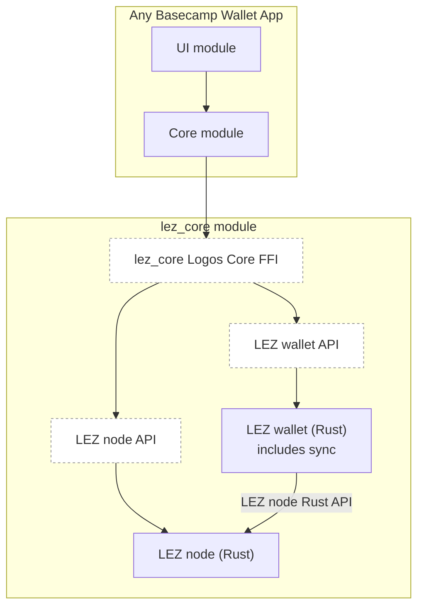
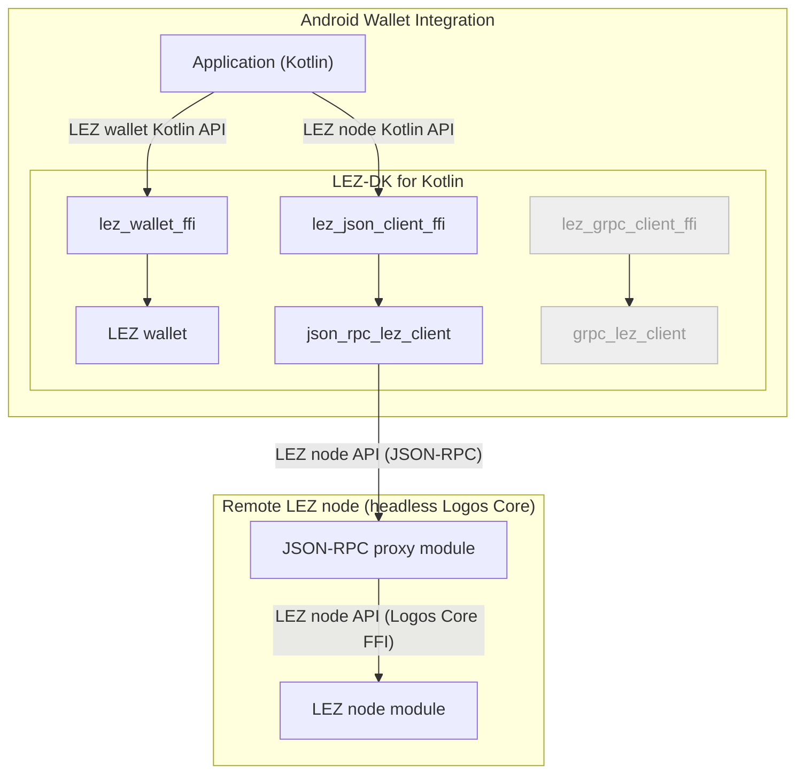
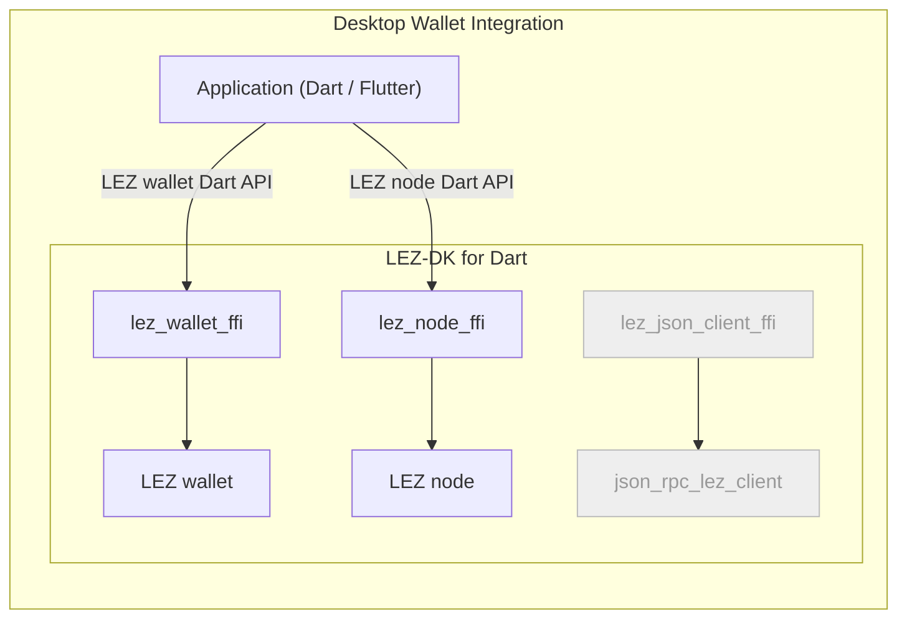

# RFP-027 — LEZ Node API

> **Note.** This specification describes an outcome that may benefit the Logos
> ecosystem. It is a proposal rather than an instruction. Its requirements
> reflect the technical compatibility with the Logos technology stack and are
> the criteria against which proposals and milestones are evaluated. Logos makes
> no representation as to the legal or regulatory treatment of this
> specification or any implementation of it in any jurisdiction.
>
> Teams implementing it are solely responsible for (i) assessing the risks and
> implications of what they build; (ii) obtaining their own professional advice;
> and (iii) for complying with any legal and regulatory requirements that apply
> to them. Software developed under the Program is published and maintained by
> its developers, not by Logos.
>
> Anyone who chooses to deploy, host, operate or use software developed under
> the Program, whether or not they were awarded a grant under the Program, does
> so at their own risk and is solely responsible for complying with any legal or
> regulatory requirements that apply to them. See the
> [Terms & Conditions](../TERMS_AND_CONDITIONS.md).
>
> Deploying the software described in this RFP, operating any service based on
> it, or carrying on business through it may amount to regulated activity in
> some jurisdictions, including where it involves holding or managing users'
> assets or providing services to others. Whoever conducts any such activity
> does so as principal, in their own name, and is solely responsible for
> assessing its regulatory treatment, including any licensing, registration,
> sanctions or anti-money laundering obligations that may apply to them. Logos
> does not make any representation, provide any advice or assume any
> responsibility in respect of any such determination or compliance.

## 🧭 Overview

Build the node API for LEZ: the set of functions an integrator needs to follow
the chain, track deposits, confirm transactions, and submit a transaction it has
already signed, delivered as exported functions on the LEZ node FFI and
surfaced through
[`lez_indexer_module`](https://github.com/logos-blockchain/lez-indexer-module).
This is the equivalent of the `eth` namespace on Ethereum's JSON-RPC: it answers
what happened and what the current state is, and it accepts a signed transaction
for the network, holding no keys and signing nothing.

The FFI is where the LEZ node surface is bounded. A capability the node holds
but the FFI does not export cannot reach an application, and adding it to the
module alone achieves nothing. See
[Appendix: Logos API Surfaces](../appendix/logos-api-surfaces.md) for the
as-built inventory of every layer.

Of the integrators listed below, the centralised exchange is used as the
reference profile for the requirements: read chain state, track deposits
credited to accounts it controls, and confirm that a transaction reached a level
of certainty it is willing to act on. It is the strictest reader of the set, so
a surface that satisfies it satisfies the others, and it is the profile whose
absence is most visible, since a chain no exchange will list is a chain most
users cannot reach.

### Target architecture and the LEZ-DK

The five deliverables exist to make LEZ integrable by the parties that have to
integrate a chain before it is usable in practice: wallets, centralised
exchanges, custodians, payment gateways, data and price aggregators, node and
RPC providers, fiat on and off ramps, bridges, and tax and accounting providers.
Each acts on the chain from outside it, holding accounts, watching for what
arrives, signing what it sends, and reconciling against its own books. Each
stops at the first capability that is missing.

A CEX backend and a self-custodial mobile wallet have different architectures
and are written in different languages, which is why this RFP suite takes a
composable approach. The first two deliverables define surfaces; the rest
consume them.

1. **The LEZ node API.** *This RFP*
   ([logos-co/ecosystem#235](https://github.com/logos-co/ecosystem/issues/235)).
   Define the LEZ node API: the global, non-wallet functions. An integrator may
   run a LEZ node and access it through this API by way of a transport proxy, which is
   what an RPC provider does. Whether indexer or sequencer features answer a
   given call is internal to it, and it is a black box in that regard. This is
   the only component used to read blockchain state and to push signed
   transactions and new commitments to the chain. It is packaged in the
   `lez_core` Logos Core module. The API needs to be exposed in Rust, to be
   consumed by the wallet features within `lez_core`, and over the Logos Core
   FFI, to be consumed by Basecamp apps and transport proxy modules (see 3
   and 5).
2. **The LEZ wallet API**
   ([logos-co/ecosystem#236](https://github.com/logos-co/ecosystem/issues/236)):
   key handling, derivation, proving, and signing. It covers the local and
   wallet operations only. The LEZ wallet library that exposes this API is
   packaged in the `lez_core` module, and an integrator can run that module with
   every wallet API function disabled. The API needs to be exposed over the
   Logos Core FFI on the `lez_core` module, and through the `lez_wallet_ffi`
   crate so it can be wrapped in libraries for other languages (see 4).
3. **The JSON-RPC proxy module and its client library**
   ([logos-co/ecosystem#237](https://github.com/logos-co/ecosystem/issues/237)):
   The module is a Logos Core module that projects the APIs the `lez_core`
   module exposes over JSON-RPC, carrying both the LEZ node API and the LEZ
   wallet API, the former being the one an integrator running a LEZ node as an
   RPC provider uses most. The client is a Rust library for that same surface,
   so a consumer reaches a remote node without writing the transport itself.
4. **LEZ-DK: The LEZ Development Kit**
   ([logos-co/ecosystem#238](https://github.com/logos-co/ecosystem/issues/238)):
   Modelled on the Bitcoin Development Kit (BDK), for the reasons set out in
   [Design Rationale: Inspiration from BDK](#inspiration-from-bdk-bitcoin-development-kit).
   The LEZ-DK carries the FFI crates that expose the Rust LEZ node API and LEZ
   wallet API. It covers both direct access to an in-process LEZ node (see the
   desktop example below) and the JSON-RPC client library for a remote one (see
   the Android example below). It ships as a unified library per language,
   Kotlin, Swift and Go among them, so an application integrates LEZ the same
   way whether the node runs in process or remotely.
5. **Further transport proxy modules and their client libraries**
   ([logos-co/ecosystem#222](https://github.com/logos-co/ecosystem/issues/222))
   beyond JSON-RPC, such as gRPC, GraphQL, and a Mesh or Rosetta adapter. Each
   adds a Logos Core module exposing the wallet and node APIs over the new
   transport, and a Rust client library with its FFI crate, consumed through the
   LEZ-DK.

The three diagrams below show the architecture these deliverables build
towards. They differ in what the application is built on and where the node
runs. A Basecamp app is a Logos UI module paired with a Logos Core module, and
its core module reaches the `lez_core` module over the Logos Core FFI. An
application outside Basecamp uses the LEZ-DK for its language instead, and from
there either embeds a node of its own or reaches a remote one over a
transport.

The `lez_core` module exposes both surfaces through one Logos Core FFI, and the
app's core module consumes both, the wallet for keys and signing and the node
for chain state:



An Android app is not built from Logos modules, so it adds one dependency, the
LEZ-DK for Kotlin, which carries the wallet and the transport clients, each its
own FFI crate over its own Rust crate. The application holds the wallet and a
client and wires them together, choosing the transport it reaches the node
through, and neither component reaches the other. Every client in the kit is
linked whether or not it is used, which is the cost of shipping one artifact.
The client runs inside the application rather than beside it, so only the node
call leaves the device:



A desktop app can link the node itself rather than reach one over a transport,
which is the same LEZ-DK with a different component selected. A Dart and Flutter
wallet in the shape of [Cake Wallet](https://github.com/cake-tech/cake_wallet)
adds the node FFI beside the wallet FFI and runs both in process, so the client
stays linked but unused and no node call leaves the device:



This RFP defines the LEZ node API only (1). Wallet and key management,
transaction construction and signing, the JSON-RPC transport, the further
transport bindings, and the LEZ-DK are out of scope and will be defined in
separate RFPs.

Two consequences of that arrangement bear on this RFP. The node API is consumed
both directly, by a caller holding it across an FFI boundary, and indirectly,
through the JSON-RPC proxy and the client library, so its surface has to survive
projection onto a wire protocol rather than assuming a local caller. And
because a consumer may reach the node through either path, the two must express
the same semantics.

### The LEZ node API is the only API for chain state access

The LEZ node API is the whole of the surface available to a consumer, in both
directions. A LEZ node is a black box to this RFP: what it is made of, which
part of it answers a given call, and how those parts talk to each other are
implementation, not API. This RFP specifies what a consumer may ask for and
what comes back, and nothing about how a node arranges itself to answer.

The node serves every read. Where it does not already hold what a consumer asks
for, it obtains it from wherever that data lives rather than directing the
consumer elsewhere. That internal arrangement is free to change without a
consumer being able to tell.

It is also the only way onto the chain. A signed transaction, and the new
commitments that come with a privacy-preserving one, are produced by the LEZ
wallet and reach the network through this API, which relays what it is handed
without constructing or signing anything itself. A consumer that holds keys
still writes through the node, so the wallet and the node divide the work rather
than offering two routes to the chain.

A capability a consumer needs is therefore required of the node regardless of
which part of it holds the data today. The pending set is the clearest case,
and the same reasoning governs every read and write below.

## 🔥 Why This Matters

LEZ is adopted when existing projects integrate it. To increase the value a
project sees in integrating LEZ, we need to decrease the upfront cost by
providing the software they need.

So the requirements below are set by what those integrators already rely on
elsewhere. Nine established chains were surveyed for that purpose. LEZ does not
currently meet several of the norms: there are no per-transaction effects; no
confirmation level; and no subscription reaches the FFI, which is the boundary
an integrator can actually call. Simulation is the one norm this RFP declines
rather than fills, for the reason given in the Design Rationale. See
[Appendix: Blockchain API and SDK Ecosystem, section 4](../appendix/blockchain-api-sdk-ecosystem.md#4-gap-summary).

Most of the missing capability already exists one layer below the FFI, as the
readiness markers below record, so the work is largely exposure rather than
invention.

## 🏗 Design Rationale

### The target is LEZ after testnet 0.3

This RFP specifies the surface for LEZ as it will be after testnet 0.3, not as
it is on the default branch today. Testnet 0.3 brings gas, so transactions carry
a fee and execution has a price a caller pays. The requirements below assume
that: cost is something to estimate, report, and budget against, and the
readiness markers describe the starting point for the work rather than a
constraint on what the surface may express.

[Functionality](#functionality) #5 requires the fee to be reported separately
from the balance changes, so a caller reads it rather than reconstructing it by
arithmetic, and #6 requires the gas consumed alongside it.

### Simulation belongs to the wallet, not to the node

Simulation is the one capability an integrator expects from a node API that this
RFP does not require. Six of the nine surveyed chains execute an unsubmitted
transaction and return its outcome, and an RPC provider elsewhere is expected to
offer it
([Appendix: Blockchain API and SDK Ecosystem, section 1.15](../appendix/blockchain-api-sdk-ecosystem.md#115-simulate-transaction-execution)).
On LEZ that shape does not fit.

A privacy-preserving transaction is executed by the wallet, which runs the
program locally over notes only it can decrypt and submits a proof that the
execution was correct. The proof is an input to the transaction rather than a
result of executing it, so a node holds neither the witness material nor the
plaintext a simulation would need, and there is nothing for the node to
simulate before the wallet has already done the work. Zcash reaches the same
conclusion from the same premise, and exposes no simulation on either leg.

Public execution could be simulated by the node, but siting it there would
split one capability across two components and answer against finalised state
rather than the state the caller is building on. The wallet already holds the
executor for the private path and can read whatever state it needs through the
queries below, so it can answer for both kinds of transaction, against a state
it chose, at the moment it is constructing the transaction. That is also what
simulation is for elsewhere: Stellar returns the transaction data and the
minimum resource fee that the caller copies back into the transaction before
submitting, which makes simulation a construction step rather than a read.
Construction is out of scope here and belongs to the wallet API, the second of
the five deliverables. [Out of Scope](#out-of-scope) records the exclusion.

### Inspiration from BDK: Bitcoin Development Kit

The [Bitcoin Development Kit](https://bitcoindevkit.org) is the closest
precedent for what this suite is building, and the LEZ-DK is named after it.
Everything below was read at `bdk-ffi` `3.1.0-alpha.0`.

BDK is what a wallet developer uses instead of writing wallet logic against a
node. It is layered. At the bottom sits
[`rust-bitcoin`](https://github.com/rust-bitcoin/rust-bitcoin), types and
consensus encoding only: it is `no_std` and contains no networking. Above it,
[`bdk_wallet`](https://github.com/bitcoindevkit/bdk_wallet) holds the wallet
proper, descriptors, key derivation, coin selection, transaction building and
signing, and the wallet's own view of the chain. Beside it sit four
interchangeable chain clients, each a separate crate: `bdk_esplora` for HTTP,
`bdk_electrum` for Electrum servers, `bdk_bitcoind_rpc` for Bitcoin Core's
JSON-RPC, and `bdk_kyoto` for P2P compact block filters.

[`bdk-ffi`](https://github.com/bitcoindevkit/bdk-ffi) then wraps the wallet and
those clients for consumers that are not writing Rust. It is its own crate,
depending on the wallet crate and re-exposing it across a UniFFI boundary rather
than re-exporting it, and the Kotlin, Swift and Python packages are generated
against it. A Kotlin consumer never sees Rust: it adds one dependency,
`bdk-android`, whose entire Kotlin source tree is a build artifact regenerated
from the FFI crate.

That arrangement answers two questions this suite would otherwise have to guess
at: how the pieces are packaged, and how the wallet and a client relate to each
other at runtime.

The first is packaging. Wallet and chain access ship as one crate, one UniFFI
namespace, and one native library: `lib.rs` declares `mod wallet` beside `mod
esplora`, `mod electrum`, and `mod kyoto`, then calls
`uniffi::setup_scaffolding!("bdk")` once. Those modules organise the Rust source
rather than the exposed surface, and they collapse at the FFI boundary: the
Android test that exercises `Wallet` and `EsploraClient` together imports
nothing from BDK at all, because both arrive in one flat package. What separates
the wallet functions from each client's functions is the object they hang off,
not a namespace. Every export is a method on a type and none is a free
function, so `Wallet` carries the wallet operations and `EsploraClient` the
chain reads, and a caller disambiguates by naming the object. The cost of the
single artifact is that no Cargo feature gates those backends, so every consumer
links all three whether it uses one or not.

The second is control flow, which is what keeps those four clients
interchangeable. The wallet holds no client and performs no network I/O. It
exposes no method returning a network error, and chain data reaches it through
one door: the consumer calls an `apply_*` method with data the consumer
fetched. Sync is three steps the integrator writes, not one call the wallet
makes:

```
wallet.start_full_scan()   -> FullScanRequest   (a value)
client.full_scan(request)  -> Update            (a value)
wallet.apply_update(update)
```

The seam is a pair of plain values rather than a trait the wallet defines and a
client implements. The dependency direction never inverts: the chain modules
import `Update` from the wallet's types, and the wallet imports nothing from
them. That is what lets three transports as different as HTTP, Electrum, and
P2P compact block filters sit behind one import without the wallet knowing which
is in use, and it survives projection onto Kotlin and Swift, which a trait does
not do cleanly.

The Rust-native path is a different shape again, so one client interface does
not serve every consumer. Where the HTTP and Electrum clients use the request
and apply pair above, `bdk_bitcoind_rpc` talks to a node over JSON-RPC through
a long-lived `Emitter` the consumer drives as a pull loop:
the wallet's checkpoint and unconfirmed set are injected once at construction,
`next_block()` is called until it returns nothing, and each block is applied
individually with `apply_block_connected_to`. There is no request to build. The
emitter holds the reorg state and the mempool snapshot, so that state sits in
the client rather than the wallet. Two transports against the same wallet
therefore present two different consumer flows, and the wallet accommodates both
only because it exposes several `apply_*` entry points rather than one.

Two consequences for this suite. The client library (deliverable 3) is a
component the integrator links and constructs directly, choosing its transport
at the call site rather than receiving it through the wallet, so it is not
reachable only by way of the wallet FFI. And because the three-step sequence is
verbose enough that integrators tend to wrap it themselves, a convenience that
performs a sync against a supplied client is worth offering rather than leaving
every consumer to write it: the `lez_core` module ships one, and the
value-passing path stays available for a consumer that needs to control the
transport. LEZ differs from BDK in having one transport today and further ones
anticipated (deliverable 5), so whether those clients are feature-gated is a
decision worth making before there are several rather than after.

### What a node can answer about a privacy-preserving transaction

**The constraint.** A public account's state lives in the replicated state
machine, so a node holds its plaintext. A private account's state exists
on-chain only as a commitment, and its plaintext travels inside the transaction
encrypted to the account's viewing key. A node holds no viewing keys.

A privacy-preserving transaction is not opaque in full. A
`PrivacyPreservingMessage` carries `public_actions` alongside
`private_actions`, and a public action carries the account identifier and its
post-state in plaintext, so the public leg is as readable as a public
transaction. Each private action carries a `nullifier`, a `commitment`, the
commitment set `root` it was proven against, and `encrypted_post_state`
(`lez/indexer/service/protocol/src/lib.rs:243-250`). A node can report that a
private action occurred, prove a commitment's membership, and serve the
ciphertext. What it cannot read is the plaintext that ciphertext holds: which
private account the action touched, and the account state it now carries, its
`balance`, `data`, and `nonce`
(`lez/indexer/service/protocol/src/lib.rs:140-145`). Amounts moved on the
public leg are readable, since a public action carries its post-state in the
clear; amounts moved between private accounts are not.

Two limits bound this. Decryption requires the viewing key, which belongs to
the wallet. And a node cannot link a private action's input to its output: the
protocol records that a private action's commitment is not necessarily
connected in content to its nullifier
(`lez/indexer/service/protocol/src/lib.rs:245-248`).

**Consequences for the API.** The surface serves the wallet the material it
needs to interpret private state itself, and serves other consumers the public
leg. Commitments, nullifiers, roots, and ciphertext are returned rather than
elided, and each read says which side of the boundary it answers for, so a
consumer is not left to infer the boundary from the shape of a response.

[Functionality](#functionality) #2 requires the returned transaction to
discriminate public, privacy-preserving, and program-deployment bodies, so a
consumer knows which it is holding. #4 scopes the balance deltas the effects
query returns to public transactions and the public leg of privacy-preserving
ones, which is what an integrator crediting deposits reads: a deshield into a
public account is reported, and a transfer between private accounts is not.
Both already hold, and the work on them is to document the boundary rather than
to build it.

The wallet is the other consumer, and there the capability is missing. #16 and
#17 require the membership proofs and the root they are proven against, which a
wallet needs to reconstruct its own balance, and #42 requires the oldest-first
ordering a wallet walking forward from its last processed block relies on to
decrypt what it can. All three are new.

### Retention is reported, not configured

The requirements below ask for the retention floor to be reported rather than
for pruning to be added: EIP-4444's design lesson is that retention should be
declared rather than discovered through a failed request
([Appendix: Blockchain API and SDK Ecosystem, section 1.29](../appendix/blockchain-api-sdk-ecosystem.md#129-read-historical-state-at-a-past-version)).

[Functionality](#functionality) #56 requires the floor to be exposed, and #57
requires a read below it to be answered as such, distinctly from a read for
data that never existed.

## ✅ Scope of Work

### Hard Requirements

#### Functionality

Each requirement carries a readiness marker describing its starting point in the
current LEZ codebase. **Ready** means the capability is already exported by the
node FFI and only a specification, test, or documentation obligation remains.
**Ready, not exposed** means it exists in the indexer service, RPC, or store but
the FFI does not export it, so the work is exposure. **Computed, not persisted**
means the indexer derives the data during ingestion but neither stores nor
exposes it, so the work is persistence plus exposure. **New** means neither the
data nor the capability exists today. The markers indicate effort, not priority:
every hard requirement is required regardless of its marker. When not already
implemented, the function signatures below should be seen as suggestions; the
description of functionality underneath is the requirement.

Every signature below elides a first argument, the indexer handle returned by
`start_indexer`. See Surface-wide obligations.

##### Transaction effects

The read that says what a transaction did to balances
([Appendix: Blockchain API and SDK Ecosystem, section 1.27](../appendix/blockchain-api-sdk-ecosystem.md#127-get-execution-effects-and-state-changes)).

- **Ethereum**: `eth_getTransactionReceipt`, with effects inferred from logs.
- **Solana**: `getTransaction`, returning pre-balances and post-balances
  directly.
- **Bitcoin**: no equivalent; the effect is the UTXO set delta itself.
- **Zcash**: `z_viewtransaction` for the shielded leg, `getblockdeltas` and
  `getspentinfo` for the transparent one, the latter two being insight-explorer
  methods a node must be started and reindexed for. The shielded call is
  wallet-layer, documented as returning "detailed shielded information about
  in-wallet transaction", so it reads only what the node holds keys for. A third
  party sees transparent effects openly and shielded effects not at all, and no
  parameterisation of the call changes that, the entitlement being cryptographic
  rather than an access-control setting.

**`query_transaction(hash) -> PointerResult<FfiOption<FfiTransaction>, OperationStatus>`**

Returns the transaction carrying the given hash, as stored in the block that
holds it. Absence is signalled structurally, through `FfiOption`, and not
through the status channel.

1. The query returns the stored transaction for a known hash and an absent
   `FfiOption` for a hash no indexed block holds, keeping the two distinct from
   a backend failure. **[Ready]**
2. The returned transaction discriminates public, privacy-preserving, and
   program-deployment bodies, exposing for each the fields the wire type carries
   (`lez/indexer/service/protocol/src/lib.rs:193-260`). **[Ready]**

**`query_transaction_effects(hash) -> PointerResult<FfiOption<FfiStateDiff>, OperationStatus>`**

Returns the state diff a transaction produced, read from storage rather than
recomputed on the caller's behalf.

3. The FFI exposes a per-transaction effects query that, given a transaction
   hash, returns the state diff that transaction produced: the accounts whose
   public state changed, their pre-state and post-state balances and nonces, the
   new commitments, the new nullifiers, and the program invoked. The diff is the
   one computed at ingest by `execute_on_state`
   (`lez/chain_state/src/apply.rs:159`), persisted rather than recomputed on
   read. **[Computed, not persisted]**
4. The effects query returns a balance delta per affected account, expressed as
   pre-state and post-state values, for public transactions and for the public
   leg of privacy-preserving transactions. **[Computed, not persisted]**
5. The fee is reported separately from the balance changes the transaction
   itself caused, naming the account charged and the amount taken. An exchange
   reconciling a withdrawal has to tell what it sent from what it paid to send
   it, and a caller that has to reconstruct the fee by arithmetic on the
   remaining deltas is reimplementing the chain's fee rules. A transaction
   carries a payer, a gas limit, a tip, and a signed cap on the fee reserve,
   and the payer is designated explicitly rather than inferred from the witness
   set, so the account charged is not always a signer. **[New]**
6. The gas a transaction consumed is reported alongside the fee, so a caller
   comparing what it budgeted against what it paid can tell a transaction that
   ran long from one that paid a high price per unit. Only public execution
   meters gas; privacy-preserving execution reports none, and the API
   distinguishes zero consumption from a transaction that meters nothing.
   **[New]**

**`query_events(from_block, to_block, tx_hash, program_id, selector) -> PointerResult<FfiVec<FfiEventRecord>, OperationStatus>`**

Returns the program events matching the filter. A non-null `tx_hash` makes the
call a point lookup and the block range is ignored; otherwise the range runs
from `from_block` to `to_block`, defaulting to the indexed tip.

7. The query returns each matching event record with its block identifier,
   transaction index, transaction hash, emitting program, selector, and data
   payload. **[Ready]**
8. A range query spanning more than `MAX_EVENT_QUERY_BLOCK_SPAN` blocks, a bound
   past the indexed tip, an inverted range, and a range outside the node's
   event-filter history each return `InvalidArgument` rather than an empty
   result. **[Ready]**
9. Events are absent for privacy-preserving transactions, `ProgramOutput.events`
   being dropped for function privacy, so the query answers for the public leg
   only. **[Ready]**

##### Account reads

Reading account state, at the tip and at a past block, singly and in batches
([Appendix: Blockchain API and SDK Ecosystem, section 1.7](../appendix/blockchain-api-sdk-ecosystem.md#17-get-an-account-or-object)).

- **Solana**: `getAccountInfo` and `getMultipleAccounts`, the closest shape to
  what is required here.
- **Ethereum**: split across `eth_getCode` and `eth_getStorageAt`, with no
  single account object.
- **Bitcoin**: `gettxout` reads a UTXO; the model has no account record.
- **Zcash**: `getaddressbalance` for transparent addresses, readable by any
  party, subject to the node running with the insight-explorer options;
  `z_getbalanceforviewingkey` for shielded ones, documented as returning the
  balance "viewable by a full viewing key known to the node's wallet". Two
  conditions sit on the shielded read: the caller holds the key, and the key was
  already imported into that node's wallet. There is no shielded read a party
  without a key can make.

**`query_account(account_id) -> PointerResult<FfiAccount, OperationStatus>`**

Returns the account record as it stands at the node's current state: its
owning program, balance, nonce, and program data blob.

10. The query returns the account's `program_owner`, `balance`, `nonce`, and
    `data` blob, balance and nonce carried as little-endian 16-byte values.
    **[Ready]**
11. An identifier the state holds no record for reads as the default account,
    every field at its zero value, which is also what an uninitialised account
    holds. The API documents that the read answers what the account holds
    rather than whether it exists, and that a default `program_owner` marks an
    account as unclaimed, the same test the state machine applies before
    allowing one to be modified
    (`lee/state_machine/src/validated_state_diff/mod.rs:351-365`). **[Ready]**

**`query_account_at_block(account_id, block_id) -> PointerResult<FfiAccount, OperationStatus>`**

Returns the account record as it stood at a given block, rather than at the tip.

12. The FFI exposes an account read pinned to a block identifier, returning the
    account record as it stood at that block, on the same terms as the read at
    the tip. This exports the existing `getAccountAtBlock` indexer RPC method
    ([Appendix: Logos API Surfaces, section 2](../appendix/logos-api-surfaces.md#2-lez-indexer-rpc)).
    **[Ready, not exposed]**
13. The pinned read returns the hash of the block it answered against, and the
    API documents that the read pins to a height rather than to a block: the
    same identifier can resolve to a different block after a reorg, and the hash
    is what tells a caller which one it read. **[New]**

**`query_accounts(account_ids, block_id) -> PointerResult<FfiVec<FfiAccount>, OperationStatus>`**

Returns one result per requested account identifier, optionally pinned to a
block.

14. The FFI exposes a batch account read taking a list of account identifiers
    and returning a result per identifier in request order, backed by
    `multi_get_cf` as the block and transaction reads in the same store already
    are. An identifier the state holds no record for reads as the default
    account rather than failing the call. **[New]**
15. The batch account read accepts an optional block identifier that pins every
    account in the batch to the same block, so a multi-account read is
    internally consistent under concurrent ingestion. **[New]**

##### Commitment membership proofs

Reading the inclusion proofs a caller needs to spend a private note, and the
root they are proven against. This read has no counterpart among the surveyed
chains, the commitment set being a structure only a shielded chain carries.

**`query_commitment_proofs(commitments) -> PointerResult<FfiCommitmentProofs, OperationStatus>`**

Returns a membership proof per requested commitment, together with the
commitment set root they are proven against.

16. The FFI returns, for a list of commitments, a membership proof per
    commitment in request order and the commitment set root those proofs are
    proven against, both read from indexer data. A commitment the set does not
    hold is reported as absent per entry rather than failing the call. This is
    the data the sequencer's `getProofsAndRoot` returns today
    (`lez/sequencer/service/rpc/src/lib.rs:80-84`), which the wallet reaches the
    sequencer for (`lez/wallet/src/lib.rs:660-667`). A consumer that holds a
    viewing key needs it to spend a note, and under the rationale above it is
    required of the node regardless of which component holds it. **[New]**
17. The proofs and the root returned by one call are consistent with one
    another: every proof verifies against the returned root. **[New]**
##### Transaction status

Answering how far a transaction has progressed and whether it succeeded
([Appendix: Blockchain API and SDK Ecosystem, section 1.24](../appendix/blockchain-api-sdk-ecosystem.md#124-get-transaction-status)).

- **Ethereum**: `eth_getTransactionReceipt`, whose absence means not yet mined.
- **Solana**: `getSignatureStatuses`, carrying an explicit commitment level.
- **Bitcoin**: `gettransaction` reports confirmations but is wallet scoped.
- **Zcash**: `gettransaction` for confirmations, wallet scoped as on Bitcoin.
  ZIP 315 specifies the confirmation policy, three confirmations for trusted
  funds and ten for untrusted, as wallet behaviour rather than as a node call.

**`query_transaction_status(hash) -> PointerResult<FfiTransactionStatus, OperationStatus>`**

Returns how far a transaction has progressed, where it sits, and whether its
execution succeeded.

18. The FFI exposes a per-transaction status query returning a level from a
    documented set that distinguishes at minimum: not known, pending, included
    in a block, and final. Each level documents what a caller may conclude from
    it, and that documented meaning is what the API guarantees. Final means the
    transaction's block is final on the underlying L1, so a caller acting on it
    is acting on a settled result; it is not a statement about how much of the
    chain a node has processed. Where LEZ recognises a degree of certainty
    between inclusion and finality, as `BedrockStatus` does with `Safe`, the
    level set carries it rather than collapsing it into either neighbour.
    **[New]**
19. The per-transaction status query returns the identifier of the block
    containing the transaction, and the L1 position the level was assessed
    against, so a caller can tell how current the answer is. **[New]**
20. The per-transaction status query reports execution success or failure, with
    a typed reason on failure, for any transaction the node has executed.
    **[Computed, not persisted]**
21. A transaction the node does not hold and the pending set does not hold is
    reported distinctly from one the node has simply not seen, once its
    validity window has passed. A privacy-preserving transaction carries a block
    and a timestamp validity window
    (`lez/indexer/service/protocol/src/lib.rs:253-260`), so a transaction absent
    from both surfaces past that window will not be included and the API says
    so rather than reporting it as unknown indefinitely. **[New]**
22. The API documents that a transaction absent from the chain and from the
    pending set before its window has passed is not distinguishable from one
    never submitted, no record of a declined transaction being retained.
    **[New]**

**`query_status() -> *mut c_char`**

Returns the node's own ingestion state as a JSON document: `state`,
`indexed_block_id`, `last_error`, `stall_reason`, `cross_zone_halt`, and
`cross_zone_peers`.

23. The query reports the ingestion state as one of `Starting`, `Syncing`,
    `CaughtUp`, `Error`, `Stalled`, or `Halted`, together with the indexed block
    identifier, and carries the stall and cross-zone diagnostics when ingestion
    stopped. A state a client build does not recognise is treated as not known
    healthy rather than as a decode failure. **[Ready]**
24. The status query signals a null handle and a serialisation failure as
    distinguishable outcomes rather than returning a bare null pointer for both
    ([Appendix: Logos API Surfaces, section 1](../appendix/logos-api-surfaces.md#1-lez-indexer-ffi)).
    **[New]**

##### Transaction submission

Handing a signed transaction to the network
([Appendix: Blockchain API and SDK Ecosystem, section 1.21](../appendix/blockchain-api-sdk-ecosystem.md#121-broadcast-a-signed-transaction)).

- **Ethereum**: `eth_sendRawTransaction`.
- **Solana**: `sendTransaction`.
- **Bitcoin**: `sendrawtransaction`.
- **Zcash**: `sendrawtransaction`, inherited from Bitcoin.

Every surveyed chain accepts a signed transaction at the same endpoint a caller
reads from. A wallet that builds and signs a transaction has to hand it
somewhere, and under the rationale above that somewhere is the node: a caller
that had to reach past it to submit would be reaching into LEZ for the one
operation the read surface does not cover.

This does not make the node a writer of chain state. It accepts a transaction
another party constructed and signed, and takes it from there. Nothing here
constructs, signs, or executes a transaction.

**`submit_transaction(transaction) -> PointerResult<FfiBytes32, OperationStatus>`**

Accepts a signed transaction and returns the hash it will be known by.

25. The FFI accepts a signed transaction, relays it to the component inside LEZ
    that accepts writes, and returns the transaction hash a caller then tracks
    through `query_transaction_status`. **[New]**
26. A transaction the network declines to accept is reported as a typed failure
    distinguishing at least a malformed transaction, one that fails a stateless
    check, and one too large for a block, separately from a failure to reach the
    accepting component at all. A caller retries the last and does not retry the
    others. **[New]**
27. Submission neither signs nor modifies the transaction it is given. The bytes
    accepted are the bytes relayed. **[New]**

##### Pending transactions

Listing what the network holds but has not yet included in a block
([Appendix: Blockchain API and SDK Ecosystem, section 1.26](../appendix/blockchain-api-sdk-ecosystem.md#126-inspect-the-mempool-or-pending-set)).

- **Bitcoin**: `getrawmempool` lists the set, `getmempoolentry` returns one
  entry's detail, `getmempoolinfo` its size.
- **Cosmos**: `/unconfirmed_txs` and `/num_unconfirmed_txs`.
- **Ethereum**: `eth_newPendingTransactionFilter`, with no direct dump.
- **Solana, XRPL, Stellar, NEAR, Sui**: no equivalent.

A privacy-preserving transaction commits to a post-state when it is built, so a
pending transaction that changes the pre-state it assumed invalidates it before
it is ever submitted. Generating the proof takes minutes, so a wallet that can
see the pending set aborts a proof it now knows will be rejected instead of
finishing it. That is the difference between reading the pending set and
diagnosing a failure afterwards.

The pending set also answers where a submitted transaction has got to, which is
how every surveyed chain that answers it at all does so. Absence from the chain
alone means nothing, since a transaction not yet included and one the network
declined look identical. Absence from both the chain and the pending set is what
distinguishes them. A transaction failing validation during block production is
today dropped without a record: it is logged and omitted from the block
(`lez/sequencer/core/src/lib.rs:939-957`), so no drop is retrievable afterwards
and the pending set is the only surface on which its disappearance is visible.
The sequencer holds a bounded mempool but uses its handle only to push, leaving
a submitted transaction unobservable until it appears in a block
([Appendix: Blockchain API and SDK Ecosystem, section 1.26](../appendix/blockchain-api-sdk-ecosystem.md#126-inspect-the-mempool-or-pending-set)).

**`query_pending_digests(cursor, limit) -> PointerResult<FfiVec<FfiPendingDigest>, OperationStatus>`**

Lists the pending set as digests: per entry, its identifier and the account
identifiers, nonces, and nullifiers it touches.

28. The FFI lists pending transactions as digests carrying, per entry, its
    identifier together with the account identifiers, nonces, and nullifiers the
    transaction acts on, so a caller detects a conflict with a transaction it is
    about to build without fetching bodies. **[New]**
29. The listing is bounded and paginated by cursor, on the same terms as the
    other paginated reads, and reports whether more entries remain. The pending
    set turns over as entries are included or dropped, so an offset into it
    names a different entry from one call to the next. **[New]**
30. The digest listing is cheap enough to poll for the duration of a proof
    generation, so a wallet re-checks for a conflict while proving and abandons
    the proof rather than completing one it knows will be rejected. **[New]**
31. The pending set is queryable by transaction hash, so a caller holding the
    hash `submit_transaction` returned asks whether that transaction is still
    pending without walking the listing. **[New]**

**`query_pending_entry(id) -> PointerResult<FfiOption<FfiTransaction>, OperationStatus>`**

Returns one pending transaction in full, for an identifier taken from the digest
listing.

32. The FFI returns a pending transaction's body for an identifier from the
    digest listing, in the same shape `query_transaction` returns an included
    one, and reports absence distinctly from failure: an entry included or
    dropped between the two calls is gone rather than an error. **[New]**

##### Subscriptions

Pushing new blocks to a consumer instead of making it poll
([Appendix: Blockchain API and SDK Ecosystem, section 1.32](../appendix/blockchain-api-sdk-ecosystem.md#132-subscribe-to-new-blocks-and-to-events)).

- **Ethereum**: `eth_subscribe("newHeads")`.
- **Solana**: `slotSubscribe` and `blockSubscribe`.
- **Bitcoin**: the ZeroMQ publishers `-zmqpubhashblock` and `-zmqpubrawblock`.
- **Zcash**: no JSON-RPC subscription; the node's own push surface is ZeroMQ,
  without the `-zmqpubsequence` publisher Bitcoin offers for loss detection. The
  streaming interface an integrator uses sits on lightwalletd rather than the
  node: `GetBlockRange` streams compact blocks over gRPC, taking an explicit
  height range, so a consumer resumes by asking for the range it has not yet
  seen.

**`subscribe_to_finalized_blocks(from_block, callback, user_data) -> PointerResult<FfiSubscription, OperationStatus>`**

Registers a consumer that is called with each newly indexed block, optionally
resuming from a position the consumer already processed.

33. The FFI exposes a subscription to finalised blocks that delivers each newly
    indexed block to a registered consumer, exporting the existing
    `subscribeToFinalizedBlocks` indexer RPC method. The consumer is notified
    through a callback rather than by polling. **[Ready, not exposed]**
34. Each delivery carries the block's height and its hash together, so a
    consumer knows which block occupied the position it was told about without a
    second read. The existing subscription yields a height alone
    (`lez/indexer/service/rpc/src/lib.rs:44`), which does not identify a block
    across a reorg; the pair already exists as `BlockMeta`
    (`lez/common/src/block.rs:11-14`). **[New]**
35. The block subscription accepts a start position: a block identifier the
    consumer last processed. Delivery resumes from the block after that
    position, so a consumer that reconnects observes no gap. Neither existing
    RPC subscription carries one: `subscribeToFinalizedBlocks` takes no
    arguments, and `subscribeToEvents` filters by transaction, program, and
    selector but not by position
    ([Appendix: Blockchain API and SDK Ecosystem, section 1.33](../appendix/blockchain-api-sdk-ecosystem.md#133-resume-a-stream-from-a-known-position)).
    **[New]**

**`unsubscribe(subscription) -> OperationStatus`**

Cancels a registered subscription and releases the resources it holds.

36. Cancelling a subscription stops delivery, and no callback fires after the
    call returns. **[New]**

##### Pagination and account history

Walking an account's transaction history in bounded pages
([Appendix: Blockchain API and SDK Ecosystem, section 1.30](../appendix/blockchain-api-sdk-ecosystem.md#130-paginate-a-result-set)).

- **Solana**: `getSignaturesForAddress`, taking `before`, `until`, and `limit`.
- **Bitcoin**: `listtransactions`, using count and skip.
- **Ethereum**: no cursor scheme on the standard node API; `eth_getLogs` is
  bounded by block range instead.
- **Zcash**: `getaddresstxids` for transparent addresses, insight-explorer gated
  and bounded by an inclusive start and end height rather than a cursor;
  `z_listreceivedbyaddress` for shielded ones, reachable only for keys the node
  holds and taking an `asOfHeight` parameter that pins the read to a past
  height. Height bounding rather than cursoring leaves a caller re-deriving its
  position from heights it has already scanned, and no method returns a next
  position.

**`query_transactions_by_account(account_id, cursor, limit, order) -> PointerResult<FfiVec<FfiTransaction>, OperationStatus>`**

Returns one page of the transactions touching an account, resumed from a cursor
the previous page returned. Exported today as a numeric offset into the
per-account index.

37. The query returns at most `limit` transactions from the position the cursor
    names, or from the start of the walk when the cursor is absent, and stops
    early at the end of the account's history rather than failing. The bounded
    read exists; the cursor replaces the offset it takes today. **[New]**
38. `query_transactions_by_account` accepts an ordering parameter supporting
    both oldest-first and newest-first. Newest-first is the order a deposit
    tracker reads in. **[New]**
39. The page is walked by an opaque cursor rather than by a numeric offset, and
    the cursor remains stable across ingestion: a caller resuming from one
    neither skips nor repeats an entry that existed when the walk began, however
    many transactions have landed since. An offset into a growing index cannot
    hold that property, because entries arriving ahead of the offset shift every
    later position, and a deposit tracker reading newest-first is the case that
    breaks first. The cursor is opaque to the caller, which may not construct
    one or infer a position from it. **[New]**

**`query_blocks(from, limit, order) -> PointerResult<FfiVec<FfiBlock>, OperationStatus>`**

Returns a page of blocks starting at `from`, walked in the requested direction,
or starting at the indexed tip when `from` is absent. Exported today as
`query_block_vec`, which descends only.

40. The query returns at most `limit` blocks, walked from `from`, or from the
    indexed tip when `from` is absent. **[Ready]**
41. The bound is documented as exclusive. The store already implements it
    that way when descending, from `before_id.saturating_sub(1)`
    (`lez/storage/src/indexer/read_multiple.rs:11`), leaving the documentation
    obligation only. **[Ready]**
42. `query_blocks` accepts an ordering parameter supporting both oldest-first
    and newest-first, on the same terms as
    `query_transactions_by_account`. Oldest-first is the order a consumer
    scanning forward reads in: a wallet syncing private accounts walks
    ascending from the last block it processed to the tip, decrypting each
    privacy-preserving transaction body against its own viewing key. Descending
    from the tip cannot serve that walk. **[New]**
43. Every paginated response reports whether more results remain, and carries the
    cursor a caller resumes from, so a caller distinguishes the end of a result
    set from a page that happens to be short and never constructs a position
    itself. No paginated return type carries either signal today. **[New]**

##### Chain and node metadata

What an integrator needs to know about the node it is talking to: where the
chain ends, which network this is, and how far back the data goes
([Appendix: Blockchain API and SDK Ecosystem, sections 1.3 and 1.6](../appendix/blockchain-api-sdk-ecosystem.md#13-identify-the-network-or-chain)).

- **Ethereum**: `eth_blockNumber` and `eth_chainId`.
- **Solana**: `getSlot` and `getGenesisHash`.
- **Bitcoin**: `getblockcount` and `getblockchaininfo`.
- **Zcash**: `getbestblockhash` and `getblockcount` for the tip,
  `getblockchaininfo` for the network.

**`query_version() -> PointerResult<FfiVersion, OperationStatus>`**

Returns the software the indexer is running, so a caller knows which build
answered it
([Appendix: Blockchain API and SDK Ecosystem, section 1.1](../appendix/blockchain-api-sdk-ecosystem.md#11-get-node-version-and-software-identity)).
Every surveyed chain reports this and LEZ reports none: `web3_clientVersion` on
Ethereum, `getVersion` on Solana, `getnetworkinfo` on Bitcoin and Zcash.

44. The FFI reports the version of the node serving the call, together with
    enough build identity to tell two builds of the same version apart. An
    integrator that hits a defect can then say which build produced it, and one
    that knows a build is bad can route around it. The reachable call today is
    `checkHealth`, which reports no version
    ([Appendix: Logos API Surfaces, section 2](../appendix/logos-api-surfaces.md#2-lez-indexer-rpc)).
    **[New]**
45. The version changes only across restarts, so a caller may cache it for the
    life of a connection and use it to detect that the surface it holds a
    schema for has been replaced. **[New]**

**`query_block(block_id) -> PointerResult<FfiBlockOpt, OperationStatus>`**

Returns the block at a given identifier: its header, its full transaction body,
and its bedrock status.

46. The query returns the stored block for a known identifier and an absent
    `FfiBlockOpt` for one the indexer does not hold, keeping the two distinct
    from a backend failure. **[Ready]**
47. The returned header carries the block identifier, previous block hash, own
    hash, timestamp, and signature, and the body carries every transaction in
    the block. **[Ready]**

**`query_block_by_hash(hash) -> PointerResult<FfiBlockOpt, OperationStatus>`**

Returns the same block record, resolved by block hash rather than by height. The
store already holds the hash as a secondary index onto the height
(`lez/storage/src/indexer/read_once.rs:68-71`).

48. The query returns the same record `query_block` returns for the
    corresponding height, and an absent `FfiBlockOpt` for a hash no indexed
    block carries. A hash resolves to one block or to none, where a height
    resolves to whichever block currently occupies it. **[Ready]**

**`query_last_block() -> LastBlockIdResult`**

Returns the identifier of the node's last finalised block, inline, with no
allocation to free.

49. The query returns the last finalised block identifier, and reports an empty
    chain as an outcome distinct from an error. **[Ready]**

**`query_chain_tip() -> PointerResult<FfiChainTip, OperationStatus>`**

Returns the tip as one record rather than as a height the caller must then
resolve.

50. The FFI exposes the chain tip as a single call returning the tip block's
    height together with its hash and timestamp, so learning about the tip does
    not cost a second call and a caller knows which block holds the position.
    No such record exists below the FFI: `getLastFinalizedBlockId` returns a
    height alone, and the header fields come from a second read. **[New]**

**`query_network_identity() -> PointerResult<FfiNetworkIdentity, OperationStatus>`**

Returns what the indexer is reading: which zone, and which Logos Blockchain
chain that zone settles to.

51. The call returns the zone identifier the indexer is reading, so an
    application can confirm which zone it is connected to. It is read from the
    indexer's own channel configuration (`lez/indexer/core/src/config.rs:30`),
    not from the sequencer's `getChannelId`. **[Ready, not exposed]**
52. The same call returns the chain identifier of the Logos Blockchain the zone
    settles to. A zone identifier alone does not distinguish the same zone
    running against different L1 networks, which is the case an integrator
    connecting to the wrong network hits first, and the two are answered
    together so a caller cannot check one and assume the other. **[New]**
53. The chain identifier is the one inscribed in the L1 genesis block as a
    Cryptarchia parameter, a bounded UTF-8 string such as `logos-chain-1`, and
    not a value the indexer is configured with independently: a configured
    string would agree with whatever an operator typed rather than with the
    chain the node is settling to. It is inscribed and read at ledger
    initialisation but served by no L1 route
    ([Appendix: Blockchain API and SDK Ecosystem, section 1.3](../appendix/blockchain-api-sdk-ecosystem.md#13-identify-the-network-or-chain)),
    and the indexer holds only an endpoint for its Bedrock connection
    (`lez/indexer/core/src/config.rs:19-29`), so obtaining it is work outside
    the indexer. A proposal states how it reaches the value. **[New]**
54. Where the chain identifier cannot be obtained, the call reports it as
    unavailable rather than omitting it or returning a placeholder, so a caller
    can tell an unidentified chain from an unasked question. **[New]**

**`query_program_ids() -> PointerResult<FfiVec<FfiProgramEntry>, OperationStatus>`**

Returns the programs the indexer has observed deployed, each with its name and
program identifier.

55. The FFI exposes the deployed programs as name and identifier pairs, derived
    from the `ProgramDeployment` transactions the indexer has ingested
    (`lez/indexer/service/protocol/src/lib.rs:283`), not from the sequencer's
    `getProgramIds`. An integrator decoding account data needs to know which
    program owns an account. **[New]**

**`query_retention_floor() -> PointerResult<FfiRetentionFloor, OperationStatus>`**

Returns the earliest block the indexer can still answer for, separately for
account state pinned to a block and for transaction retrieval.

56. The FFI exposes the node's retention floor: the earliest block for which
    account state can be read at a pinned block identifier, and the earliest
    block for which a transaction can be retrieved. A deployment that retains
    everything reports genesis and one bounded by Reliability #7 reports a
    moving value, and a caller learns which by asking rather than by
    discovering it through a failed read. **[New]**
57. A read for data below the retention floor is answered as such, distinctly
    from a read for data that never existed. Asking for a block the indexer
    discarded and asking for one the chain never held are different questions
    with different answers: the first is retried against an archival source and
    the second is not. A caller learns which without a second call to the
    retention floor, which may itself have moved between the two. **[New]**

##### Surface-wide obligations

These bind every function above rather than adding one
([Appendix: Blockchain API and SDK Ecosystem, section 1.34](../appendix/blockchain-api-sdk-ecosystem.md#134-structured-errors-and-a-code-taxonomy)).

- **Ethereum**: JSON-RPC error codes, and OpenRPC as the published contract.
- **Solana**: `getVersion` and the documented schema conventions.
- **Bitcoin**: numeric JSON-RPC error codes, with no published machine-readable
  contract.
- **Zcash**: the Bitcoin-inherited numeric error codes, with no Zcash-specific
  taxonomy published.

The module parity requirement has no ecosystem analogue, because no surveyed
chain interposes a plugin layer between its API and its consumers.

**`query_schema() -> *mut c_char`**

Returns a machine-readable description of the exported surface.

58. The FFI exposes a machine-readable description of its own surface, covering
    every exported function, its parameters, its return type, and its error
    codes. The existing `getSchema` describes the block type only and is not
    exported
    ([Appendix: Logos API Surfaces, section 2](../appendix/logos-api-surfaces.md#2-lez-indexer-rpc)).
    **[New]**

Every function defined above is further bound by the following.

59. Every exported function takes the indexer handle returned by `start_indexer`
    as its first argument, which the signatures above elide, and signals a null
    handle as `OperationStatus::NullPointer` rather than as a not-found result.
    **[Ready]**
60. Every function above is exposed through `lez_indexer_module` with the same
    semantics, including the not-found and error distinction required by
    Functionality #61. No capability reaching the FFI stops at the module
    boundary. **[New]**
61. The FFI and the module signal not-found, invalid-argument, and backend
    failure as three distinguishable outcomes on every query. The module
    currently flattens not-found and failure into an empty string
    ([Appendix: Logos API Surfaces, section 1](../appendix/logos-api-surfaces.md#1-lez-indexer-ffi)).
    **[New]**
62. Errors are machine-readable and stable: a caller branches on a value rather
    than on message text, and that value does not change meaning between
    releases. Which values exist is for the implementation to decide; what this
    RFP requires is that two failures a caller would recover from differently
    never arrive as the same value. The current implementation returns the
    stock JSON-RPC `InternalError` code with free text, so every failure looks
    alike
    ([Appendix: Blockchain API and SDK Ecosystem, section 1.34](../appendix/blockchain-api-sdk-ecosystem.md#134-structured-errors-and-a-code-taxonomy)).
    **[New]**
63. The distinctions a caller acts on are, at minimum: a request that was
    malformed, which the caller fixes; a request for data below the retention
    floor, which the caller sends elsewhere; a request the indexer could not
    serve because it is stalled or lagging, which the caller retries; and a
    backend failure, which the caller retries with backoff. A transient failure
    is distinguishable from a permanent one without parsing text. **[New]**
64. Every heap-allocating return has a documented matching free function, and
    calling it releases every allocation the return holds. The convention is
    established for the returns exported today; the return types this RFP adds
    need theirs. **[Ready, not exposed]**

#### Usability

1. Provide a Logos module surface (`lez_indexer_module`) covering every function
   in Functionality, usable to build Logos modules for reading LEZ state,
   following the chain, and tracking deposits.
2. Provide a CLI that covers core functionality: read an account at current and
   at a pinned block, read a batch of accounts, read a block, read a
   transaction, read a transaction's effects, query a
   transaction's status, list an account's transactions with ordering and
   pagination, and follow the chain tip. The CLI may have fewer features than
   the FFI but must support all essential operations.
3. Provide a worked deposit-tracking example, in the CLI or as a documented
   reference consumer, that follows the chain from a chosen start block, detects
   credits to a supplied set of public accounts, and reports each credit with
   its transaction hash, amount, block, and status level.
4. Document which state is readable and which is not for privacy-preserving
   transactions, and state that deposits into private accounts are not trackable
   from indexer data without the viewing key.
5. Return clear, actionable error messages for every failure mode, each
   carrying the machine-readable value required by Functionality #62 alongside
   the text.
6. Document the semantics of every pagination parameter, including the
   exclusivity of the block bound, what a cursor guarantees across ingestion,
   and the behaviour when new data lands during a walk.

#### Reliability

1. A pinned account read at a given block identifier returns the same value on
   every call, however far ingestion has advanced, and returns the hash of the
   block it answered against so a caller can tell that a repeated read resolved
   to the same block. **[Ready, not exposed]**
2. A batch account read pinned to a block identifier returns a set of accounts
   consistent with one another as at that block, not a mixture of values read at
   different points during concurrent ingestion. **[New]**
3. Pagination cursors remain valid across ingestion: a caller walking blocks or
   an account's transactions by cursor neither skips nor repeats an entry that
   existed when the walk began.
4. A subscription consumer that disconnects and reconnects with its last
   processed block identifier receives every block after that position, with no
   gap and no assumption that the consumer was connected.
5. Every read reports the indexed tip it was served against, so a caller can
   detect that it read from a stalled or lagging indexer.
6. A stalled indexer is reported as stalled by the status surface rather than
   serving stale reads silently.
7. Storage growth is bounded by something the deployment controls rather than by
   the length of the chain. The indexer runs both as infrastructure an operator
   provisions and inside Basecamp on an end user's machine, where no one is
   watching a disk and no one can add one, so growth that a server operator
   would size for is a defect on a desktop. A deployment can put a ceiling on
   what the indexer retains, and reaching that ceiling degrades what the
   retention floor reports rather than failing reads or exhausting the disk.

#### Performance

1. Document the latency of every exported function, measured rather than
   estimated, against a stated chain size and transaction density.
2. Where a function's cost varies with something the caller controls or
   observes, document what it varies with and report the worst case as well as
   the typical one. A read of a past block, a batch sized by the caller, and a
   page bounded by a limit each cost more than a read at the tip, and a caller
   choosing between them needs to know by how much.
3. A batch account read of N accounts costs materially less than N single reads,
   and the improvement is measured and documented for representative N.
4. Document the storage cost of persisting per-transaction effects: bytes per
   transaction, and projected growth against a stated block rate and transaction
   density.
5. Benchmarks are reproducible from the test suite and run against a LEZ
   devnet/testnet indexer.

#### Supportability

This RFP defines the FFI. `lez_indexer_module` is what exposes it to Logos Core:
the module links `libindexer_ffi` and includes the generated `indexer_ffi.h`, so
the two ship together and a function reaches an application only when both carry
it. "The FFI and module" below means the Rust crate at `lez/indexer/ffi/` and
the module that links it.

1. Both are built and tested against a LEZ devnet and testnet sequencer.
2. End-to-end integration tests run against a LEZ sequencer (standalone mode)
   with an indexer ingesting from it, and are included in CI.
3. CI must be green on the default branch.
4. Every hard requirement in Functionality, Usability, Reliability, and Performance
   has at least one corresponding test.
5. Tests cover, at minimum: a read of an identifier the state holds no record
   for; a pinned read at a block before and after a state change; a batch
   read spanning recorded and unrecorded accounts; effects for a public transaction
   and for the public leg of a privacy-preserving transaction; membership proofs
   for a commitment the set holds and one it does not; a transaction status at
   each documented level; and a subscription resumed from a stored position
   across a disconnection.
6. A README documents end-to-end usage: building the FFI and the module that
   links it, the configuration and storage directory `start_indexer` requires,
   and step-by-step instructions for every operation via the CLI.
7. Submit a
   [doc packet](https://github.com/logos-co/logos-docs/issues/new?template=doc-packet.yml)
   for the FFI and module, covering the developer integration journey for
   reading state, tracking deposits, and confirming transactions.
8. Submit a
   [doc packet](https://github.com/logos-co/logos-docs/issues/new?template=doc-packet.yml)
   for the CLI, covering the core operator journey.
9. Provide a get started guide that takes a developer from an empty repository
   to a working Logos Core module consuming the indexer FFI, covering linking
   `libindexer_ffi`, including the generated header, reading LEZ state through
   it, and running the result against a devnet. The README required above
   documents building and operating what this RFP delivers; this documents
   building something else on top of it.
10. Provide a full API reference for the indexer API, published per version in
    the shape the Logos Storage module's reference takes at
    [docs.logos.co](https://docs.logos.co), covering every exported function,
    its parameters, its return type, and its error codes. The reference is
    generated from the machine-readable description required by Functionality
    #58 rather than maintained by hand, so it cannot drift from the header it
    describes.

#### + Privacy

1. No function added by this RFP returns plaintext private state, a viewing key,
   or any value derived from either. Private post-states remain readable only by
   the viewing key holder.
2. The effects and status surfaces do not report, for a privacy-preserving
   transaction, any linkage between its private inputs and its private outputs
   beyond the commitments and nullifiers already published on-chain.
3. Provide a privacy properties document covering: what a third party reading
   the indexer can learn about a public transaction, about the public leg of a
   privacy-preserving transaction, and about its private leg; which of those
   boundaries are enforced by encryption and which by the API declining to
   expose data it holds; and what an operator running their own indexer can see
   that a remote caller cannot.

### Soft Requirements

If possible.

#### Functionality

1. A subscription filtered to a supplied set of accounts, delivering only blocks
   containing a transaction that touches one of them. Every surveyed chain that
   offers a block subscription also offers a filtered one
   ([Appendix: Blockchain API and SDK Ecosystem, section 1.32](../appendix/blockchain-api-sdk-ecosystem.md#132-subscribe-to-new-blocks-and-to-events)).
2. A batch transaction read, taking a list of transaction hashes and returning a
   result per hash in request order.
3. A block-scoped effects query returning the diffs for every transaction in one
   block, so a consumer following the chain reads one result per block rather
   than one per transaction.
4. A decoder for the account data blob returned by the account read, so a caller
   can interpret token balances without a client-side Borsh decode against an
   unpublished schema. `getAccount` returns program data as an opaque base64
   blob of up to 100 KiB, with the token balance inside `Account.data` rather
   than `Account.balance`.
5. Retention policies beyond a single ceiling, such as keeping transaction
   history for accounts a deployment cares about while discarding the rest, so
   a desktop deployment holds what its user needs rather than the most recent
   window of everything.

### Out of Scope

The following are explicitly excluded from this RFP:

- **Wallet and key management.** Key handling, derivation, watch-only address
  derivation, viewing keys, and signing belong to the LEZ wallet API, the second
  of the five deliverables.
- **Transaction construction and signing.** Building a transaction and signing
  it run through the wallet path (`wallet_ffi` and `lez_core`). This RFP
  requires the indexer to accept a signed transaction and relay it, and nothing
  more: it does not construct, sign, or execute one.
- **Simulation, and the cost estimate that comes with it.** Executing an
  unsubmitted transaction to see what it would do belongs to the wallet API, for
  both public and privacy-preserving transactions, for the reason given in the
  Design Rationale. Nothing in this RFP executes a transaction a caller
  supplies.
- **The JSON-RPC proxy and its client, and the LEZ-DK.** These are items 3 and
  4 of the five deliverables above, each with its own RFP. This RFP defines what
  those consume, not how it is transported or wrapped.
- **Reaching inside a node.** A consumer reaches a LEZ node only through the
  API defined here. Whatever a node is made of internally, those interfaces are
  not an API this RFP or any other in this set defines. Every read an
  integrator needs is required of the node above, whichever part of it holds
  the data today.
- **The program event system.** Events already exist end to end, from
  `ProgramOutput.events` through indexer capture to `getEvents`,
  `subscribeToEvents`, and `query_events` on the FFI. Nothing here changes them.
  The requirements below neither depend on events nor duplicate them, for the
  two reasons given in the Design Rationale: events do not cover private
  transactions, and their availability depends on how an operator configured the
  indexer's event filter.
- **Tracking deposits into private accounts.** Private post-states are encrypted
  and readable only by the viewing key holder, so this is foreclosed by the
  design of the chain rather than by the scope of this RFP.

## ⚠ Platform Dependencies

Every capability required above is either already present on the indexer RPC and
unexported, already computed by the indexer and discarded, or derivable from
data the indexer store already holds, with one exception.

The exception is the L1 chain identifier `query_network_identity` returns. It
exists, inscribed in the Logos Blockchain genesis block and read at ledger
initialisation, but no L1 route serves it and the indexer's Bedrock
configuration carries only an endpoint. Reaching it therefore depends on Logos
Blockchain exposing it, or on the zone obtaining it at initialisation and
retaining it. The requirement that an unobtainable value be reported as
unavailable keeps the rest of the surface deliverable while that is
outstanding.

## 🌍 Open Source Requirement

All code must be released under the **MIT+Apache2.0 dual License**.

## Resources

- [Appendix: Logos API Surfaces](../appendix/logos-api-surfaces.md): as-built
  inventory of the LEZ indexer FFI and RPC, the sequencer RPC, the wallet FFI
  and `lez_core` module, and the L1 bindings, routes, and module
- [Appendix: Blockchain API and SDK Ecosystem](../appendix/blockchain-api-sdk-ecosystem.md):
  34 API functions across nine established chains, with transports, SDK
  languages, response shapes, and per-function gap notes for LEZ
- [logos-execution-zone](https://github.com/logos-blockchain/logos-execution-zone):
  the LEZ sequencer, indexer, and wallet
- [`logos-execution-zone-module`](https://github.com/logos-blockchain/logos-execution-zone-module)): `lez_core` Logos Core module
- [lez-indexer-module](https://github.com/logos-blockchain/lez-indexer-module):
  the Logos Core module wrapping the indexer FFI
- [Logos glossary](https://docs.logos.co/get-started/glossary): zone, channel,
  Bedrock, Basecamp, module, viewing key, and note
- [LEZ documentation](https://docs.logos.co/lez): the sequencer and indexer
  roles, and the separation of public and private state
- [Logos Documentation](https://github.com/logos-co/logos-docs)

## ✏️ How to Apply

👉 Submit a proposal using the Issue form:

**[Submit Proposal](https://github.com/logos-co/rfp/issues/new?template=proposal.yml)**

We typically respond within **14 days**. For clarification questions, please use
**Discussions**.
