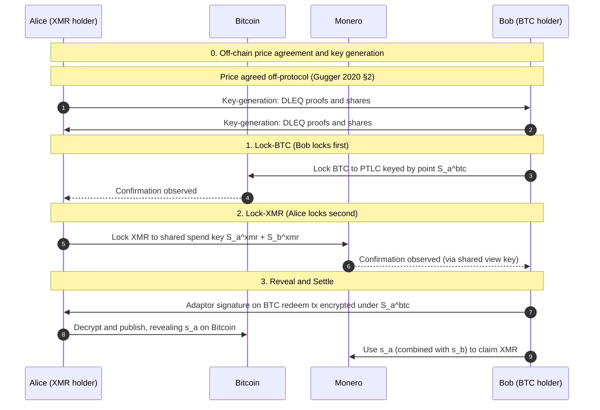

# Atomic Swaps Primer

Background appendix on how cross-chain atomic swaps work. Covers the
cryptographic mechanics, the canonical XMR-BTC flow, and the free-option
property of atomicity. Pure survey of deployed protocols and published
literature; no specific RFP designs.

## The primitive

An atomic swap is a two-party exchange of assets on two different chains where
either both legs settle or both legs unwind. Atomicity comes from cryptography,
not from a third party: a single secret unlocks both legs, and the protocol is
constructed so revealing the secret on one chain forces revelability on the
other.

Two cryptographic constructions are deployed:

- **Hash time-locked contract (HTLC)** for chain pairs where both chains have
  scripting expressive enough for hashlocks (`HASH160`/`SHA256` + `OP_EQUAL`),
  relative timelocks (`CHECKLOCKTIMEVERIFY` / `CHECKSEQUENCEVERIFY`), and a
  transaction-malleability fix (e.g. SegWit on Bitcoin). The lock outputs are
  spendable either by knowledge of a hash preimage (claim path) or by waiting
  out a timelock (refund path). Decred-Litecoin executed the first on-chain HTLC
  swap on 2017-09-19. Sources:
  [Decred blog, On-Chain Atomic Swaps (2017-09-20)](https://blog.decred.org/2017/09/20/On-Chain-Atomic-Swaps/)
  (accessed 2026-05-22);
  [Gugger 2020 §3.2](https://eprint.iacr.org/2020/1126.pdf) (accessed
  2026-05-22).
- **Adaptor signatures with cross-curve DLEQ proofs** for chain pairs where one
  side lacks the script primitives required for HTLC (Monero being the canonical
  case). The secret is a scalar that simultaneously serves as a private-key
  share on each chain's signature scheme; revealing it on one chain's signature
  enables the counterparty to sign on the other. The cross-curve DLEQ proof
  (proving the same scalar is a discrete log over two different elliptic-curve
  groups) is the gluing primitive. Sources:
  [Gugger, Bitcoin-Monero Cross-chain Atomic Swap, IACR 2020/1126](https://eprint.iacr.org/2020/1126.pdf)
  (accessed 2026-05-22);
  [Hoenisch and del Pino, Atomic Swaps between Bitcoin and Monero, arXiv:2101.12332](https://arxiv.org/abs/2101.12332)
  (accessed 2026-05-22);
  [getmonero.org: Bitcoin to Monero atomic swaps are now live, 2021-08-20](https://www.getmonero.org/2021/08/20/atomic-swaps.html)
  (accessed 2026-05-22).

The two constructions differ in their script requirements but share the same
trust model and the same free-option property.

## The canonical XMR-BTC swap

Standard adaptor-signature flow, as implemented by COMIT (`xmr-btc-swap`,
unmaintained since 2024-11) and its successor fork eigenwallet (`core`, v4.6.4
released 2026-05-21). The papers (Gugger 2020; Hoenisch and del Pino 2021)
present two directional variants; the deployed COMIT/eigenwallet code follows
the Hoenisch-del Pino direction (BTC locks first). See "Locking order" below for
why.

### Roles (deployed COMIT/eigenwallet direction)

- **Alice** holds XMR, wants BTC. She locks XMR second.
- **Bob** holds BTC, wants XMR. He locks BTC first.

The Hoenisch-del Pino paper labels are intentional: "Service Provider" plays
Alice (XMR seller), and the customer plays Bob (BTC seller). The deployed code
is BTC-first because the alternative (XMR-first with a maker holding BTC)
exposes the maker to a draining attack; see "Locking order" below.

### Sequence



What the secret is: the cross-curve DLEQ proof binds a single scalar `s_a` to a
secp256k1 point (Alice's adaptor-signature decryption key on the BTC side) and
to an Ed25519 point (Alice's Monero spend-key share). When Alice publishes the
decrypted BTC redeem signature on Bitcoin, `s_a` is on-chain. Bob then combines
`s_a + s_b` to spend the jointly-locked Monero. Source:
[Gugger 2020 §4.2](https://eprint.iacr.org/2020/1126.pdf);
[Hoenisch and del Pino 2021 Fig. 4](https://arxiv.org/abs/2101.12332).

### Price agreement is not a protocol step

Both papers treat price agreement as off-protocol. Gugger 2020 §2 says: "We
assume that they already have negotiated the price in advance ... This
negotiation can also be integrated into the protocol, for example by swap
services who provide a price to their customers." The first formal step in both
protocols is key generation, not a quote.

In practice, `xmr-btc-swap` and `eigenwallet/core` makers do publish a quote
over libp2p before swap setup begins (the maker daemon `asb` computes price from
off-chain ticker data). It relies on libp2p's secure-channel authentication for
transport-level integrity. This is an implementation-layer convention used by
maker software, not a step of the protocol.

### Locking order

The deployed code locks BTC first, and this is a **protocol-level constraint**
of the BTC-XMR construction: Monero today provides no on-chain primitive that
would let it play the locks-first role in any published atomic-swap protocol.

Three primary-source data points support this:

- The Monero core team's 2026-05-10 blog post *Deprecating Monero's Custom
  Transaction Unlock Time* states: *"It is a common misconception that Monero's
  Unlock Time is useful for known atomic swap or payment channel protocols. To
  date, no scheme has been specified that utilizes Monero's Unlock Time
  feature."* Source:
  [getmonero.org, 2026-05-10](https://www.getmonero.org/2026/05/10/deprecating-unlock-time.html)
  (accessed 2026-05-22).
- The eigenwallet team removed the XMR-first chapter from their compiled
  protocol paper on 2025-11-04 with the explanatory comment: *"We don't care
  about swaps where the Bitcoin seller is the maker because that is unsupported
  by the current Monero protocol. It will require a hardfork to work."* Source:
  [eigenwallet/protocol commit 6151734](https://github.com/eigenwallet/protocol)
  (accessed 2026-05-22).
- The upcoming FCMP++ hardfork (mid-2026) is *deprecating* Monero's timelock
  primitive rather than extending it, and does not introduce any of the
  candidate primitives (CLSAG-adaptor signatures, DLSAG, hidden timelocks) that
  an XMR-first construction would need.

The Hoenisch and del Pino 2021 §4 paper describes a reverse XMR-first variant
that would depend on *"adaptor signatures based on Monero's ring signature
scheme, which is a work-in-progress"*. Five years later, no peer-reviewed
Monero-endorsed CLSAG-adaptor construction has been published, and the Monero
project is not pursuing one. Treat XMR-first BTC↔XMR atomic swaps as
structurally unavailable for the foreseeable horizon. Source:
[`projects/xmr-first-required-monero-features.md`](https://github.com/marclawclaw/research-cross-chain-dex)
documents the underlying primary sources; this primer summarises.

The economic draining-attack analysis (Hoenisch and del Pino 2021 §4)
complements but does not replace the protocol constraint. Even if Monero gained
one of the missing primitives, the draining attack would still push the swap to
BTC-first for any pair where Bitcoin's refund-fee burden is smaller than
Monero's. Both layers point the same direction.

### Timelocks and refunds

Both timelocks are on the Bitcoin chain. Monero has no script primitive for
timelocks (Gugger 2020 §3.1: "Monero does not require any particular on-chain
primitives (hashlocks, timelocks)"). The XMR-side "refund" path works by one
party publishing a Bitcoin transaction that reveals a secret, which the
counterparty then uses to spend the jointly-locked Monero output.

- `t_1` (cancel timelock): blocks after `tx_lock^btc` confirms before
  `tx_cancel^btc` can be published by either party. Determines the upper bound
  on Alice's redeem window.
- `t_2` (punish timelock): blocks after `tx_cancel^btc` confirms before Alice
  can publish `tx_punish^btc` to take Bob's BTC if Bob has stayed offline.

Source: [Hoenisch and del Pino 2021 §3.3](https://arxiv.org/abs/2101.12332).

Refund path (when the swap fails to reach reveal):

```mermaid
sequenceDiagram
    autonumber
    participant A as Alice (XMR holder)
    participant BTC as Bitcoin
    participant B as Bob (BTC holder)

    Note over A,B: TxLock(BTC) confirmed; swap stalls before reveal
    Note over A,B: Wait t_1 blocks
    A->>BTC: Either party publishes TxCancel (consumes TxLock)
    Note over A,B: TxCancel confirmed; refund window now open

    alt Bob refunds within t_2
        B->>BTC: Publish TxRefund (consumes TxCancel)
        Note over A,B: Bob recovers BTC; swap unwinds with no settlement
    else Bob stays offline past t_2
        A->>BTC: Publish TxPunish (consumes TxCancel after t_2)
        Note over A,B: Alice takes Bob's BTC as punishment for non-participation
    end
```

Canonical mainnet values:

- **`comit-network/xmr-btc-swap`** (upstream, unmaintained): `t_1 = 72` blocks
  (~12h), `t_2 = 72` blocks (~12h); total refund window ~24h.
- **`eigenwallet/core`** (active fork, as of 2026-05-22): `t_1 = 24` blocks
  (~4h), `t_2 = 144` blocks (~24h); total refund window ~28h.

A swap that proceeds normally completes in roughly one Bitcoin confirmation
depth for the BTC lock plus one Monero confirmation depth for the XMR lock plus
the reveal latency.

### Production status of XMR-BTC implementations

- **COMIT `xmr-btc-swap`**: original reference implementation,
  [unmaintained since 2024-11, archival pending per issue #1791](https://github.com/comit-network/xmr-btc-swap)
  (accessed 2026-05-22). Last formal release v1.0.0-rc.1 on 2024-11-15.
- **eigenwallet `core`**: active fork of `xmr-btc-swap`; v4.6.4 released
  2026-05-21 (14 releases in the 47 days from 2026-04-05 to 2026-05-21).
  [github.com/eigenwallet/core](https://github.com/eigenwallet/core) (accessed
  2026-05-22).
- **Farcaster Project (`farcaster-project/farcaster-node`)**: independent
  BTC-XMR implementation. Last formal release v0.8.4 on 2023-01-16; last code
  push 2024-08-11; not archived but inactive since 2024. Source:
  [github.com/farcaster-project/farcaster-node](https://github.com/farcaster-project/farcaster-node)
  (accessed 2026-05-22).
- **AtomicDEX / Komodo Wallet**: rebranded to "Komodo Wallet" in 2025. No public
  BTC-XMR pair-level volume figures available; Nomics' last published 24-hour
  volume for AtomicDEX was approximately USD 5,737 from November 2021. Source:
  [Nomics: AtomicDEX](https://nomics.com/exchanges/atomicdex) (accessed
  2026-05-19).
- **Liquality**: consumer atomic-swap wallet extension discontinued effective
  2024-06-15. Sources:
  [Liquality on X, 2024-05-20](https://x.com/Liquality_io/status/1792678368694985162)
  (accessed 2026-05-19);
  [Rootstock Helpdesk: Liquality](https://helpdesk.rootstock.io/solutions/liquality.html)
  (accessed 2026-05-19).

The XMR-BTC corridor is operational at community scale. See the
[trust-model contrast appendix](./cross-chain-trust-model-contrast.md) for
cumulative-volume comparison against federated-signer protocols.

## The free-option problem

Atomic swaps are deliberately symmetric: either party can refuse the next
message at any stage, and both sides refund at timeout. From outside, this looks
like a stall; structurally, it is the design.

At each phase boundary, one party has committed (locked their leg) and the other
has not yet acted. The uncommitted party holds a **free option**: they can
observe the market for the duration of the lock window and proceed only if the
trade is still in their favour.

Stage-by-stage in the deployed BTC-first XMR-BTC flow:

1. **After Bob locks BTC (step 1, before step 2).** Alice holds the free option.
   If XMR price has moved against her since the quote, she simply does not lock
   XMR. Bob's BTC refunds at timeout. Alice's downside: time. Bob's downside:
   refund-fee burden and lock window with BTC wedged.
2. **After Alice locks XMR (step 2, before step 3).** Bob holds the free option.
   If the price has moved against him, he does not deliver the adaptor
   signature. Both legs refund at timeout. Bob's downside: time. Alice's
   downside: capital wedged for the longer refund window.
3. **After secret reveal (step 3 onward).** No party holds an option; the swap
   completes deterministically.

This is the **free-option problem** of atomic swaps. It is not a bug in any
particular implementation; it is the cost of atomicity itself. Han, Lin, and Yu
2019 prove the atomic swap is formally equivalent to a premium-free American
Call Option and estimate the implicit premium using the Cox-Ross-Rubinstein
option-pricing model at 2-3% of asset value for cryptocurrency pairs (vs ~0.3%
for stocks and fiat). The paper provides the mechanism and quantifies the
premium; it does not directly attribute deployed-protocol volume scarcity to the
free-option problem. Source:
[Han et al., On the optionality and fairness of Atomic Swaps, IACR 2019/896](https://eprint.iacr.org/2019/896)
(accessed 2026-05-22).

Empirically the free-option problem is a friction rather than an absolute
blocker. eigenwallet runs a community-scale BTC-XMR atomic-swap market with
single-digit active makers, ~89k cumulative binary downloads, and developer-
reported 3,000+ mainnet swaps via the GUI in 2023 alone, demonstrating that the
protocol is workable for privacy-maximalist user bases even without a
free-option mitigation. See the
[trust-model contrast appendix](./cross-chain-trust-model-contrast.md) for
adoption-scale comparison against federated-signer protocols.

### Notation for option value

The expected value of a free option held over a timelock window scales as:

`option_value ≈ σ × √T × notional`

where:

- `σ` = annualised volatility of the price ratio between the two swap legs;
- `T` = duration of the timelock window (the period over which the option holder
  can observe and decide);
- `notional` = size of the locked leg.

This is a Black-Scholes-style approximation, valid for small `T` and
continuous-time random-walk price dynamics. It is the standard way to size a
bond, premium, or cap intended to neutralise the free option a counterparty
holds during a lock window.

## How locking order generalises across pairs

For HTLC swaps with two script-bearing chains (BTC-LTC, BTC-ETH), the
lock-ordering is conventional: both chains can play either role. Operational
choice usually puts the chain with the **shorter refund-fee burden** or
**stronger maker-side draining-attack protection** first.

For adaptor-signature swaps **involving Monero**, the locking order is fixed by
protocol: **the non-Monero side must lock first**, because Monero today provides
no on-chain primitive that supports the locks-first role in any published
atomic-swap construction. This is the same constraint analysed under "Locking
order" above and applies to every XMR↔X pair: X must lock first. The situation
will not change without a Monero hardfork that adds at least one of: DLSAG,
hidden timelocks, or a published CLSAG-adaptor construction adopted by the
Monero project; none of these is on the Monero roadmap as of 2026-05.

For adaptor-signature swaps with other restricted-scripting chains (Grin and
others), the locks-first rule may be driven by primitive availability or by the
draining-attack economic constraint, depending on what each chain's signature
scheme supports. Each pair must be analysed individually.

## A defensible "BTC-XMR took 4 years" claim

The first published BTC-XMR atomic-swap protocol is Gugger 2020 (IACR ePrint
2020/1126); the COMIT reference implementation reached public mainnet on
2021-08-20. From first formal proposal to working mainnet implementation was
about 18 months, not four years.

However, BTC-XMR was the hardest atomic-swap case to bring to mainnet because
Monero has no scripting for HTLCs. The cryptographic gap (cross-curve DLEQ
proofs plus ECDSA one-time verifiably-encrypted signatures) was bridged by
intermediate work (Noether 2018 MRL-0010 for cross-curve DLEQ; Fournier 2019 for
ECDSA one-time VES). From the **first on-chain HTLC swap** (Decred-Litecoin
2017-09-19) to the **first BTC-XMR adaptor-signature swap on mainnet** (COMIT
2021-08-20) is approximately four years of cryptographic and engineering work to
bridge the script-vs-no-script chain gap. Sources:
[Decred blog, On-Chain Atomic Swaps (2017-09-20)](https://blog.decred.org/2017/09/20/On-Chain-Atomic-Swaps/);
[getmonero.org, Bitcoin to Monero atomic swaps are now live (2021-08-20)](https://www.getmonero.org/2021/08/20/atomic-swaps.html);
[Gugger 2020](https://eprint.iacr.org/2020/1126.pdf);
[Hoenisch and del Pino 2021](https://arxiv.org/abs/2101.12332). The TierNolan
bitcointalk post (topic 193281, 2013-05-21) is the originating idea for
cross-chain atomic swaps, cited as reference [17] in Hoenisch and del Pino 2021.

## What atomic swaps do not provide

- **Counterparty availability.** Both parties must be online to lock, reveal,
  and (on adversarial paths) submit refund transactions. If one party goes
  offline mid-swap, the other waits out the refund window.
- **Per-trade matching.** No protocol-owned liquidity; each swap requires a
  willing counterparty for the exact pair and size.
- **Pair coverage by default.** HTLC required hashlocks plus timelocks plus
  malleability fixes on both chains; adaptor signatures generalise this but each
  pair still needs cross-curve cryptographic work.
- **Settlement speed.** End-to-end time is dominated by the slowest chain's
  confirmation depth plus the timelock window.

These are intrinsic limits of the primitive, not deficiencies of any particular
implementation. Deployed protocols address them with off-protocol layers (intent
gossip for liveness, market-making conventions for matching) or accept them as
user-facing constraints.

## References

- [Decred blog, On-Chain Atomic Swaps (2017-09-20, first on-chain swap, Decred-Litecoin)](https://blog.decred.org/2017/09/20/On-Chain-Atomic-Swaps/)
  (accessed 2026-05-22)
- [Gugger, Bitcoin-Monero Cross-chain Atomic Swap, IACR 2020/1126](https://eprint.iacr.org/2020/1126.pdf)
  (accessed 2026-05-22)
- [Hoenisch and del Pino, Atomic Swaps between Bitcoin and Monero, arXiv:2101.12332 (2021-01-29)](https://arxiv.org/abs/2101.12332)
  (accessed 2026-05-22)
- [getmonero.org: Bitcoin to Monero atomic swaps are now live (2021-08-20)](https://www.getmonero.org/2021/08/20/atomic-swaps.html)
  (accessed 2026-05-22)
- [Han et al., On the optionality and fairness of Atomic Swaps, IACR 2019/896](https://eprint.iacr.org/2019/896)
  (accessed 2026-05-22)
- [comit-network/xmr-btc-swap (unmaintained since 2024-11)](https://github.com/comit-network/xmr-btc-swap)
  (accessed 2026-05-22)
- [eigenwallet/core (active fork; v4.6.4, 2026-05-21)](https://github.com/eigenwallet/core)
  (accessed 2026-05-22)
- [farcaster-project/farcaster-node (independent XMR-BTC implementation; v0.8.4 release 2023-01-16, last push 2024-08-11)](https://github.com/farcaster-project/farcaster-node)
  (accessed 2026-05-22)
- [Nomics: AtomicDEX](https://nomics.com/exchanges/atomicdex) (accessed
  2026-05-19)
- [Liquality on X: discontinuation (2024-05-20)](https://x.com/Liquality_io/status/1792678368694985162)
  (accessed 2026-05-19)
