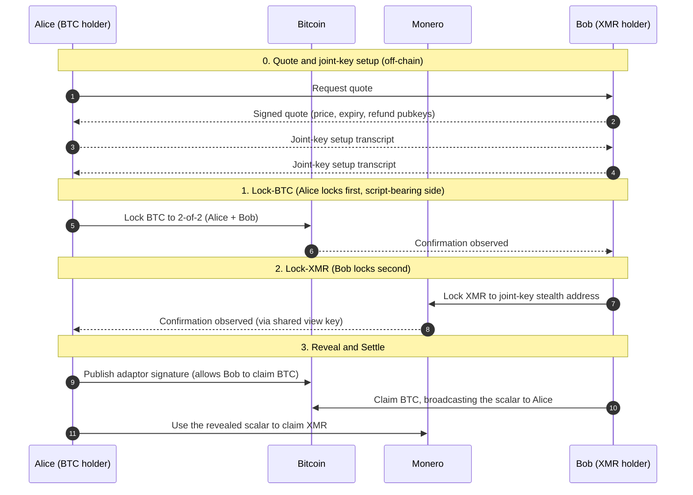

# Atomic Swaps Primer

Background appendix on how cross-chain atomic swaps work. Covers the
cryptographic mechanics, the canonical XMR-BTC flow, and the free-option
property of atomicity. Pure survey of deployed protocols and published
literature; no specific RFP designs.

## The primitive

An atomic swap is a two-party exchange of assets on two different chains where
either both legs settle or both legs unwind. Atomicity comes from cryptography,
not from a third party: a single secret unlocks both legs, and the protocol is
constructed so revealing the secret on one chain forces revelability on the
other.

Two cryptographic constructions are deployed:

- **Hash time-locked contract (HTLC)** for chain pairs with compatible
  scripting. The lock outputs are spendable either by knowledge of a hash
  preimage `s` (claim path) or by waiting out a timelock (refund path).
  Decred-Litecoin executed the first on-chain HTLC swap on 2017-09-20. Source:
  [Decred blog, On-Chain Atomic Swaps (2017-09-20)](https://blog.decred.org/2017/09/20/On-Chain-Atomic-Swaps/)
  (accessed 2026-05-21).
- **Adaptor signatures with cross-curve DLEQ proofs** for chain pairs where one
  side has restricted scripting (e.g. Monero). The secret is a scalar that
  completes a signature on one chain; revealing it lets the counterparty produce
  a valid signature on the other. The construction was first proposed for
  BTC-XMR in 2017 and reached working implementations in 2021. Sources:
  [Gugger, Bitcoin-Monero Cross-chain Atomic Swap, IACR 2020/1126](https://eprint.iacr.org/2020/1126.pdf)
  (accessed 2026-05-21);
  [Hoenisch and del Pino, Atomic Swaps between Bitcoin and Monero, arXiv:2101.12332](https://arxiv.org/abs/2101.12332)
  (accessed 2026-05-21);
  [getmonero.org: Bitcoin to Monero atomic swaps are now live, 2021-08-20](https://www.getmonero.org/2021/08/20/atomic-swaps.html)
  (accessed 2026-05-21).

The two constructions differ in their script requirements but share the same
trust model and the same free-option property.

## The canonical XMR-BTC swap

Standard adaptor-signature flow, as implemented by COMIT (`xmr-btc-swap`,
archival pending since 2024-11) and its successor fork eigenwallet (`core`,
active as of v4.6.1 on 2026-05-15).

### Roles

- **Alice** holds BTC, wants XMR.
- **Bob** holds XMR, wants BTC.

### Sequence

### Why BTC is locked first

The script-bearing side locks first **by construction of the adaptor-signature
primitive**, not as a design choice.

The mechanism: the secret that completes the swap is an Ed25519 scalar `s` whose
discrete log corresponds to one half of the joint Monero spend key. Alice's
adaptor signature on a Bitcoin transaction is a *signature with `s` factored
out*; Bob can adapt it into a valid signature by adding `s`, but the act of
broadcasting that adapted signature on Bitcoin publishes `s` as part of the
on-chain transaction (it can be extracted by anyone observing the broadcast).
Alice then uses `s` to construct a Monero spend signature for the joint-key
output, claiming the XMR.

Reversing the order does not compose:

- If Bob locked XMR first, there would be no Bitcoin transaction whose broadcast
  reveals `s`. Bob would need a way to commit to `s` such that Alice can extract
  it after she locks BTC — but the only mechanism the primitive provides is
  "Bob's broadcast of a Bitcoin-claim signature reveals `s`", which presupposes
  Bob has something to claim on Bitcoin.
- Equivalently: the secret-revelation flow points from BTC settlement to XMR
  claimability. The chain that hosts the adaptor signature (BTC) must hold a
  lock the counterparty wants to claim before the secret materialises.

Consequence: **whichever chain holds the script side of the swap locks first.**
For XMR-BTC, BTC. For XMR with any other script-bearing chain, that chain. This
is a property of the primitive, fixed independently of who is taker or maker.

### Timelocks and refunds

Each lock has a refund timelock. If the swap stalls before reveal, the locker
can sweep their lock back after the timelock expires. The script-side refund
(Alice's BTC) typically has a shorter timelock than the secret-side refund
(Bob's XMR), so Alice cannot wait until Bob has refunded his XMR and then claim
Alice-side BTC anyway.

Refund and claim windows are conventionally measured in hours. A swap that
proceeds normally completes in roughly one Bitcoin confirmation depth (typically
10-60 minutes for the BTC lock) plus one Monero confirmation depth (typically
10-30 minutes for the XMR lock) plus the reveal latency.

### Production status of XMR-BTC implementations

- **COMIT `xmr-btc-swap`**: original reference implementation,
  [unmaintained since 2024-11, archival pending per issue #1791](https://github.com/comit-network/xmr-btc-swap)
  (accessed 2026-05-21).
- **eigenwallet `core`**: active fork of `xmr-btc-swap`; v4.6.1 released
  2026-05-15. [github.com/eigenwallet/core](https://github.com/eigenwallet/core)
  (accessed 2026-05-21).
- **Farcaster Project (`farcaster-project/farcaster-node`)**: independent
  BTC-XMR implementation. Still listed as actively maintained as of 2026, with
  Lightning BTC support added to reduce BTC-side confirmation time.
  Community-scale rather than volume-scale operation. Sources:
  [xgram.io: Best Monero atomic swap platforms 2026](https://xgram.io/blog/best-xmr-atomic-swaps-and-community-services-2026)
  (accessed 2026-05-19);
  [github.com/farcaster-project](https://github.com/farcaster-project) (accessed
  2026-05-19).
- **AtomicDEX / Komodo Wallet**: rebranded to "Komodo Wallet" in 2025. Public
  trackers report no recent volume; Nomics' last published 24-hour volume figure
  is approximately USD 5,737 from November 2021. Source:
  [Nomics: AtomicDEX](https://nomics.com/exchanges/atomicdex) (accessed
  2026-05-19).
- **Liquality**: consumer atomic-swap wallet extension discontinued effective
  2024-06-15. Sources:
  [Liquality on X, 2024-05-20](https://x.com/Liquality_io/status/1792678368694985162)
  (accessed 2026-05-19);
  [Rootstock Helpdesk: Liquality](https://helpdesk.rootstock.io/solutions/liquality.html)
  (accessed 2026-05-19).

The XMR-BTC corridor is operational but at community scale. See the
[trust-model contrast appendix](./cross-chain-trust-model-contrast.md) for
cumulative-volume comparison against federated-signer protocols.

## The free-option problem

Atomic swaps are deliberately symmetric: either party can refuse the next
message at any stage, and both sides refund at timeout. From outside, this looks
like a stall; structurally, it is the design.

At each phase boundary, one party has committed (locked their leg) and the other
has not yet acted. The uncommitted party holds a **free option**: they can
observe the market for the duration of the lock window and proceed only if the
trade is still in their favour.

Stage-by-stage in the XMR-BTC flow:

1. **After Alice locks BTC (step 1, before step 2).** Bob holds the free option.
   If XMR price has moved against him since the quote, he simply does not lock
   XMR. Alice's BTC refunds at timeout. Bob's downside: time. Alice's downside:
   lock window plus refund timelock with capital wedged.
2. **After Bob locks XMR (step 2, before step 3).** Alice holds the free option.
   If the price has moved against her, she does not publish the adaptor
   signature. Both legs refund at timeout. Alice's downside: time. Bob's
   downside: capital wedged for the longer refund window.
3. **After secret reveal (step 3 onward).** No party holds an option; the swap
   completes deterministically.

This is the **free-option problem** of atomic swaps. It is not a bug in any
particular implementation; it is the cost of atomicity itself. Cited in the
literature as the structural reason atomic-swap volume has remained small
despite working implementations. Source:
[Han et al., On the optionality and fairness of Atomic Swaps, IACR 2019/896](https://eprint.iacr.org/2019/896)
(accessed 2026-05-21).

### Notation for option value

The expected value of a free option held over a timelock window scales as:

`option_value ≈ σ × √T × notional`

where:

- `σ` = annualised volatility of the price ratio between the two swap legs;
- `T` = duration of the timelock window (the period over which the option holder
  can observe and decide);
- `notional` = size of the locked leg.

This is a Black-Scholes-style approximation, valid for small `T` and
continuous-time random-walk price dynamics. It is the standard way to size a
bond, premium, or cap intended to neutralise the free option a counterparty
holds during a lock window.

## Generalising the locks-first rule across pairs

The lock-ordering constraint is a property of the cryptographic construction,
not of the specific BTC-XMR pair. In any adaptor-signature swap, the
**script-bearing side** (the chain that hosts the adaptor signature whose
broadcast reveals the secret scalar) must lock first. The non-script side, where
the swap output is a joint-key construction that the secret unlocks, locks
second.

For HTLC swaps, the analogous constraint is that the chain whose HTLC reveals
the preimage on claim must be locked first; the chain whose HTLC consumes the
same preimage on its claim path then settles second. In practice for
symmetric-script pairs (e.g. BTC-LTC) the ordering is conventional rather than
forced, since both chains can play either role.

For XMR paired with any other chain, XMR is always the non-script side. The
script-bearing partner locks first.

## What atomic swaps do not provide

- **Counterparty availability.** Both parties must be online to lock, reveal,
  and (on adversarial paths) submit refund transactions. If one party goes
  offline mid-swap, the other waits out the refund window.
- **Per-trade matching.** No protocol-owned liquidity; each swap requires a
  willing counterparty for the exact pair and size.
- **Pair coverage by default.** HTLC required compatible scripting on both
  chains; adaptor signatures generalise this but each pair still needs
  cross-curve cryptographic work (BTC-XMR required ~4 years from proposal to
  working implementation).
- **Settlement speed.** End-to-end time is dominated by the slowest chain's
  confirmation depth plus the timelock window.

These are intrinsic limits of the primitive, not deficiencies of any particular
implementation. Deployed protocols address them with off-protocol layers (intent
gossip for liveness, market-making conventions for matching) or accept them as
user-facing constraints.

## References

- [Decred blog, On-Chain Atomic Swaps (2017-09-20, first on-chain swap, Decred-Litecoin)](https://blog.decred.org/2017/09/20/On-Chain-Atomic-Swaps/)
  (accessed 2026-05-21)
- [Gugger, Bitcoin-Monero Cross-chain Atomic Swap, IACR 2020/1126](https://eprint.iacr.org/2020/1126.pdf)
  (accessed 2026-05-21)
- [Hoenisch and del Pino, Atomic Swaps between Bitcoin and Monero, arXiv:2101.12332 (2021-01-29)](https://arxiv.org/abs/2101.12332)
  (accessed 2026-05-21)
- [getmonero.org: Bitcoin to Monero atomic swaps are now live (2021-08-20)](https://www.getmonero.org/2021/08/20/atomic-swaps.html)
  (accessed 2026-05-21)
- [Han et al., On the optionality and fairness of Atomic Swaps, IACR 2019/896](https://eprint.iacr.org/2019/896)
  (accessed 2026-05-21)
- [comit-network/xmr-btc-swap (unmaintained since 2024-11; archival pending)](https://github.com/comit-network/xmr-btc-swap)
  (accessed 2026-05-21)
- [eigenwallet/core (active fork of xmr-btc-swap; v4.6.1, 2026-05-15)](https://github.com/eigenwallet/core)
  (accessed 2026-05-21)
- [farcaster-project/farcaster-node (independent XMR-BTC implementation; last release v0.8.4, 2023-01-16)](https://github.com/farcaster-project/farcaster-node)
  (accessed 2026-05-21)
