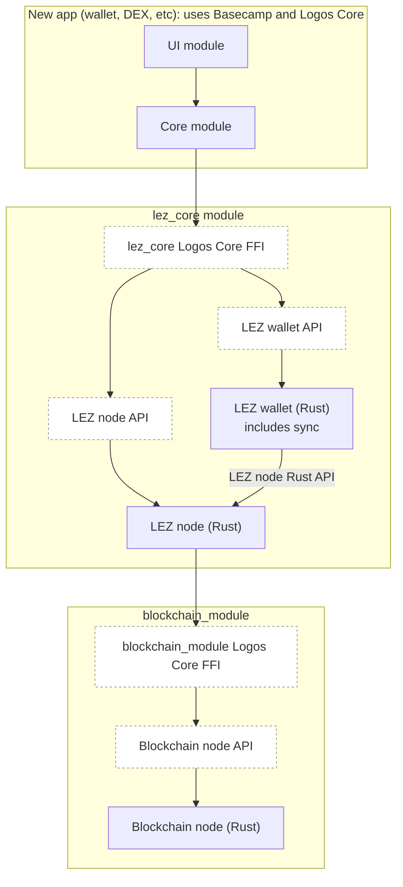
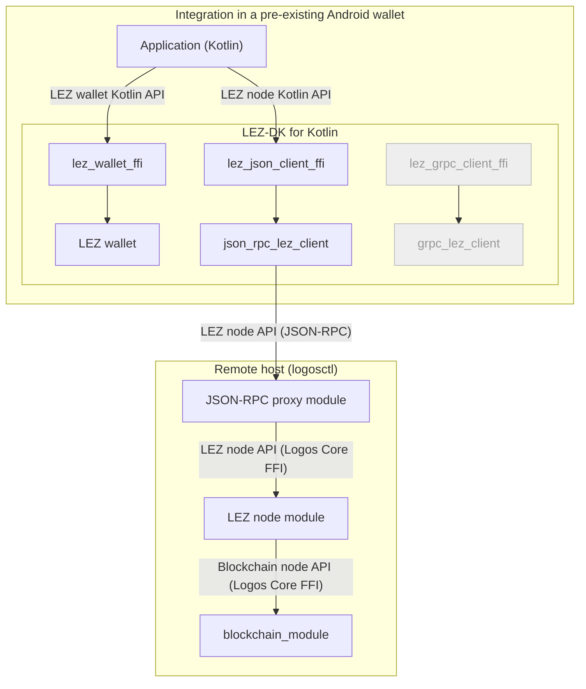
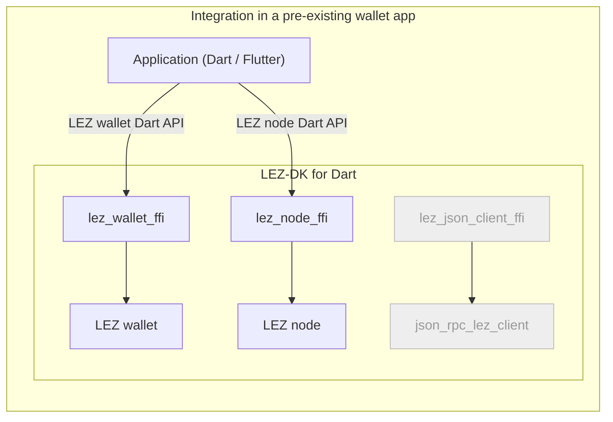

# Appendix: Integrating the Logos Technology Stack

This appendix describes how an application reaches the Logos technology stack,
and what that costs. It covers the shapes an integration takes, the components
the stack exposes to serve them, the measured size of the node libraries an
embedded integration links, and the questions the stack has not yet settled.

It is written as shared background for the RFPs that define those components
individually, rather than as a specification of any one of them. Where it names
a deliverable, the RFP for that deliverable is the authority on its scope.

## Scope and priority

The Logos technology stack comprises four main components:

- **Logos Blockchain**: the L1 settlement layer.
- **LEZ (Logos Execution Zone)**: the programmable execution layer.
- **Storage**: decentralised storage.
- **Delivery**: messaging and delivery infrastructure.

**Regarding integration, this appendix treats LEZ and Logos Blockchain integration as the primary focus.** An integrator may use either chain individually, or both together;
the analysis and recommendations below are written with that in mind.

**Storage** is treated as medium priority, with potential integrators already identified; or as a potential extension to successful LEZ or Blockchain integration.

**Delivery** is treated as lowest priority at this point in time.

## Integration paths

We attempt to categorise the type of integrations that we want to enable. Such
categorisation helps define technical solutions, as well as prioritising based
on demand and value.

### Basecamp & Logos Core

The Basecamp and Logos Core framework is the canonical way to integrate Logos
technology stack components.

It is proven and working on **desktop platforms** (Linux & Mac, Windows is
actively worked on), as well as **server platforms** with `logosctl`.

**Mobile support** is currently planned for testnet 0.4. Architecture is not
defined at this stage but functionality is expected to be similar as Basecamp
desktop.

#### Technology Stack

- Business logic can be written in any language as long as FFI bindings can be
  exposed as a "Logos SDK" (C++, Rust, etc). Note that to facilitate developer
  experience, best to have a Logos SDK for the target language. Currently, Logos
  SDK are available in C++, Rust, Nim and JavaScript.
- Canonical UIs are written in QML with C++ Backend, but support for Web
  (QtWebView mobile, QtWebEngine desktop) has been investigated (need to clarify
  commitment).

For the integrators:

#### Added Value

Logos Basecamp and the core framework are in themselves a valuable product for
secure, private and censorship-resistant distribution of software to users.

- **No reliance on any centralised service**: once Basecamp is installed, the
  whole experience is meant to be over the Logos technology stack: module
  discovery over dedicated DHT, distribution run over Logos Storage (WIP)
- **Secure distribution**, with developer signatures and module integrity checks
  integrated (WIP)
- **Isolated sandboxes** per module, giving a safe execution environment despite
  running native software.
- **Access to the full stack via composition**: messaging, storage and
  blockchain are existing modules to assemble, and an application composed from
  them inherits metadata protection and private state support whether or not its
  developer built anonymity measures directly.
- **Modules are a fault and audit boundary**. Each is developed, audited and
  upgraded independently, and a defect in one does not reach the others.

#### Frictions

- **Distribution via Basecamp/Basecamp as a dependency**: The canonical
  distribution path involves the installation of Basecamp or `logosctl` first.
  Distribution via Basecamp and not App Store for mobile (To Be Confirmed).
  However, there is an available path to **build the application as one
  standalone native app**, linking in all necessary modules. It is currently for
  development purposes only but it could potentially enable distribution both
  via Basecamp and directly.
- **Language/Framework limitations**: The FFI approach facilitates integration
  in most platforms (browser being the obvious outlier). However, QML is not
  commonly used. React Native is the most used stack for multi-chain wallets
  (8/10 top wallets; see appendix). With Dart/Flutter and native Swift/Kotlin
  being used by 2 exceptions. This does open the question of whether **an
  electron-like experience could convince a migration** to Basecamp (not a
  straightforward choice due to the security goals).

#### Current/Potential Gaps

- Completion of Basecamp full USP (security for b)
- Mobile support
- Electron-like experience/Web UI (?)
- Standalone app release build (?)

### JSON-RPC Providers + Wallet Library

It is possible to adopt an architecture similar to classic Web3 by exposing APIs
via JSON-RPC. Similar to Eth/Infura, IPFS Gateways, etc.

In this instance, Logos Core CLI can be used to manage Logos nodes (LEZ,
Blockchain, Delivery, Storage).

#### Ecosystem overview 

For most blockchains, wallet functionality (signing, proving for LEZ) is
excluded from the JSON-RPC functionalities. `bitcoind` remains the main
exception as of today.

From superficial research, a variety of languages is used by potential
integrators (Rust, Golang, Node.JS, C++, etc.; see appendix).

From a recent L1 launch perspective, non-EVM chains tend to provide a full suite of native SDKs (Sui 8 languages, Aptos 4, Injective/Cosmos 4; see appendix). The SDKs are all native (non-FFI) implementations of their wallet features.

Only Bitcoin uses a Rust-FFI strategy (Bitcoin Dev Kit) to minimize re-writing of software.

The most obvious benefit of a Rust-FFI approach is limiting software rewrite by maintaining the core logic in one codebase. This has been seen as critical for Bitcoin due to the limited number of developers (including cryptographers) who understand Bitcoin protocols and are motivated to implement the libraries. BIPs are usually implemented in rust-bitcoin first, where Bitcoin maintainers primarily work. However, there are a number of drawbacks:
 1. The cost of wrapping and making the FFI work on various platforms may not be as predictable as rewriting the library.
2. The developer experience is less idiomatic, using less type-safety across all languages as the API needs to be flat and compatible for all languages;
3. No tree-shaking is available, meaning all functionality is present in the pre-built artefact, unless several FFI libraries are provided; especially important for mobile platforms.
4. Duplication between libraries: to avoid one big library with no tree-shaking, a solution can be to split them (e.g., LDK vs BDK). The resulting issue is that both dev kits may ship common code.

The complexity of the wallet software seems to have a strong influence on the design choice between Sui and Bitcoin. In Sui, the clients mostly sign transactions, with the chain state being provided by the RPC node. More complex logic is needed for a Bitcoin wallet: UTXO tracking, building transactions satisfying complex descriptions (miniscript), and validating them locally. **LEZ is clearly closer to Bitcoin in this regard due to the need to execute private transactions locally to prove them.** However, **Logos Blockchain wallet logic is very light** (the `wallet` crate in `logos-blockchain` is ~2.5 kLOC and the wallet service runs node-side; see [Appendix: L1 SDK Strategies, section 5.2](./l1-sdk-strategies.md#52-logos-blockchain-does-not-fit-the-same-gap)). In terms of cost of re-implementation, **the LEZ wallet is the main risk, and re-implementation of Logos Blockchain wallet logic in another language may be a cost-effective solution.**

#### Logos characteristics

There are a few characteristics to note for a Logos wallet library that differs from other L1s, in
addition to being non-EVM:
- 2 chains to integrate: Logos Blockchain the L1, native tokens are native to the L1, so is staking; LEZ is the programmable chain living in a zone; anyone can create their own zone: Zone-as-a-Service.
- The chains have different cryptographic schemes between LEZ and Logos (Secp256k1, ed25519)
- LEZ private transactions require client-side proving

**If the RPC node and the wallet are run by different entities, are private transactions still valuable?**

The answer depends on which chain is being used.

**LEZ private transactions.** Mostly yes, with caveats. Submitting a private transaction to an RPC endpoint does reveal network-level PII (IP address, API key) and the transaction payload that the RPC receives. That payload includes commitments and nullifiers, but the actual private account state is not in the payload: private values are encrypted to the recipient's viewing key and remain local to the account owner. A recipient with the viewing key can later decrypt the post-state, but the RPC provider cannot read it without that key. If a public account is involved in the transaction, the public portion is visible to the RPC provider as it would be to any node.

**Logos Blockchain transactions.** The value is reduced because the privacy mechanism is different. Transaction contents are public on the ledger, similar to Bitcoin. The Bedrock layer does not hide transaction data; instead, privacy is provided at the network level by the Blend Network, which hides the identity of block proposers and, with EmPoWering, blends transactions among core nodes and concurrent transactions to obscure their origin. Submitting through a third-party RPC bypasses the Blend Network entirely, because the RPC receives the transaction directly from the caller before relaying it. The RPC operator therefore sees the full transaction contents and can correlate them with the caller's IP address and API key. The only way to benefit from Blend privacy is to submit directly to the peer-to-peer network.

**Storage and delivery.** Privacy is not primarily provided by the RPC boundary. It comes from participating directly in the mix, gossipsub, or DHT networks. Routing reads or writes through a remote RPC provider therefore weakens the privacy properties those protocols are designed to provide.

Thus, trust assumptions need to be considered when separating the node from the wallet. When both run inside the same infrastructure (for example, a CEX or custodian), the trust assumptions are similar to running them on the same device. However, when the RPC node is run by one entity (a project team or provider) and the wallet by another (an end-user wallet, DEX, or aggregator), the RPC provider can see transaction metadata and correlate it with the caller. That weakens the value of LEZ private transactions and removes the Logos Blockchain Blend privacy entirely relative to running the node locally.

#### Potential demand

The JSON-RPC provider + wallet library model is likely to be the highest-demand path for pre-existing applications that cannot adopt Basecamp. Likely consumers include:

- **Existing mobile wallets** adding LEZ or Logos Blockchain support. They need a wallet library in Kotlin, Swift, Dart, or React Native, plus a JSON-RPC client, but they cannot embed a node due to mobile size limits.
- **Centralised exchanges and custodians** that already run their own node infrastructure. They need wallet operations (key handling, signing, proving) exposed through a language SDK while their backend runs the node.
- **Server-side integrators** in Go, Rust, Node.js, or Python that prefer a library to a Basecamp module workflow.
- **RPC providers** that want to expose Logos nodes through a standard transport without requiring consumers to use Basecamp.

This model intentionally leaves the node out of the mobile artefact. Mobile libraries ship with JSON-RPC clients only; nodes run on desktop, server, or in Basecamp. The dynamic loading of modules via `logos-liblogos` is the mechanism Basecamp and standalone module hosts use, but it is not required for a JSON-RPC client library.

### Node and Wallet as a Library

This path is for integrators who want to embed both the node and the wallet in
their own application process, without adopting Basecamp or Logos Core as a
framework. It is the closest to a traditional light-client or embedded-node
model: the application links native libraries that provide chain
synchronisation, state queries, transaction construction, signing, and
submission, all running locally.

It differs from Basecamp in that the integrator does not write business logic as
Logos modules or distribute through Basecamp. It differs from the JSON-RPC
provider path in that there is no remote node: the wallet and node are
co-located in the same process and communicate through in-process APIs rather
than over a transport.

#### Technology Stack

- The node is linked as a native library (for example, `libindexer_ffi.so` for
  LEZ, `liblogos_blockchain_c.so` for Logos Blockchain).
- The wallet is linked as a native library, either from the same crate or a
  separate one.
- Language bindings are generated over the Rust FFI boundary, similar to BDK.
- The application initialises and drives both node and wallet lifecycles
  directly.

#### Added Value

- **No network dependency for reads or writes**: once synced, the application
  can query chain state and submit transactions without reaching a third-party
  RPC endpoint.
- **Stronger privacy**: the user does not reveal which addresses or
  transactions they care about to a remote RPC provider.
- **Censorship resistance**: the application talks directly to the peer-to-peer
  network.
- **Unified control**: the integrator owns the full stack and can tune sync,
  caching, and resource use.

#### Frictions

- **Artefact size**: embedding a node is expensive. The LEZ indexer FFI library
  alone is ~28 MiB stripped; the Logos Blockchain node library is ~84.5 MiB
  stripped. Together they exceed typical mobile size budgets before application
  code or assets are added.
- **Build complexity**: integrators must link Rust crates or prebuilt native
  libraries and manage their dependency graphs, including ZK circuit artefacts
  that currently do not build for Android or iOS.
- **Resource consumption**: running a node consumes CPU, memory, battery, and
  storage, which is punishing on mobile.
- **Platform support gaps**: mobile builds of the node libraries are not yet
  available, and the ZK circuits they depend on are not ported to mobile
  architectures.
- **No public SDK today**: unlike the JSON-RPC client path, there is no
  published LEZ-DK or Logos Blockchain SDK that exposes an embedded-node API for
  Kotlin, Swift, Dart, or Go.

#### Current/Potential Gaps

- Mobile builds of LEZ and Logos Blockchain node libraries.
- Size optimisation and modularisation of node libraries.
- FFI bindings for embedded-node APIs in target languages.
- Decision on whether the embedded node belongs in the same development kit as
  the wallet or in a separate, larger artefact.

## Existing Logos SDKs

Logos provides language SDKs for authoring and consuming Logos Core modules.
They are not wallet libraries in the BDK sense; they are module runtimes that let
a process participate in the Logos module network. The current SDKs are:

- `logos-rust-sdk`
- `logos-cpp-sdk`
- `logos-nim-sdk`
- `logos-js-sdk`

All four bind the `lp_*` C ABI exported by `logos-protocol`. A module is a
compiled plugin (Qt plugin, `cdylib`, or `.lgx` package) with a `metadata.json`;
`logos-liblogos` discovers it, resolves dependencies, and loads it through a
pluggable loader/container pair. By default the loader spawns a separate OS
process per module. For mobile and embedded use the runtime supports **Local
mode**, in which modules are registered in-process through an in-process
`PluginRegistry`.

### Fit for the JSON-RPC Provider + Wallet Library model

The JSON-RPC proxy is a Logos Core module deployed via `logosctl` alongside the
node modules it fronts. That part is standard Logos module development and does
not need separate SDK analysis.

The more relevant question is whether a **wallet module built with a Logos SDK**
can consume a remote JSON-RPC API:

- **Logos Blockchain.** The wallet service runs node-side and exposes an HTTP
  API. `wallet-http-client` (~115 LOC) is a consumer-side HTTP client for that
  API, not an internal communication channel used by the `wallet` crate itself.
  The API is HTTP, not JSON-RPC, so pointing a wallet module at a remote
  JSON-RPC endpoint would require structural changes or a bridge.
- **LEZ.** The `lez/wallet` crate reaches the node through internal Rust APIs
  (`lez/sequencer/service/rpc`), not over HTTP. Remote JSON-RPC consumption is
  unverified.

**Strengths:**

- A wallet built as a Logos Core module inherits sandboxing and lifecycle
  management.
- The same wallet module can run in Basecamp or in a standalone module host.

**Gaps:**

- LEZ wallet-to-node communication is internal; remote JSON-RPC consumption is
  unverified.
- Logos SDKs do not provide a generic JSON-RPC client for non-module
  applications.
- No Kotlin, Swift, Dart, or Go SDK exists for wallet modules.

### Fit for the Node and Wallet as a Library model

The existing Logos SDKs are the best fit for this model because they let an
application load modules that already contain node and wallet functionality, and
expose their APIs through the module boundary.

**Strengths:**

- Modules are sandboxed, dynamically loadable, and composable.
- Local mode keeps everything in one process, which is the intended mobile
  shape.
- The same wallet and node modules (code and `.so`) can be reused across Basecamp and embedded-library integrations.

**Gaps:**

- Mobile Local mode is planned but not delivered.
- No Kotlin, Swift, Dart, or Go SDKs exist.
- Artefact size, module loading, and tree-shaking need to be resolved for mobile platforms.

## Recommendation

Given the analysis above, there are two main paths. The first is the ideal end
state, if de-risked; the second is the pragmatic near-term start that also
serves as a fallback if the first proves unmanageable.

**Basecamp & Logos Core** remains the canonical path for new applications. It is
not discussed below because it needs no separate native library or development
kit; applications are built from Logos modules directly.

### Ideal long-term: rely exclusively on the Logos SDK

Make the Logos SDKs the only integration surface and avoid creating dedicated
wallet or node native libraries altogether. This requires:

1. **Resolve Android and iOS risks.** Deliver mobile Local mode and confirm that
   modules can run in-process on Android and iOS.

2. **Separate wallet and node functionality into distinct modules.** Split
   `lez_core` and `logos-blockchain` into smaller modules so that a wallet module can be loaded without the full node. This enables smaller node artefacts for mobile apps (wallet-only integration) and makes wallet + node combinations possible on demand.
   On Android, each module should be shipped as an independent AAR, similar to
   the LEZ wallet AAR described below, so that standalone mobile applications can
   include only the modules they need and leave out the rest.

3. **Enable dynamic configuration between remote JSON-RPC nodes and local
   nodes.** With modular wallet and node components, an application could load
   a wallet module locally, point it at a remote node module via JSON-RPC, or
   load a local node module, switching at runtime based on platform, network
   conditions, or user preference. This enables both modes for non-Basecamp apps at low cost.

This is the ideal end-state because it avoids maintaining parallel SDKs
(Logos SDK + LEZ-DK + Logos Blockchain SDK) and lets integrators compose only
the components they need. It also relies on the Logos core framework, having most components in common with the Basecamp path (TODO: verify/clarify). However, it depends on delivering mobile Local mode,
modularising the node crates, and producing language SDKs for Kotlin, Swift,
Dart, and Go with good tree-shaking capabilities. If those prerequisites are not met, this path is not yet viable.

### Short-term / low-risk start: build native libraries

While the Logos SDK-only path matures, the recommended near-term approach is to
build focused native libraries for the **wallet library + JSON-RPC client**
integration model.

1. **Dedicated native library for the Logos Blockchain wallet.** Logos
   Blockchain wallet logic is light and runs node-side today. Because it is
   simple, it is cost-effective to re-implement it as a native SDK per language
   or expose it through a small, focused FFI library, rather than adopting a
   heavy BDK-style Rust-FFI strategy.

2. **Reuse the Rust codebase for the LEZ wallet via FFI.** LEZ private
   transactions require client-side proving and complex state management,
   making a rewrite risky. Expose the existing Rust LEZ wallet through FFI
   (the LEZ-DK pattern), similar to BDK.

These two libraries are delivered as **one SDK with multiple platform
artefacts**. On Android that means multiple AARs: a pure-Kotlin AAR for the
Logos Blockchain wallet and a JNI + `.so` AAR for the LEZ wallet. This is
necessary because Android tree-shaking (R8/ProGuard) removes unused bytecode
but does **not** remove native `.so` libraries from the APK. A single monolithic
AAR that bundles both would force every integrator to ship the LEZ `.so`
whether they use it or not. Splitting into separate AARs lets an integrator
include only what they need. The same pattern applies on iOS (separate
Frameworks or Swift Package Manager products), on desktop (separate crates or
shared libraries), and on server platforms (separate packages).

If the Logos SDK-only path (above) never becomes manageable, these native
libraries remain the long-term fallback.

---

TODO: rework below

**What the application is built from** is the division that matters most. An
application built from Logos modules, a Logos UI module paired with a Logos Core
module, reaches `lez_core` over the Logos Core FFI and needs no development kit
at all. An application not built that way reaches LEZ through the LEZ-DK for its
language. This is a property of the application, not of the platform it runs on:
a Basecamp app is a Basecamp app on desktop, mobile or a server.

**Where the node runs** is the second choice, and it is open only to the second
kind of application. It embeds a LEZ node, linking it into its own process, or
reaches a remote one over a transport. Embedding removes a network dependency
and a trusted endpoint at the cost of artefact size, which the sizes recorded
below make the deciding factor on mobile.

**How many zones it reads** is the third. A node reads one zone: its channel
identifier is a single value in its configuration, and the API reports the one
zone it is reading. An integrator covering several zones therefore runs a node
per zone and keeps them apart itself, which is why the API answers the zone
identifier and the identifier of the L1 that zone settles to together, so a
caller can tell two zones apart and tell the same zone on two networks apart.

The scenarios those choices produce:

- **A new desktop, mobile or server application on Basecamp.** The recommended
  shape, and the first diagram below. The application is Logos modules, so it
  reaches `lez_core` and `blockchain_module` through the runtime and inherits
  whatever those modules offer without linking anything itself. Mobile is not
  reachable yet, for the reason under Logos stack readiness.
- **An existing mobile wallet adding LEZ.** The second diagram. It cannot become
  a Basecamp app without re-architecting, so it takes the LEZ-DK for its
  language and reaches a remote node over JSON-RPC. The wallet runs locally and
  holds the keys; only the node call leaves the device.
- **An existing desktop or server application embedding a node.** The third
  diagram. The same kit with the node selected rather than a client, which suits
  a deployment that would rather not depend on someone else's node and can carry
  the size.
- **A centralised exchange or custodian backend.** A server integration, and the
  reference profile the node API requirements are written against. It holds
  accounts, watches for deposits, and confirms transactions before crediting
  them; it holds keys but is not a wallet application, and it is the strictest
  reader of the set.
- **An RPC provider.** Runs nodes and exposes them to others through a transport
  proxy, so it consumes the node API in order to serve it onward rather than to
  act on the chain itself.
- **An integration spanning several zones.** A bridge, an aggregator or an
  explorer covering more than one zone runs a node per zone. Nothing in the API
  joins them, so the joining is the integrator's own work.

## Target architecture and the LEZ-DK

The five deliverables exist to make LEZ integrable by the parties that have to
integrate a chain before it is usable in practice: wallets, centralised
exchanges, custodians, payment gateways, data and price aggregators, node and
RPC providers, fiat on and off ramps, bridges, and tax and accounting providers.
Each acts on the chain from outside it, holding accounts, watching for what
arrives, signing what it sends, and reconciling against its own books. Each
stops at the first capability that is missing.

A CEX backend and a self-custodial mobile wallet have different architectures
and are written in different languages, which is why the suite takes a
composable approach. The first two deliverables define surfaces; the rest
consume them.

1. **The LEZ node API** ([RFP-027](../RFPs/RFP-027-lez-node-api.md),
   [logos-co/ecosystem#235](https://github.com/logos-co/ecosystem/issues/235)).
   Define the LEZ node API: the global, non-wallet functions. An integrator may
   run a LEZ node and access it through this API by way of a transport proxy,
   which is what an RPC provider does. Whether indexer or sequencer features
   answer a given call is internal to the node, which is a black box in that
   regard. This is the only component used to read blockchain state and to push
   signed transactions and new commitments to the chain. It is packaged in the
   `lez_core` Logos Core module. The API needs to be exposed in Rust, to be
   consumed by the wallet features within `lez_core`, and over the Logos Core
   FFI, to be consumed by Basecamp apps and transport proxy modules (see 3 and
   5).

2. **The LEZ wallet API**
   ([logos-co/ecosystem#236](https://github.com/logos-co/ecosystem/issues/236)):
   key handling, derivation, proving, and signing. It covers the local and
   wallet operations only. The LEZ wallet library that exposes this API is
   packaged in the `lez_core` module, and an integrator can run that module with
   every wallet API function disabled. The API needs to be exposed over the
   Logos Core FFI on the `lez_core` module, and through the `lez_wallet_ffi`
   crate so it can be wrapped in libraries for other languages (see 4).

3. **The JSON-RPC proxy module and its client library**
   ([logos-co/ecosystem#237](https://github.com/logos-co/ecosystem/issues/237)):
   The module is a Logos Core module that projects the APIs the `lez_core`
   module exposes over JSON-RPC, carrying both the LEZ node API and the LEZ
   wallet API, the former being the one an integrator running a LEZ node as an
   RPC provider uses most. The client is a Rust library for that same surface,
   so a consumer reaches a remote node without writing the transport itself.

4. **LEZ-DK: The LEZ Development Kit**
   ([logos-co/ecosystem#238](https://github.com/logos-co/ecosystem/issues/238)):
   Modelled on the Bitcoin Development Kit (BDK), for the reasons set out in
   [RFP-027: Inspiration from BDK](../RFPs/RFP-027-lez-node-api.md#inspiration-from-bdk-bitcoin-development-kit).
   The LEZ-DK carries the FFI crates that expose the Rust LEZ node API and LEZ
   wallet API. It covers both direct access to an in-process LEZ node (see the
   embedded-node example below) and the JSON-RPC client library for a remote one
   (see the Android example below). It ships as a unified library per language,
   Kotlin, Swift and Go among them, so an application integrates LEZ the same
   way whether the node runs in process or remotely.

   Whether the in-process node belongs in the same kit as the wallet and the
   clients, or in a separate one, is yet to be decided. It is the component that
   drives the artefact size, so the choice turns on the figures discussed in
   [Unified Logos Development Kit & artefact size](#unified-logos-development-kit--artefact-size).

   The LEZ-DK exists to integrate LEZ into applications that already exist, and
   to help LEZ reach the users those applications already have. It is not the
   recommended starting point for something new. A developer building a new
   application, whether or not LEZ is the whole of it, is strongly encouraged to
   build on the Logos Core framework and Basecamp instead, which is the first of
   the shapes below rather than the second.

5. **Further transport proxy modules and their client libraries**
   ([logos-co/ecosystem#222](https://github.com/logos-co/ecosystem/issues/222))
   beyond JSON-RPC, such as gRPC, GraphQL, and a Mesh or Rosetta adapter. Each
   adds a Logos Core module exposing the wallet and node APIs over the new
   transport, and a Rust client library with its FFI crate, consumed through the
   LEZ-DK.

Note that similar components are needed for Logos Blockchain integration and
will be defined in future RFPs, tracked as the FFI bindings
([logos-co/ecosystem#219](https://github.com/logos-co/ecosystem/issues/219)) and
the proxy module and its SDK
([logos-co/ecosystem#220](https://github.com/logos-co/ecosystem/issues/220)),
both under
[logos-co/ecosystem#214](https://github.com/logos-co/ecosystem/issues/214). The
intent is for the JSON-RPC proxy module to cover the Logos Blockchain API as
well, and other module APIs alongside it.

The three diagrams below show the architecture these deliverables build towards.
They differ in what the application is built on, which is the division that
matters, and then in where the node runs. A new app built on Basecamp is a Logos
UI module paired with a Logos Core module, and its core module reaches the
`lez_core` module over the Logos Core FFI, on any platform it runs on. A
pre-existing application not built from Logos modules uses the LEZ-DK for its
language instead, and from there either reaches a remote node over a transport
or embeds one of its own.

The `lez_core` module exposes both surfaces through one Logos Core FFI, and the
app's core module consumes both, the wallet for keys and signing and the node
for chain state:

An existing Android application, a wallet already shipping that is adding LEZ
support, is not built from Logos modules. It adds one dependency, the LEZ-DK for
Kotlin, which carries the wallet and the transport clients, each its own FFI
crate over its own Rust crate. The application holds the wallet and a client and
wires them together, choosing the transport it reaches the node through, and
neither component reaches the other. Every client in the kit is linked whether
or not it is used, which is the cost of shipping one artefact. The client runs
inside the application rather than beside it, so only the node call leaves the
device:

An application can also link the node itself rather than reach one over a
transport, which is the same LEZ-DK with a different component selected. A Dart
and Flutter wallet in the shape of
[Cake Wallet](https://github.com/cake-tech/cake_wallet) adds the node FFI beside
the wallet FFI and runs both in process, so the client stays linked but unused
and no node call leaves the device:

**Note**: unlike the two above, this diagram omits the Logos Blockchain node
that the embedded LEZ node reads finalised on-chain state from. Whether an
application embedding a LEZ node should embed the L1 node as well, or reach a
remote one, is undecided: see
[Unified Logos Development Kit & artefact size](#unified-logos-development-kit--artefact-size)
for the sizes that bear on the choice.

Each component has its own RFP, and each of those is the authority on its own
scope.

Two consequences of that arrangement bear on the node API. It is consumed both
directly, by a caller holding it across an FFI boundary, and indirectly, through
the JSON-RPC proxy and the client library, so its surface has to survive
projection onto a wire protocol rather than assuming a local caller. And because
a consumer may reach the node through either path, the two must express the same
semantics.

## Unified Logos Development Kit & artefact size

The architecture proposed here assumes a similar development kit will be needed
for Logos Blockchain, and for Logos Delivery, Chat and Storage in turn,
depending on the appetite for integrating those protocols into existing
applications.

A unified Logos Development Kit would simplify integration for a developer, at
the cost of artefact size. BDK is the example to reason from: it publishes a
prebuilt AAR, `bdk-android`, whose `libbdkffi.so` carries every capability the
kit offers. A single `.so` for all of Logos may be too large for mobile, where
Android and iOS both impose size limits past which the experience degrades for
users and developers alike. Publishing several variants of a unified kit may in
turn cost more to maintain than keeping the kits separate in the first place.

The LEZ node alone already sets a high floor. Built from `lez/indexer/ffi` at
`--release` for `x86_64-unknown-linux-gnu`, `libindexer_ffi.so` is 33.6 MiB
unstripped and 28.0 MiB stripped. For comparison, `bdk-android` 3.0.0 ships a
15.3 MiB `.so` for `arm64-v8a`, and that one artefact carries a wallet and four
chain backends. So the LEZ node on its own, before any wallet or client joins
it, already outweighs a complete Bitcoin kit. This is a verifier only: the risc0
`prove` feature is enabled by `lez/wallet-ffi` and a benchmark tool alone, and
`indexer_ffi` resolves `risc0-zkvm` with `client` and `std`, so the figure
excludes proving. What it does include is the risc0 verifier, RocksDB, libp2p,
and the guest ELF the state machine embeds.

A LEZ node also needs a Logos Blockchain node, and that one is larger again.
`logos-blockchain-c` builds `liblogos_blockchain.so` at 84.5 MiB, also for
`x86_64-unknown-linux-gnu`, already stripped by its release profile, since it
carries the whole node: the in-house `zk/` circuit subtree with its provers,
plus the chain, blend, proof-of-work, wallet and API services. An application
embedding both a LEZ node and the L1 node it reads from therefore starts from
roughly 112 MiB for a single protocol pair, which is the same order as the size
ceilings the mobile stores impose, before the application has shipped any code
of its own. That is also before the four remaining Logos protocols, and before
any per-architecture packaging.

Neither number above is for a mobile target, and neither can be today: the ZK
circuit artefacts both libraries depend on are published for Linux, macOS and
Windows only, so an Android or iOS build fails before it produces a size.
Building those circuits for mobile is a prerequisite to answering the question,
and a proposal is expected to obtain the figures rather than assume them.

#### Different prebuilt artefacts per platform

One candidate strategy, offered as a starting point rather than a requirement,
is to let the published artefacts differ by platform. A desktop or server
artefact carries the embedded node; a mobile artefact omits it and reaches a
remote node through the client instead. The kit is then the same source with the
same surface, and only what is shipped varies, which keeps the choice away from
the integrator: a developer consuming a prebuilt library cannot set a build
feature, so the platform an artefact targets has to decide what is in it.
Prebuilt artefacts are still worth publishing for every platform, including the
desktop and server ones that carry the node, since a build from source over this
dependency graph is not a reasonable first step for an integrator, and a server
integrator in Go or on the JVM may hold no Rust toolchain at all.

The cost of that strategy is a wider artefact matrix, and one question it leaves
open is what the mobile artefact does about the node surface it does not carry:
omitting those types keeps the artefact honest at the price of two shapes for
one language binding, while exposing them and failing at run time keeps one
shape at the price of a surprise. A proposal states which it chose.

## The bitcoind-style JSON-RPC node wallet

Historically geth, and still today bitcoind, carry wallet features and a wallet
API inside the node. The ecosystem has moved away from that arrangement
([Appendix: Wallet Libraries Ecosystem, section 1](./wallet-libraries-ecosystem.md#1-where-wallet-functionality-lives)):
geth removed the `personal` namespace, Bitcoin Core is separating its wallet
into its own process, and chains newer than those two ship wallet libraries
without ever putting a wallet in the node.

LEZ is nonetheless positioned to offer that shape cheaply, because the
`lez_core` module already carries the wallet beside the node. One further
component, the JSON-RPC proxy module of deliverable 3, would expose the wallet
API over the same transport as the node API, which makes wallet integration
reachable from a server or cloud environment, and potentially a desktop one,
alongside the Logos Core and Basecamp path.

This could be a quicker and cheaper way to provide wallet integration for both
LEZ and Logos Blockchain. The demand for it would need to be validated first,
however, given the move away from it the ecosystem has demonstrated.

## Logos stack readiness

Two items bear on the architecture proposed above.

**Basecamp mobile readiness.** The first diagram is marked as applying to any
Basecamp application, but mobile support is not planned for testnet 0.3, so at
the time of writing that shape is reachable on desktop only.

**The target topology for LEZ and Logos Blockchain on mobile.** It is not yet
settled whether a mobile device is expected to run light versions of the chain
nodes and join the peer-to-peer networks directly, to reach remote nodes over
RPC alone, or to combine the two. That decision governs the unified development
kit and what embedding a node means per platform, so the sizes and the
per-platform artefact strategy above are provisional until it is made.

## The LEZ node API is the only API for LEZ chain state access

The LEZ node API is the whole of the surface available to a consumer, in both
directions. A LEZ node is a black box: what it is made of, which part of it
answers a given call, and how those parts talk to each other are implementation,
not API. The API says what a consumer may ask for and what comes back, and
nothing about how a node arranges itself to answer.

The node serves every read. Where it does not already hold what a consumer asks
for, it obtains it from wherever that data lives rather than directing the
consumer elsewhere. That internal arrangement is free to change without a
consumer being able to tell.

It is also the only way onto the chain. A signed transaction, and the new
commitments that come with a privacy-preserving one, are produced by the LEZ
wallet and reach the network through this API, which relays what it is handed
without constructing or signing anything itself. A consumer that holds keys
still writes through the node, so the wallet and the node divide the work rather
than offering two routes to the chain.

A capability a consumer needs is therefore required of the node regardless of
which part of it holds the data today. The pending set is the clearest case, and
the same reasoning governs every read and write RFP-027 requires.
