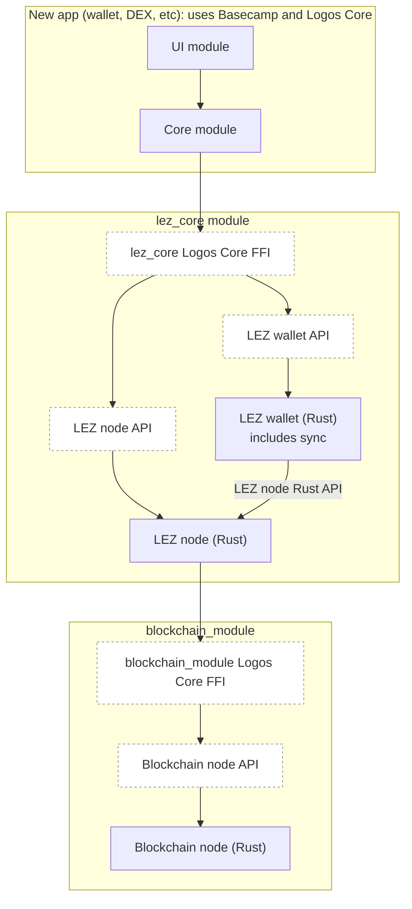
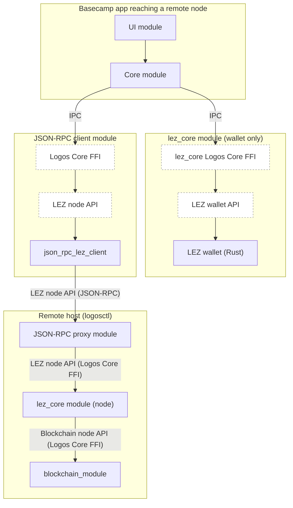
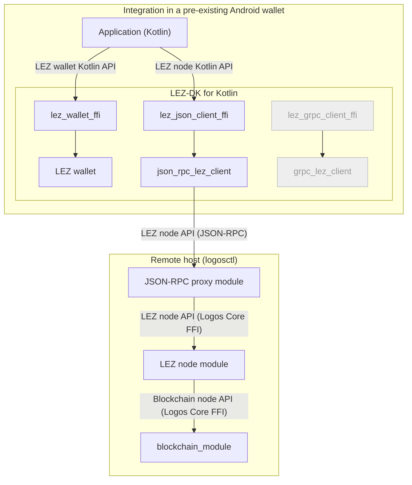
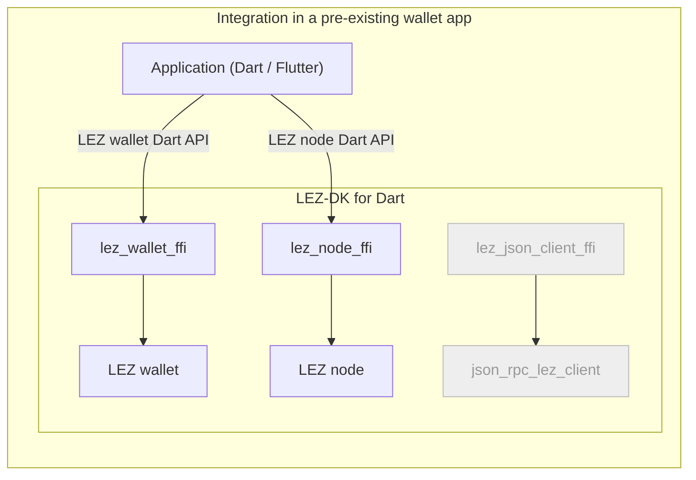

# Appendix: Integrating the Logos Technology Stack

This appendix describes how an application reaches the Logos technology stack,
and what that costs. It covers the shapes an integration takes, the components
the stack exposes to serve them, the measured size of the node libraries an
embedded integration links, and the questions the stack has not yet settled.

It is written as shared background for the RFPs that define those components
individually, rather than as a specification of any one of them. Where it names
a deliverable, the RFP for that deliverable is the authority on its scope.

## Scope and priority

The Logos technology stack comprises four main components:

- **Logos Blockchain**: the L1 settlement layer.
- **LEZ (Logos Execution Zone)**: the programmable execution layer.
- **Storage**: decentralised storage.
- **Delivery**: messaging and delivery infrastructure.

**Regarding integration, this appendix treats LEZ and Logos Blockchain integration as the primary focus.** An integrator may use either chain individually, or both together;
the analysis and recommendations below are written with that in mind.

**Storage** is treated as medium priority, with potential integrators already identified; or as a potential extension to successful LEZ or Blockchain integration.

**Delivery** is treated as lowest priority at this point in time.

## Integration paths

We attempt to categorise the type of integrations that we want to enable. Such
categorisation helps define technical solutions, as well as prioritising based
on demand and value.

Two choices separate the paths from each other.

**What the application is built from** is the division that matters most. An
application built from Logos modules, a Logos UI module paired with a Logos Core
module, reaches `lez_core` over the Logos Core FFI and needs no development kit
at all. An application not built that way reaches LEZ through a language
library instead. This is a property of the application, not of the platform it
runs on: a Basecamp app is a Basecamp app on desktop, mobile or a server.

**Where the node runs** is the second choice. The application embeds a node,
linking it into its own process, or reaches a remote one over a transport.
Embedding removes a network dependency and a trusted endpoint, at the cost of
both artefact size and resource consumption. The figures under
[Unified Logos Development Kit & artefact size](#unified-logos-development-kit--artefact-size)
make size the more measurable of the two, but a running node also spends CPU,
network, battery and storage for as long as it is syncing. Size is paid once at
install; the rest is paid continuously, which is what makes the two costs bite
differently on mobile.

This choice is open to both kinds of application, and deliberately so. A
Basecamp application reaches the node API over IPC and does not care what
answers behind that boundary, so a local node module and a JSON-RPC client
module pointing at a remote node are interchangeable to it; an application using
a development kit selects an embedded node or a transport client from the same
kit. Keeping the choice open matters most on mobile, where none of Logos
Blockchain, LEZ or Storage has settled its mobile strategy yet. Until they do,
committing the architecture to either answer would be premature, so the
architecture below assumes the flexibility is needed and lets the decision be
made per platform and per protocol.

The end goal may resemble the edge and relay distinction that delivery
infrastructure conventionally draws, where a constrained device runs a light
participant that leans on better-provisioned peers, and a capable one carries
the full role. Whether the chain nodes adopt that shape is part of the mobile
topology question under
[Logos stack readiness](#logos-stack-readiness).

The three paths below follow from those two choices.

### Basecamp & Logos Core

The Basecamp and Logos Core framework is the canonical way to integrate Logos
technology stack components.

It is proven and working on **desktop platforms** (Linux & Mac, Windows is
actively worked on), as well as **server platforms** with `logosctl`.

**Mobile support** is currently planned for testnet 0.4. Architecture is not
defined at this stage but functionality is expected to be similar as Basecamp
desktop. Meaning a single application that enables the downloading and dynamic
loading of both ui and core modules.

#### Technology Stack

- Business logic can be written in any language as long as FFI bindings can be
  exposed as a "Logos SDK" (C++, Rust, etc). Note that to facilitate developer
  experience, best to have a Logos SDK for the target language. Currently, Logos
  SDK are available in C++, Rust, Nim and JavaScript.
- Canonical UIs are written in QML with C++ Backend, but support for Web
  (QtWebView mobile, QtWebEngine desktop) has been investigated (need to clarify
  commitment).

#### Added Value

Logos Basecamp and the core framework are in themselves a valuable product for
secure, private and censorship-resistant distribution of software to users.

- **No reliance on any centralised service**: once Basecamp is installed, the
  whole experience is meant to be over the Logos technology stack: module
  discovery over dedicated DHT, distribution run over Logos Storage (WIP)
- **Secure distribution**, with developer signatures and module integrity checks
  integrated (WIP)
- **Isolated sandboxes** per module, giving a safe execution environment despite
  running native software.
- **Access to the full stack via composition**: messaging, storage and
  blockchain are existing modules to assemble, and an application composed from
  them inherits metadata protection and private state support whether or not its
  developer built anonymity measures directly.
- **Modules are a fault and audit boundary**. Each is developed, audited and
  upgraded independently, and a defect in one does not reach the others.

#### Frictions

- **Distribution via Basecamp/Basecamp as a dependency**: The canonical
  distribution path involves the installation of Basecamp or `logosctl` first.
  Distribution via Basecamp and not App Store for mobile (To Be Confirmed).
  However, there is an available path to **build the application as one
  standalone native app**, linking in all necessary modules. It is currently for
  development purposes only but it could potentially enable distribution both
  via Basecamp and directly.
- **Language/Framework limitations**: The FFI approach facilitates integration
  in most platforms (browser being the obvious outlier). However, QML is not
  commonly used. React Native is the most used stack for multi-chain wallets
  (8/10 top wallets; see appendix). With Dart/Flutter and native Swift/Kotlin
  being used by 2 exceptions. This does open the question of whether **an
  electron-like experience could convince a migration** to Basecamp (not a
  straightforward choice due to the security goals).

#### Current/Potential Gaps

- Completion of Basecamp full USP (security for b)
- Mobile support
- Electron-like experience/Web UI (?)
- Standalone app release build (?)

### JSON-RPC Providers + Wallet Library

It is possible to adopt an architecture similar to classic Web3 by exposing APIs
via JSON-RPC. Similar to Eth/Infura, IPFS Gateways, etc.

In this instance, Logos Core CLI can be used to manage Logos nodes (Blockchain,
LEZ, Storage, Delivery).

#### Ecosystem overview

For most blockchains, wallet functionality (signing, proving for LEZ) is
excluded from the JSON-RPC functionalities. `bitcoind` remains the main
exception as of today.

From superficial research, a variety of languages is used by potential
integrators (Rust, Golang, Node.JS, C++, etc.; see appendix).

From a recent L1 launch perspective, non-EVM chains tend to provide a full suite of native SDKs (Sui 8 languages, Aptos 4, Injective/Cosmos 4; see appendix). The SDKs are all native (non-FFI) implementations of their wallet features.

Only Bitcoin uses a Rust-FFI strategy (Bitcoin Dev Kit) to minimize re-writing of software.

The most obvious benefit of a Rust-FFI approach is limiting software rewrite by maintaining the core logic in one codebase. This has been seen as critical for Bitcoin due to the limited number of developers (including cryptographers) who understand Bitcoin protocols and are motivated to implement the libraries. BIPs are usually implemented in rust-bitcoin first, where Bitcoin maintainers primarily work. However, there are a number of drawbacks:
 1. The cost of wrapping and making the FFI work on various platforms may not be as predictable as rewriting the library.
2. The developer experience is less idiomatic, using less type-safety across all languages as the API needs to be flat and compatible for all languages;
3. No tree-shaking is available, meaning all functionality is present in the pre-built artefact, unless several FFI libraries are provided; especially important for mobile platforms.
4. Duplication between libraries: to avoid one big library with no tree-shaking, a solution can be to split them (e.g., LDK vs BDK). The resulting issue is that both dev kits may ship common code.

The complexity of the wallet software seems to have a strong influence on the design choice between Sui and Bitcoin. In Sui, the clients mostly sign transactions, with the chain state being provided by the RPC node. More complex logic is needed for a Bitcoin wallet: UTXO tracking, building transactions satisfying complex descriptions (miniscript), and validating them locally. **LEZ is clearly closer to Bitcoin in this regard due to the need to execute private transactions locally to prove them.** However, **Logos Blockchain wallet logic is very light** (the `wallet` crate in `logos-blockchain` is ~2.5 kLOC and the wallet service runs node-side; see [Appendix: L1 SDK Strategies, section 5.2](./l1-sdk-strategies.md#52-logos-blockchain)). In terms of cost of re-implementation, **the LEZ wallet is the main risk, and re-implementation of Logos Blockchain wallet logic in another language may be a cost-effective solution.**

#### Logos characteristics

There are a few characteristics to note for a Logos wallet library that differs from other L1s, in
addition to being non-EVM:
- 2 chains to integrate: Logos Blockchain the L1, native tokens are native to the L1, so is staking; LEZ is the programmable chain living in a zone; anyone can create their own zone: Zone-as-a-Service.
- The chains have different cryptographic schemes between LEZ and Logos (Secp256k1, ed25519)
- LEZ private transactions require client-side proving

**If the RPC node and the wallet are run by different entities, are private transactions still valuable?**

The answer depends on which chain is being used.

**LEZ private transactions.** Mostly yes, with caveats. Submitting a private transaction to an RPC endpoint does reveal network-level PII (IP address, API key) and the transaction payload that the RPC receives. That payload includes commitments and nullifiers, but the actual private account state is not in the payload: private values are encrypted to the recipient's viewing key and remain local to the account owner. A recipient with the viewing key can later decrypt the post-state, but the RPC provider cannot read it without that key. If a public account is involved in the transaction, the public portion is visible to the RPC provider as it would be to any node.

**Logos Blockchain transactions.** The value is reduced because the privacy mechanism is different. Transaction contents are public on the ledger, similar to Bitcoin. The Bedrock layer does not hide transaction data; instead, privacy is provided at the network level by the Blend Network, which hides the identity of block proposers and, with EmPoWering, blends transactions among core nodes and concurrent transactions to obscure their origin. Submitting through a third-party RPC bypasses the Blend Network entirely, because the RPC receives the transaction directly from the caller before relaying it. The RPC operator therefore sees the full transaction contents and can correlate them with the caller's IP address and API key. The only way to benefit from Blend privacy is to submit directly to the peer-to-peer network.

**Storage and delivery.** Privacy is not primarily provided by the RPC boundary. It comes from participating directly in the mix, gossipsub, or DHT networks. Routing reads or writes through a remote RPC provider therefore weakens the privacy properties those protocols are designed to provide.

Thus, trust assumptions need to be considered when separating the node from the wallet. When both run inside the same infrastructure (for example, a CEX or custodian), the trust assumptions are similar to running them on the same device. However, when the RPC node is run by one entity (a project team or provider) and the wallet by another (an end-user wallet, DEX, or aggregator), the RPC provider can see transaction metadata and correlate it with the caller. That weakens the value of LEZ private transactions and removes the Logos Blockchain Blend privacy entirely relative to running the node locally.

#### Potential demand

The JSON-RPC provider + wallet library model is likely to be the highest-demand path for pre-existing applications that cannot adopt Basecamp. Likely consumers include:

- **Existing mobile wallets** adding LEZ or Logos Blockchain support. They need a wallet library in Kotlin, Swift, Dart, or React Native, plus a JSON-RPC client, but they cannot embed a node given mobile size limits and the CPU, network and battery a running node consumes.
- **Centralised exchanges and custodians** that already run their own node infrastructure. They need wallet operations (key handling, signing, proving) exposed through a language SDK while their backend runs the node.
- **Server-side integrators** in Go, Rust, Node.js, or Python that prefer a library to a Basecamp module workflow.
- **RPC providers** that want to expose Logos nodes through a standard transport without requiring consumers to use Basecamp.

This model intentionally leaves the node out of the mobile artefact. Mobile libraries ship with JSON-RPC clients only; nodes run on desktop, server, or in Basecamp. The dynamic loading of modules via `logos-liblogos` is the mechanism Basecamp and standalone module hosts use, but it is not required for a JSON-RPC client library.

### Node and Wallet as a Library

This path is for integrators who want to embed both the node and the wallet in
their own application process, without adopting Basecamp or Logos Core as a
framework. It is the closest to a traditional light-client or embedded-node
model: the application links native libraries that provide chain
synchronisation, state queries, transaction construction, signing, and
submission, all running locally.

It differs from Basecamp in that the integrator does not write business logic as
Logos modules or distribute through Basecamp. It differs from the JSON-RPC
provider path in that there is no remote node: the wallet and node are
co-located in the same process and communicate through in-process APIs rather
than over a transport.

#### Technology Stack

- The node is linked as a native library (for example, `libindexer_ffi.so` for
  LEZ, `liblogos_blockchain_c.so` for Logos Blockchain).
- The wallet is linked as a native library, either from the same crate or a
  separate one.
- Language bindings are generated over the Rust FFI boundary, similar to BDK.
- The application initialises and drives both node and wallet lifecycles
  directly.

#### Added Value

- **No network dependency for reads or writes**: once synced, the application
  can query chain state and submit transactions without reaching a third-party
  RPC endpoint.
- **Stronger privacy**: the user does not reveal which addresses or
  transactions they care about to a remote RPC provider.
- **Censorship resistance**: the application talks directly to the peer-to-peer
  network.
- **Unified control**: the integrator owns the full stack and can tune sync,
  caching, and resource use.

#### Frictions

- **Artefact size**: embedding a node is expensive. The LEZ indexer FFI library
  alone is ~28 MiB stripped; the Logos Blockchain node library is ~84.5 MiB
  stripped (see
  [Unified Logos Development Kit & artefact size](#unified-logos-development-kit--artefact-size)
  for provenance). Together they exceed typical mobile size budgets before application
  code or assets are added.
- **Build complexity**: integrators must link Rust crates or prebuilt native
  libraries and manage their dependency graphs, including ZK circuit artefacts
  that currently do not build for Android or iOS.
- **Resource consumption**: running a node consumes CPU, memory, battery, and
  storage, which is punishing on mobile.
- **Platform support gaps**: mobile builds of the node libraries are not yet
  available, and the ZK circuits they depend on are not ported to mobile
  architectures.
- **No public SDK today**: unlike the JSON-RPC client path, there is no
  published LEZ-DK or Logos Blockchain SDK that exposes an embedded-node API for
  Kotlin, Swift, Dart, or Go.

#### Current/Potential Gaps

- Mobile builds of LEZ and Logos Blockchain node libraries.
- Size optimisation and modularisation of node libraries.
- FFI bindings for embedded-node APIs in target languages.
- Decision on whether the embedded node belongs in the same development kit as
  the wallet or in a separate, larger artefact.

### Scenarios

The concrete integrations the three paths produce:

- **A new desktop, mobile or server application on Basecamp.** The recommended
  shape. The application is Logos modules, so it reaches `lez_core` and
  `blockchain_module` through the runtime and inherits whatever those modules
  offer without linking anything itself. Whether those modules run a node
  locally or reach a remote one is a deployment choice it does not encode.
  Mobile is not reachable yet, for the reason under
  [Logos stack readiness](#logos-stack-readiness).
- **An existing mobile wallet adding LEZ.** It cannot become a Basecamp app
  without re-architecting, so it takes the development kit for its language and
  reaches a remote node over JSON-RPC. The wallet runs locally and holds the
  keys; only the node call leaves the device.
- **An existing desktop or server application embedding a node.** The same kit
  with the node selected rather than a client, which suits a deployment that
  would rather not depend on someone else's node and can carry both the size and
  the resources a running node consumes.
- **A centralised exchange or custodian backend.** A server integration, and the
  reference profile the node API requirements are written against. It holds
  accounts, watches for deposits, and confirms transactions before crediting
  them; it holds keys but is not a wallet application, and it is the strictest
  reader of the set.
- **An RPC provider.** Runs nodes and exposes them to others through a transport
  proxy, so it consumes the node API in order to serve it onward rather than to
  act on the chain itself.
- **An integration spanning several zones.** A bridge, an aggregator or an
  explorer covering more than one LEZ zone. How the stack serves this shape is
  an open question: see [Multizone integration](#multizone-integration).

## Existing Logos SDKs

Two different libraries are involved, and the appendix distinguishes them
throughout because they answer different questions.

**`logos-liblogos` is the host runtime.** It provides `liblogos_core`, a C-API
shared library, and `logos_host`, the module subprocess host binary. It is what
discovers modules, resolves their dependencies, loads them and manages their
lifecycle. It is a library rather than an application, and it is consumed by two
frontends today: `logos-basecamp`, the desktop GUI shell, and
`logos-logoscore-cli`, the headless CLI runtime that ships `logosctl`.

**The language SDKs are guest-side.** They are not wallet libraries in the BDK
sense, and they are not module loaders either. They are what a module uses to
implement its own contract and to call the other modules it depends on.

Because the two are separate, "a Logos SDK for language X" is a shorthand that
hides more than one piece of work. What an integrator needs is better stated as a
set of capabilities a library must offer in their language, set out under
[What a development kit must provide](#what-a-development-kit-must-provide)
below.

The current SDKs are:

- `logos-rust-sdk`
- `logos-cpp-sdk`
- `logos-nim-sdk`
- `logos-js-sdk`

All four bind the `lp_*` C ABI exported by `logos-protocol`. A module is a
compiled plugin (Qt plugin, `cdylib`, or `.lgx` package) with a `metadata.json`;
`logos-liblogos` discovers it, resolves dependencies, and loads it through a
pluggable loader/container pair. By default the loader spawns a separate OS
process per module. For mobile and embedded use the runtime supports **Local
mode**, in which modules are registered in-process through an in-process
`PluginRegistry`.

### Standalone applications hosting modules

A question this raises is whether an application that is not a Basecamp app, and
is not itself packaged as a module, can load Logos modules and use them. It can,
but not through the language SDKs, and the two halves of "load and use" are
served by different targets.

**Hosting** is `liblogos_core`. Its C API (`logos_core.h`) carries the whole
lifecycle: `logos_core_init`, `logos_core_add_modules_dir`, `logos_core_start`,
`logos_core_load_module`, `logos_core_unload_module`,
`logos_core_get_loaded_modules`, the dependency-graph queries, and
`logos_core_set_access_policy` for gating which caller may invoke which target.
The C++ SDK names this target `logos-cpp-sdk::logos_host` and lists its
consumers as Basecamp, the CLI, a standalone app and a module viewer, noting
that a module itself never needs it. A standalone host is therefore an
anticipated shape rather than an accident of the API being public.

**Calling** is a separate target. `logos_core.h` exposes no invoke function at
all; the calling surface is `logos-cpp-sdk::logos_consumer`
(`logos_lp_client.h`), which is also where the generated per-dependency
wrappers compile. A standalone application consumes both: the host target to
stand a core up and load modules, the consumer target to call into them.

**This path is C and C++ today.** Both libraries expose C or C++ surfaces, and
no binding for another language reaches them. The wrappers that exist for other
languages drive the CLI as a subprocess rather than linking the library:
`logos-logoscore-py` describes itself as a thin layer that spawns a
`logoscore` subprocess per operation, with no C++ bindings and no IPC code, and
`logos-logoscore-tui`, though written in Rust, likewise invokes the CLI as a
subprocess and states that no Qt or C++ dependencies are needed. Both are
usable ways to drive a daemon, but neither is a host-side binding, and a
subprocess-per-operation design carries costs an embedded integration would not
accept.

The language SDKs do not close this gap. `logos-rust-sdk` is explicit that it is
the runtime behind the typed clients a Rust module uses to call other modules,
and that its `lp_*` symbols resolve inside a module built on the cdylib path,
against the protocol archive linked into the plugin. A plain Rust binary has no
such link step. `logos-js-sdk` states that it loads a shared `liblogos_protocol`
directly and does not use `liblogos_core` at all, which is the same guest-side
scope by a different route.

So the gap for a standalone host in Rust, Go, Kotlin, Swift or Dart is a binding
over the `liblogos_core` and consumer C APIs. That binding does not exist today
and would be new work, though the C surface it would wrap is already there and
already carries the semantics a host needs.

**Two proofs of concept explore this.**

[`liblogos-rust-poc`](https://github.com/fryorcraken/liblogos-rust-poc) embeds
`liblogos_core` in a standalone Rust application, which demonstrates that the
path is reachable from a language other than C++ today. It is a proof of concept
rather than a supported binding, and it is worth reading for what it had to do as
much as for what it achieved: it carries a twenty-line C++ shim that constructs
the `QCoreApplication` the C API requires but cannot create, and its analysis of
that constraint is the basis for the Qt item in the gaps below. It drives the
full lifecycle, `init`, `add_modules_dir`, `start`, `load_module`, `cleanup`,
and brings up a real module together with its dependency, so the path is
demonstrated rather than merely argued.

[`liblogos-electron-poc`](https://github.com/fryorcraken/liblogos-electron-poc)
explores using `liblogos_core` as a library inside an Electron application. It is
work in progress and not fully proven, so it should be read as an exploration of
the shape rather than as evidence that the shape works. The question it probes
matters for the framework limitations noted under
[Basecamp & Logos Core](#basecamp--logos-core): if an Electron application can
host Logos modules directly, that is a different answer to the reach of
web-stack developers than making Basecamp itself more Electron-like, and it
would let such an application distribute through conventional channels. It has
established the packaging and the module loading, and what it has not yet settled
is the invocation path, which is the third capability below.

#### What a development kit must provide

The useful way to scope this work is by the capabilities a library must offer in
a given language, rather than by which artefact gets wrapped. The artefact
question is unsettled, as the rest of this section describes, but the
capabilities are stable regardless of how it resolves, and an integrator needs
all of them before anything works end to end.

They currently live in three different repositories, which is part of what makes
the shape hard to see.

**1. Runtime lifecycle.** Discovery, dependency resolution, loading and
unloading, access policy, transports. This is the `logos_core_*` C ABI from
`logos-liblogos`, shipped as `liblogos_core`. It is solved: a plain C ABI that
both proofs of concept wrapped without difficulty, and nothing about it is
language specific.

**2. Provider hosting.** Registering a provider so that calls can be served,
through `LogosAPI` and `LogosAPIProvider`, from `logos-liblogos` and shipped as
`liblogos_qt_host`. This is the barrier. `LogosAPI` is a `QObject` and
registration goes through Qt, with no C ABI over it, so every language binding
needs a C++ shim and a Qt one at that.

**3. Invocation and authorisation.** Calling a module's methods, subscribing to
its events, and the capability handshake that makes a call complete rather than
hang. This is `LogosProviderObject`, `LogosAPIClient` and `TokenManager`, from
`logos-protocol` and shipped as `liblogos_protocol`. It is half solved, which is
the frustrating part: the provider interface already defines a universal
interface alongside the Qt one, taking strings and JSON, which is exactly the
shape an FFI binding wants. But the hosting side and the token handshake are
still Qt C++, so that universal interface cannot be reached from outside without
one.

The `lp_*` C ABI that `logos-protocol` also exports is already bound in Rust and
in JavaScript, and it carries invocation, token saving and subscription. Binding
it again in another language is therefore not the missing piece: a binding that
exists reaches introspection but not invocation, because the capability surface
publishes nothing over a plain transport and the token lookup has nothing to
reach.

The third capability is the one where the shape of the answer matters most,
because driving a separate binary per call is a poor fit for an embedded
integration and an especially poor one for mobile. The preferable shape is for
an application to host the same gateway in process rather than to spawn a
daemon beside it: `logosctl`'s daemon registers `core_service` as an in-process
module through the C++ SDK, and that gateway is what every client talks to. Its
dispatch is deliberately Qt-free, and the two methods an integration needs from
it, proxying a call to a module and watching a module's events, are a small
surface over the module management an application already has. Taking that route
would give a development kit a genuine `call(module, method, args)` without a
second copy of the runtime in the artefact, and it has a reference
implementation to follow rather than being a new design.

What stands in the way is that the invocation path inside that gateway is a
client method over Qt's remote objects, so it cannot simply be wrapped from
another language: hosting the gateway is C++ work even when everything above it
is not. Whether the approach holds is also unconfirmed at the time of writing.
The proof of concept that is pursuing it has not yet driven a module through a
running daemon's gateway, which is the cheaper check that would validate the
assumption before any of the in-process work is committed to.

The Qt dependency bears on each of the three differently, and the distinction
matters more than a general statement that the stack depends on Qt:

- For the runtime lifecycle it is a build-time and packaging cost. A twenty-line
  C++ shim is enough to satisfy it, as the Rust proof of concept shows.
- For provider hosting it is the barrier itself, since registration goes through
  a `QObject` with no C ABI over it.
- For invocation and authorisation it is what keeps an already universal
  interface out of reach, since the handshake runs through a client holding a
  token manager, which today means C++.

Three changes upstream would between them turn this from a C++ undertaking into
a binding exercise, and they are worth naming because they are smaller than the
work they would displace.

- **A C ABI for provider registration**, over the universal string and JSON
  interface that already exists, would make provider hosting bindable from any
  language with no Qt. Groundwork may already cover part of this: the `lp_*` C
  ABI and the Qt-free provider interface were extracted from the C++ SDK into
  `logos-protocol`
  ([logos-protocol#2](https://github.com/logos-co/logos-protocol/pull/2),
  [#3](https://github.com/logos-co/logos-protocol/pull/3),
  [logos-cpp-sdk#67](https://github.com/logos-co/logos-cpp-sdk/pull/67)), to
  verify against the residual registration gap.
- **Publishing the capability surface over a plain transport** would make the
  existing `lp_*` ABI sufficient for consuming modules. No planned work found.
- **Shipping the gateway as a library**, rather than only inside the `logosctl`
  binary, would make invocation reachable, since it is already written and
  already Qt-free in its dispatch. The LogosCore roadmap carries a testnet 0.3
  item to support talking to an existing core, which addresses the same need by
  the opposite mechanism, a client reaching a running daemon rather than an
  application hosting the gateway itself, so it may not substitute for this, to
  verify.

Reducing the Qt dependency is itself an active programme rather than a proposal.
Work to remove Qt from the core stack has been under way across
`logos-liblogos`, the C++ SDK and the CLI, including removal of the
`QCoreApplication` requirement
([logos-logoscore-cli#35](https://github.com/logos-co/logos-logoscore-cli/pull/35)),
which is the constraint the proof of concept above had to shim around. The
roadmap pages predate much of this work, so the absence of an item there is not
evidence that a given piece is unplanned, and the repositories are the better
place to check.

Two things follow for anyone scoping this work. A delivery covering fewer than
all three leaves an integrator with something that does not work end to end: the
runtime lifecycle alone loads modules it cannot call, and adding provider hosting
without invocation and authorisation produces calls that never complete. And the
split between the three is not fixed. If the capability surface becomes reachable
over a plain transport, consuming a module needs no more than the `lp_*` ABI that
is already bound. If the handshake instead stays behind a token manager, the kit
hosts that gateway in process, as described above, rather than driving a separate
binary per call. Either way the aim is the same, an application that carries the
runtime rather than one that shells out to it, and the difference is how much
C++ sits between the integrator's language and a working call.

#### Gaps for `logos-liblogos`

Taking Android as the worked example, because it is the hardest of the targets
the RFPs name, four pieces of work stand between the host runtime as it is today
and a mobile application hosting Logos modules. They compound rather than sit
side by side.

**1. An FFI wrap of `liblogos_core`, the hosting half.** The binding over the 18
C functions, so Kotlin can stand a core up, point it at a module directory, load
modules and set the access policy.

**2. An FFI wrap of the SDK surface, the consuming half.** The binding above only
hosts; calling into a loaded module is a different surface, and a Kotlin
equivalent of what `logos-cpp-sdk::logos_consumer` provides does not exist.
Delivering this without also reaching the capability handshake leaves calls that
never complete, so invocation and authorisation above is part of the same piece
of work. Of the languages an integrator is likely to want, only the JavaScript
SDK has a tracked item to align it with the current runtime; Kotlin, Swift, Dart
and Go do not appear on the roadmap at all.

**3. A single-process framework for Android.** The default container runs one OS
process per module, which Android's application model does not accommodate the
way a desktop does. This is the Local mode question from the mobile side: modules
would register in-process rather than being spawned, and the registration
mechanism is what a mobile host needs. The roadmap carries iOS and Android
support as testnet 0.3 items, though as bare entries without a milestone page,
and the in-process module model does not appear in them; the recent direction of
travel, towards stronger process isolation, runs the other way. Whether this is
planned is worth confirming with the LogosCore team rather than inferring.

**4. Addressing the Qt dependency.** This one raises the cost of the others
rather than blocking them, because Qt leaks through the C boundary rather than
staying behind it:

- A live `QCoreApplication` must exist before `logos_core_start()`. The C API
  neither creates one nor exposes a C function that would, so **every** embedder
  must first perform a C++ operation the C ABI cannot express. A pure-Kotlin,
  Rust or Go consumer therefore needs a small C++ shim before it can call the
  "C" API at all, which is exactly what
  [`liblogos-rust-poc`](https://github.com/fryorcraken/liblogos-rust-poc) had to
  write to get a Rust host working.
- Module loading is `QPluginLoader`-based, and the shipped default format loader
  is `logos-module-loader-qt`, so module discovery is tied to Qt even though the
  loader is swappable in principle.
- The typed call path the existing frontends use runs over Qt-based IPC, which
  bears directly on gap 2 above.
- Embedders are coupled to the *same Qt version* liblogos was built with, and
  drag in `libQt6Core` alongside liblogos's own shared runtime, so the artefact
  is not a self-contained `.so`.

On desktop this is a developer experience cost rather than a blocker, and the
proof of concept above is what establishes that: a twenty-line shim was enough to
bring a real module up from Rust. What it costs is paid per language rather than
once, and it is paid by every integrator, since each binding carries a C++ shim,
a Qt build dependency and a version-matching constraint that a C ABI is supposed
to hide. The value of a C ABI is that it conceals the implementation; here the
implementation is a precondition the C ABI cannot satisfy on its own.

It is also a known item: the embedding doctest notes that `QCoreApplication`
"should no longer be needed but it's pending some changes", so moving it inside
`logos_core_init` is already anticipated, which would reduce the desktop cost to
nothing for most consumers.

Mobile is where it may be more than friction, and the proof of concept does not
speak to it. There the Qt runtime has to ship inside the artefact and coexist
with the platform's application model rather than merely be present at build
time, which makes it a question about size and topology rather than about a
shim. A Qt-free default loader and container would close that, and the loader and
container are already swappable inputs, but whether mobile needs them is part of
the topology question under
[Logos stack readiness](#logos-stack-readiness).

These four are ordered by dependency rather than by difficulty. The first two are
the substantive work; the Qt item conditions how expensive they are per language
rather than whether they are possible.

### Fit for the JSON-RPC Provider + Wallet Library model

The JSON-RPC proxy is a Logos Core module deployed via `logosctl` alongside the
node modules it fronts. That part is standard Logos module development and does
not need separate SDK analysis.

The more relevant question is whether a **wallet module built with a Logos SDK**
can consume a remote JSON-RPC API:

- **Logos Blockchain.** The wallet service runs node-side and exposes an HTTP
  API. `wallet-http-client` (~115 LOC) is a consumer-side HTTP client for that
  API, not an internal communication channel used by the `wallet` crate itself.
  The API is HTTP, not JSON-RPC, so pointing a wallet module at a remote
  JSON-RPC endpoint would require structural changes or a bridge.
- **LEZ.** The `lez/wallet` crate reaches the node through internal Rust APIs
  (`lez/sequencer/service/rpc`), not over HTTP. Remote JSON-RPC consumption is
  unverified.

**Strengths:**

- A wallet built as a Logos Core module inherits sandboxing and lifecycle
  management.
- The same wallet module can run in Basecamp or in a standalone module host.

**Gaps:**

- LEZ wallet-to-node communication is internal; remote JSON-RPC consumption is
  unverified.
- Logos SDKs do not provide a generic JSON-RPC client for non-module
  applications.
- No Kotlin, Swift, Dart, or Go SDK exists for wallet modules.

### Fit for the Node and Wallet as a Library model

The existing Logos components are the best fit for this model, though the work
divides between them: `liblogos_core` loads the modules that already contain node
and wallet functionality, and the consumer surface calls into them across the
module boundary. The language SDKs are not what does the loading.

**Strengths:**

- Modules are sandboxed, dynamically loadable, and composable.
- Local mode keeps everything in one process, which is the intended mobile
  shape.
- The same wallet and node modules (code and `.so`) can be reused across Basecamp and embedded-library integrations.

**Gaps:**

- Mobile Local mode is planned but not delivered.
- No Kotlin, Swift, Dart, or Go SDKs exist.
- Hosting is reachable from C and C++ only: see
  [Gaps for `logos-liblogos`](#gaps-for-logos-liblogos).
- Artefact size, module loading, and tree-shaking need to be resolved for mobile platforms.

## Recommendation

Given the analysis above, there are two main paths. The first is the ideal end
state, if de-risked; the second is the pragmatic near-term start that also
serves as a fallback if the first proves unmanageable.

**Basecamp & Logos Core** remains the canonical path for new applications. It is
not discussed below because it needs no separate native library or development
kit; applications are built from Logos modules directly.

### Ideal long-term: rely exclusively on the Logos SDK

Make the Logos module stack the only integration surface and avoid creating
dedicated wallet or node native libraries altogether. An application would host
modules through `liblogos_core` and call them through the consumer surface,
which is the arrangement Basecamp and `logosctl` already use.

This means a library per language carrying the three capabilities set out under
[What a development kit must provide](#what-a-development-kit-must-provide):
consuming a module's API, managing modules, and the token and capability
handshake. A delivery covering fewer than all three leaves an integrator with
something that does not work end to end, so they belong in the same piece of
work.

This requires:

1. **Make the host runtime reachable from the target languages.** Hosting is
   reachable from C and C++ only today, so this path needs bindings over
   `liblogos_core` and the consumer surface for Kotlin, Swift, Dart, Go and
   Rust. This is more than wrapping a C header: the Qt dependency leaks through
   the C boundary, so each binding currently needs a C++ shim before it can call
   the API at all. See
   [Gaps for `logos-liblogos`](#gaps-for-logos-liblogos) for the four pieces
   this breaks into.

2. **Resolve Android and iOS risks.** Deliver mobile Local mode and confirm that
   modules can run in-process on Android and iOS.

3. **Separate wallet and node functionality into distinct modules.** Split
   `lez_core` and `logos-blockchain` into smaller modules so that a wallet module can be loaded without the full node. This enables smaller node artefacts for mobile apps (wallet-only integration) and makes wallet + node combinations possible on demand.
   On Android, each module should be shipped as an independent AAR, similar to
   the LEZ wallet AAR described below, so that standalone mobile applications can
   include only the modules they need and leave out the rest.

4. **Enable dynamic configuration between remote JSON-RPC nodes and local
   nodes.** With modular wallet and node components, an application could load
   a wallet module locally, point it at a remote node module via JSON-RPC, or
   load a local node module, switching at runtime based on platform, network
   conditions, or user preference. This enables both modes for non-Basecamp apps at low cost.

This is the ideal end-state because it avoids maintaining parallel SDKs
(Logos SDK + LEZ-DK + Logos Blockchain SDK) and lets integrators compose only
the components they need. It also relies on the Logos core framework, having most components in common with the Basecamp path (TODO: verify/clarify). However, it depends on delivering mobile Local mode,
modularising the node crates, and producing language SDKs for Kotlin, Swift,
Dart, and Go with good tree-shaking capabilities. If those prerequisites are not met, this path is not yet viable.

### Short-term / low-risk start: build native libraries

While the Logos SDK-only path matures, the recommended near-term approach is to
build focused native libraries for the **wallet library + JSON-RPC client**
integration model.

1. **Dedicated native library for the Logos Blockchain wallet.** Logos
   Blockchain wallet logic is light and runs node-side today. Because it is
   simple, it is cost-effective to re-implement it as a native SDK per language
   or expose it through a small, focused FFI library, rather than adopting a
   heavy BDK-style Rust-FFI strategy.

2. **Reuse the Rust codebase for the LEZ wallet via FFI.** LEZ private
   transactions require client-side proving and complex state management,
   making a rewrite risky. Expose the existing Rust LEZ wallet through FFI
   (the LEZ-DK pattern), similar to BDK.

These two libraries are delivered as **one SDK with multiple platform
artefacts**. On Android that means multiple AARs: a pure-Kotlin AAR for the
Logos Blockchain wallet and a JNI + `.so` AAR for the LEZ wallet. This is
necessary because Android tree-shaking (R8/ProGuard) removes unused bytecode
but does **not** remove native `.so` libraries from the APK. A single monolithic
AAR that bundles both would force every integrator to ship the LEZ `.so`
whether they use it or not. Splitting into separate AARs lets an integrator
include only what they need. The same pattern applies on iOS (separate
Frameworks or Swift Package Manager products), on desktop (separate crates or
shared libraries), and on server platforms (separate packages).

If the Logos SDK-only path (above) never becomes manageable, these native
libraries remain the long-term fallback.

## Target architecture and the LEZ-DK

The five deliverables exist to make LEZ integrable by the parties that have to
integrate a chain before it is usable in practice: wallets, centralised
exchanges, custodians, payment gateways, data and price aggregators, node and
RPC providers, fiat on and off ramps, bridges, and tax and accounting providers.
Each acts on the chain from outside it, holding accounts, watching for what
arrives, signing what it sends, and reconciling against its own books. Each
stops at the first capability that is missing.

A CEX backend and a self-custodial mobile wallet have different architectures
and are written in different languages, which is why the suite takes a
composable approach. The first two deliverables define surfaces; the rest
consume them.

1. **The LEZ node API** ([RFP-027](../RFPs/RFP-027-lez-node-api.md),
   [logos-co/ecosystem#235](https://github.com/logos-co/ecosystem/issues/235)).
   Define the LEZ node API: the global, non-wallet functions. An integrator may
   run a LEZ node and access it through this API by way of a transport proxy,
   which is what an RPC provider does. Whether indexer or sequencer features
   answer a given call is internal to the node, which is a black box in that
   regard. This is the only component used to read blockchain state and to push
   signed transactions and new commitments to the chain. It is packaged in the
   `lez_core` Logos Core module. The API needs to be exposed in Rust, to be
   consumed by the wallet features within `lez_core`, and over the Logos Core
   FFI, to be consumed by Basecamp apps and transport proxy modules (see 3 and
   5).

2. **The LEZ wallet API**
   ([logos-co/ecosystem#236](https://github.com/logos-co/ecosystem/issues/236)):
   key handling, derivation, proving, and signing. It covers the local and
   wallet operations only. The LEZ wallet library that exposes this API is
   packaged in the `lez_core` module, and an integrator can run that module with
   every wallet API function disabled. The API needs to be exposed over the
   Logos Core FFI on the `lez_core` module, and through the `lez_wallet_ffi`
   crate so it can be wrapped in libraries for other languages (see 4).

3. **The JSON-RPC proxy module and its client library**
   ([logos-co/ecosystem#237](https://github.com/logos-co/ecosystem/issues/237)):
   The module is a Logos Core module that projects the APIs the `lez_core`
   module exposes over JSON-RPC, carrying both the LEZ node API and the LEZ
   wallet API, the former being the one an integrator running a LEZ node as an
   RPC provider uses most. The client is a Rust library for that same surface,
   so a consumer reaches a remote node without writing the transport itself.

   The client should also be packaged as a **Logos Core module** in its own
   right, exposing the LEZ node API over the Logos Core FFI and answering it by
   calling a remote JSON-RPC endpoint. That keeps a Basecamp application on one
   shape: its core module always reaches the node API over IPC, and what sits
   behind that boundary is either a local node module or the JSON-RPC client
   module pointing at a remote node. Local and remote then become a deployment
   choice, resolved by which module is loaded and how it is configured, rather
   than a code change in the application. It is the mechanism behind the dynamic
   configuration described under
   [Ideal long-term: rely exclusively on the Logos SDK](#ideal-long-term-rely-exclusively-on-the-logos-sdk),
   and it is what lets a mobile Basecamp application skip the node artefact
   entirely while still speaking the same API.

4. **LEZ-DK: The LEZ Development Kit**
   ([logos-co/ecosystem#238](https://github.com/logos-co/ecosystem/issues/238)):
   Modelled on the Bitcoin Development Kit (BDK), for the reasons set out in
   [RFP-027: Inspiration from BDK](../RFPs/RFP-027-lez-node-api.md#inspiration-from-bdk-bitcoin-development-kit).
   The LEZ-DK carries the FFI crates that expose the Rust LEZ node API and LEZ
   wallet API. It covers both direct access to an in-process LEZ node (see the
   embedded-node example below) and the JSON-RPC client library for a remote one
   (see the Android example below). It ships as a unified library per language,
   Kotlin, Swift and Go among them, so an application integrates LEZ the same
   way whether the node runs in process or remotely.

   Whether the in-process node belongs in the same kit as the wallet and the
   clients, or in a separate one, is yet to be decided. It is the component that
   drives the artefact size, so the choice turns on the figures discussed in
   [Unified Logos Development Kit & artefact size](#unified-logos-development-kit--artefact-size).

   The LEZ-DK exists to integrate LEZ into applications that already exist, and
   to help LEZ reach the users those applications already have. It is not the
   recommended starting point for something new. A developer building a new
   application, whether or not LEZ is the whole of it, is strongly encouraged to
   build on the Logos Core framework and Basecamp instead, which is the first of
   the shapes below rather than the second.

5. **Further transport proxy modules and their client libraries**
   ([logos-co/ecosystem#222](https://github.com/logos-co/ecosystem/issues/222))
   beyond JSON-RPC, such as gRPC, GraphQL, and a Mesh or Rosetta adapter. Each
   adds a Logos Core module exposing the wallet and node APIs over the new
   transport, and a Rust client library with its FFI crate, consumed through the
   LEZ-DK.

Note that similar components are needed for Logos Blockchain integration and
will be defined in future RFPs, tracked as the FFI bindings
([logos-co/ecosystem#219](https://github.com/logos-co/ecosystem/issues/219)) and
the proxy module and its SDK
([logos-co/ecosystem#220](https://github.com/logos-co/ecosystem/issues/220)),
both under
[logos-co/ecosystem#214](https://github.com/logos-co/ecosystem/issues/214). The
intent is for the JSON-RPC proxy module to cover the Logos Blockchain API as
well, and other module APIs alongside it.

The four diagrams below show the architecture these deliverables build towards.
They differ in what the application is built on, which is the division that
matters, and then in where the node runs. A new app built on Basecamp is a Logos
UI module paired with a Logos Core module, and its core module reaches the
`lez_core` module over the Logos Core FFI, on any platform it runs on, whether
the node is local or remote. A pre-existing application not built from Logos
modules uses the LEZ-DK for its language instead, and from there either reaches
a remote node over a transport or embeds one of its own.

The `lez_core` module exposes both surfaces through one Logos Core FFI, and the
app's core module consumes both, the wallet for keys and signing and the node
for chain state:

The same application reaches a remote node by loading the JSON-RPC client module
in place of the node module. Its core module is unchanged: it still consumes the
LEZ node API over the Logos Core FFI, and only the module behind that boundary
differs. This is the shape a mobile Basecamp application takes while embedding a
node remains out of reach, and the wallet stays local either way, so keys and
proving do not leave the device:

An existing Android application, a wallet already shipping that is adding LEZ
support, is not built from Logos modules. It adds one dependency, the LEZ-DK for
Kotlin, which carries the wallet and the transport clients, each its own FFI
crate over its own Rust crate. The application holds the wallet and a client and
wires them together, choosing the transport it reaches the node through, and
neither component reaches the other. Every client in the kit is linked whether
or not it is used, which is the cost of shipping one artefact. The client runs
inside the application rather than beside it, so only the node call leaves the
device:

An application can also link the node itself rather than reach one over a
transport, which is the same LEZ-DK with a different component selected. A Dart
and Flutter wallet in the shape of
[Cake Wallet](https://github.com/cake-tech/cake_wallet) adds the node FFI beside
the wallet FFI and runs both in process, so the client stays linked but unused
and no node call leaves the device:

**Note**: unlike the two above, this diagram omits the Logos Blockchain node
that the embedded LEZ node reads finalised on-chain state from. Whether an
application embedding a LEZ node should embed the L1 node as well, or reach a
remote one, is undecided: see
[Unified Logos Development Kit & artefact size](#unified-logos-development-kit--artefact-size)
for the sizes that bear on the choice.

Each component has its own RFP, and each of those is the authority on its own
scope.

Two consequences of that arrangement bear on the node API. It is consumed both
directly, by a caller holding it across an FFI boundary, and indirectly, through
the JSON-RPC proxy and the client library, so its surface has to survive
projection onto a wire protocol rather than assuming a local caller. And because
a consumer may reach the node through either path, the two must express the same
semantics.

## Multizone integration

Anyone can create a zone: Zone-as-a-Service is a property of the LEZ design, so
an integrator covering the ecosystem rather than a single application is likely
to face more than one zone. Bridges, aggregators, explorers, exchanges listing
assets from several zones, and wallets showing a user their holdings across
zones all share this shape.

The `lez_core` module serves one zone at a time. That makes multizone an
unresolved question for the architecture above rather than a configuration
detail, and it bears on every deliverable: the node API, the proxy module, and
the development kits that consume them.

Two paths are available, and choosing between them is R&D work rather than a
decision this appendix can settle.

**Multizone support within one core module.** The module holds several zones at
once, and the node API gains a zone parameter so a caller says which zone a call
refers to. One process, one module instance, one endpoint. The cost is a change
to the module and to the API surface: every call that reads chain state acquires
a zone dimension, and the module has to keep per-zone state apart internally.

**Several core module instances, one per zone.** The module stays as it is and
the integrator runs one instance per zone. The cost moves to the surrounding
machinery, and this is where the harder question sits: it is not clear how the
JSON-RPC proxy addresses several instances behind one endpoint. The proxy would
need to route a call to the right instance, which means either a zone parameter
in the API after all, one endpoint per zone with the integrator keeping them
apart, or a naming scheme in the module registry that the proxy can resolve.

The two paths are not as far apart as they look, because both may end up
requiring the node API to carry a zone identifier. The distinction is then where
the multiplexing happens: inside the module, or in front of it.

Some evidence bears on the choice. The Rust FFI for the indexer is handle-based,
returning a handle per instance, which suggests the Rust layer could hold
several instances in one process; the single-instance restriction appears to be
imposed by the C++ module wrapper rather than by the FFI beneath it. If that
holds, the second path may be cheaper than it first appears, since the
constraint would sit in a wrapper that can be changed rather than in the node
itself. This needs confirming against the source before it is relied on.

Related questions a proposal or an R&D effort should answer:

- Whether a zone identifier belongs in the node API regardless of which path is
  taken, since a caller already needs to tell two zones apart and to tell the
  same zone on two networks apart.
- How zone discovery works: how an integrator learns which zones exist and how
  to reach a node for one.
- What a development kit exposes for multizone, and whether an application holds
  several clients or one client addressing several zones.

Until this is settled, an integrator covering several zones runs a node per zone
and joins the results itself. The API reporting both the zone identifier and the
identifier of the L1 that zone settles to is what makes that possible today,
since it lets a caller confirm which zone a node is reading.

### Multizone and the wallet

Whether the wallet spans zones is a separate decision from whether the node does,
and it should be taken separately. The node question is about where chain state
comes from; the wallet question is about what a user has to hold and understand,
which makes it the one with a clear answer at the level of intent even while the
mechanism is open.

**Key management should be zone-abstract.** A user should worry about one seed,
not one per zone. If each zone a user touches requires its own seed phrase, the
burden grows with the ecosystem, and it grows in the most damaging way available:
more secrets to record, more to back up, and more to lose. Zone-as-a-Service
means the number of zones is not bounded by anything the user controls, so a
per-zone seed is a design that degrades as the ecosystem succeeds. Deriving
per-zone material from one seed keeps the user's burden constant regardless of
how many zones they end up touching.

That intent leaves the API question open. Deriving zone-specific keys and viewing
keys from a single seed is a well-understood shape, but what a clean API looks
like over it is not settled: whether a caller names a zone on each wallet call,
holds a per-zone wallet handle derived from one seed, or holds one wallet object
that reports balances and history per zone. The choice is visible to every
integrator, so it is worth designing rather than inheriting from whichever
implementation lands first.

The consequences run in both directions, and a proposal should weigh them
together:

- **Developer experience.** A single-zone wallet is simpler to implement and to
  reason about, but pushes multizone onto every integrator who needs it, each
  solving it differently. A multizone wallet concentrates that complexity in one
  place, at the cost of a larger surface that single-zone integrators still carry.
- **User experience.** This is where a single-zone wallet is hardest to defend.
  If the wallet is scoped to one zone, an application spanning zones holds
  several wallet instances, and keeping one seed behind them becomes the
  application's problem rather than the wallet's. Different applications will
  solve it differently or not at all, and the user meets the inconsistency:
  seed handling and recovery become per-application behaviour rather than a
  property of the platform.

The recommendation implied by the above is that zone-abstract key management is a
requirement rather than an option, and that the open question is the shape of the
API expressing it, not whether one seed should cover a user's zones.

## Unified Logos Development Kit & artefact size

The architecture proposed here assumes a similar development kit will be needed
for Logos Blockchain, and for Storage and Delivery in turn,
depending on the appetite for integrating those protocols into existing
applications.

A unified Logos Development Kit would simplify integration for a developer, at
the cost of artefact size. BDK is the example to reason from: it publishes a
prebuilt AAR, `bdk-android`, whose `libbdkffi.so` carries every capability the
kit offers. A single `.so` for all of Logos may be too large for mobile, where
Android and iOS both impose size limits past which the experience degrades for
users and developers alike. Publishing several variants of a unified kit may in
turn cost more to maintain than keeping the kits separate in the first place.

The LEZ node alone already sets a high floor. Built from `lez/indexer/ffi` at
`--release` for `x86_64-unknown-linux-gnu`, `libindexer_ffi.so` is 33.6 MiB
unstripped and 28.0 MiB stripped. For comparison, `bdk-android` 3.0.0 ships a
15.3 MiB `.so` for `arm64-v8a`, and that one artefact carries a wallet and four
chain backends. So the LEZ node on its own, before any wallet or client joins
it, already outweighs a complete Bitcoin kit. This is a verifier only: the risc0
`prove` feature is enabled by `lez/wallet-ffi` and a benchmark tool alone, and
`indexer_ffi` resolves `risc0-zkvm` with `client` and `std`, so the figure
excludes proving. What it does include is the risc0 verifier, RocksDB, libp2p,
and the guest ELF the state machine embeds.

A LEZ node also needs a Logos Blockchain node, and that one is larger again.
`logos-blockchain-c` builds `liblogos_blockchain.so` at 84.5 MiB, also for
`x86_64-unknown-linux-gnu`, already stripped by its release profile, since it
carries the whole node: the in-house `zk/` circuit subtree with its provers,
plus the chain, blend, proof-of-work, wallet and API services. An application
embedding both a LEZ node and the L1 node it reads from therefore starts from
roughly 112 MiB for a single protocol pair, which is the same order as the size
ceilings the mobile stores impose, before the application has shipped any code
of its own. That is also before Storage and Delivery, and before any
per-architecture packaging.

Neither number above is for a mobile target, and neither can be today: the ZK
circuit artefacts both libraries depend on are published for Linux, macOS and
Windows only, so an Android or iOS build fails before it produces a size.
Building those circuits for mobile is a prerequisite to answering the question,
and a proposal is expected to obtain the figures rather than assume them.

### Different prebuilt artefacts per platform

One candidate strategy, offered as a starting point rather than a requirement,
is to let the published artefacts differ by platform. A desktop or server
artefact carries the embedded node; a mobile artefact omits it and reaches a
remote node through the client instead. The kit is then the same source with the
same surface, and only what is shipped varies, which keeps the choice away from
the integrator: a developer consuming a prebuilt library cannot set a build
feature, so the platform an artefact targets has to decide what is in it.
Prebuilt artefacts are still worth publishing for every platform, including the
desktop and server ones that carry the node, since a build from source over this
dependency graph is not a reasonable first step for an integrator, and a server
integrator in Go or on the JVM may hold no Rust toolchain at all.

The cost of that strategy is a wider artefact matrix, and one question it leaves
open is what the mobile artefact does about the node surface it does not carry:
omitting those types keeps the artefact honest at the price of two shapes for
one language binding, while exposing them and failing at run time keeps one
shape at the price of a surprise. A proposal states which it chose.

## The bitcoind-style JSON-RPC node wallet

Historically geth, and still today bitcoind, carry wallet features and a wallet
API inside the node. The ecosystem has moved away from that arrangement
([Appendix: Wallet Libraries Ecosystem, section 1](./wallet-libraries-ecosystem.md#1-where-wallet-functionality-lives)):
geth removed the `personal` namespace, Bitcoin Core is separating its wallet
into its own process, and chains newer than those two ship wallet libraries
without ever putting a wallet in the node.

LEZ is nonetheless positioned to offer that shape cheaply, because the
`lez_core` module already carries the wallet beside the node. One further
component, the JSON-RPC proxy module of deliverable 3, would expose the wallet
API over the same transport as the node API, which makes wallet integration
reachable from a server or cloud environment, and potentially a desktop one,
alongside the Logos Core and Basecamp path.

This could be a quicker and cheaper way to provide wallet integration for both
LEZ and Logos Blockchain. The demand for it would need to be validated first,
however, given the move away from it the ecosystem has demonstrated.

## Logos stack readiness

Three items bear on the architecture proposed above.

**Basecamp mobile readiness.** The Basecamp shape is described as applying to
any Basecamp application, but mobile support is not planned for testnet 0.3, so
at the time of writing that shape is reachable on desktop only.

**The target topology for Logos Blockchain, LEZ and Storage on mobile.** It is
not yet settled whether a mobile device is expected to run light versions of the
chain nodes and join the peer-to-peer networks directly, to reach remote nodes
over RPC alone, or to combine the two. None of the three protocols has defined
its mobile strategy, and the answer need not be the same for each. That decision
governs the unified development kit and what embedding a node means per
platform, so the sizes and the per-platform artefact strategy above are
provisional until it is made.

The architecture above therefore keeps both options open rather than resolving
them early: the node API is reached the same way whether a local node module or
a JSON-RPC client module answers it, so a protocol settling on either answer,
or on a light participant leaning on better-provisioned peers in the manner of
an edge and relay split, does not invalidate the surface built against it.

**Multizone support.** `lez_core` serves one zone at a time, and whether
multizone is delivered inside the module or by running several instances behind
a proxy is unresolved. It bears on the node API surface and on the development
kits, so it is left as an R&D question. The wallet side of it is a separate
decision with a clearer intent, since key management should be zone-abstract
whatever the node does: see [Multizone integration](#multizone-integration) and
[Multizone and the wallet](#multizone-and-the-wallet).

## The LEZ node API is the only API for LEZ chain state access

The LEZ node API is the whole of the surface available to a consumer, in both
directions. A LEZ node is a black box: what it is made of, which part of it
answers a given call, and how those parts talk to each other are implementation,
not API. The API says what a consumer may ask for and what comes back, and
nothing about how a node arranges itself to answer.

The node serves every read. Where it does not already hold what a consumer asks
for, it obtains it from wherever that data lives rather than directing the
consumer elsewhere. That internal arrangement is free to change without a
consumer being able to tell.

It is also the only way onto the chain. A signed transaction, and the new
commitments that come with a privacy-preserving one, are produced by the LEZ
wallet and reach the network through this API, which relays what it is handed
without constructing or signing anything itself. A consumer that holds keys
still writes through the node, so the wallet and the node divide the work rather
than offering two routes to the chain.

A capability a consumer needs is therefore required of the node regardless of
which part of it holds the data today. The pending set is the clearest case, and
the same reasoning governs every read and write RFP-027 requires.
